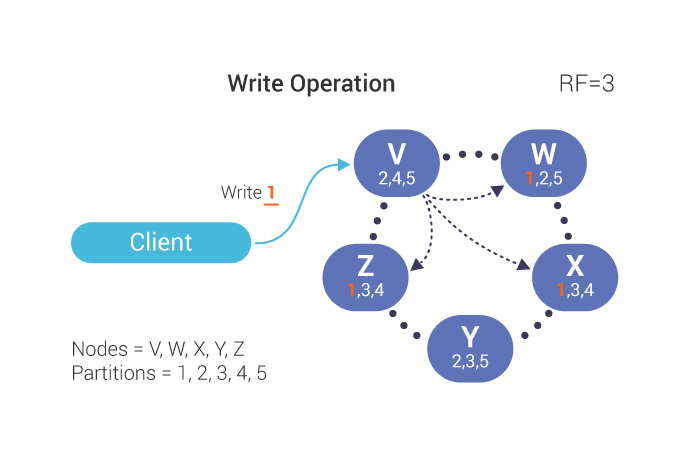
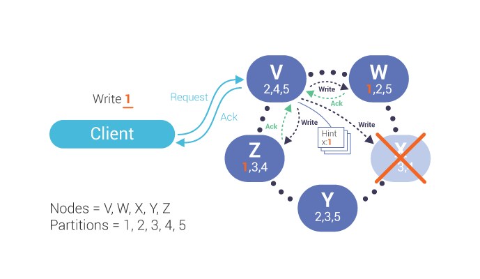
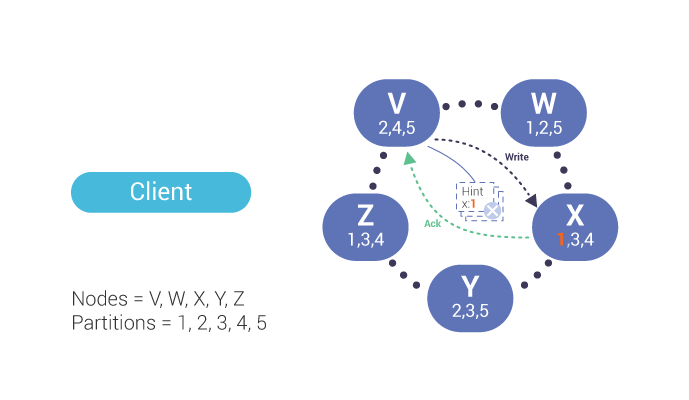

ScyllaDB Hinted Handoff
========================

A typical write in ScyllaDB works according to the scenarios described in our :doc:`Fault Tolerance documentation </architecture/architecture-fault-tolerance>`.

But what happens when a write request is sent to a ScyllaDB node that is unresponsive due to reasons including heavy write load on a node, network issues, or even hardware failure? To ensure availability and consistency, ScyllaDB implements :term:`hinted handoff<Hinted Handoff>`.

 :term:`Hint<Hint>` = target replica ID + :term:`mutation<Mutation>` data

In other words, ScyllaDB saves a copy of the writes intended for down nodes, and replays them to the nodes when they are up later.  Thus, the write operation flow, when a node is down, looks like this:

1. The co-ordinator determines all the replica nodes;

2. Based on the replication factor (RF) , the co-ordinator :doc:`attempts to write to RF nodes </architecture/architecture-fault-tolerance>`;

3. If one node is down, acknowledgments are only returned from two nodes:

4. If the consistency level does not require responses from all replicas, the co-ordinator, *V* in this case,  will respond to the client that the write was successful.   The co-ordinator will write and store a :term:`hint<Hint>` for the missing node:

5. Once the down node comes up, the co-ordinator will replay the hint for that node.  After the co-ordinator receives an acknowledgement of the write, the hint is deleted.

A co-ordinator stores hints for a handoff under the following conditions:

1. For down nodes;
2. If the replica doesn't respond within :code:`write_request_timeout_in_ms`.

The co-ordinator will stop creating any hints for a dead node if the node's downtime is greater than :code:`max_hint_window_in_ms`.

Hinted handoff is enabled and managed by these settings in :code:`scylla.yaml`:

* :code:`hinted_handoff_enabled`: enables or disables the hinted handoff feature completely or enumerates data centers where hints are allowed. By default, “true” enables hints to all nodes.
* :code:`max_hint_window_in_ms`: do not generate hints if the destination node has been down for more than this value.  If  a node is down longer than this period, new hints are not created.  Hint generation resumes once the destination node is back up. By default, this is set to 3 hours.
* :code:`hints_directory`: the directory where ScyllaDB will store hints. By default this is :code:`$SCYLLA_HOME/hints`.

Storing of the hint can also fail. Enabling hinted handoff therefore does not eliminate the need for repair; a user must recurrently :doc:`run a full repair </operating-scylla/procedures/maintenance/repair/>` to ensure data consistency across the cluster nodes.

Sync point HTTP API
^^^^^^^^^^^^^^^^^^^

ScyllaDB provides you with a means to wait until hints for given nodes have been replayed. It is realized by creating a so-called sync point that corresponds to the hints that have accumulated up to the time of its creation. It always covers both regular hints and updates for materialized views. You can create and await sync points by sending HTTP requests to :code:`http://{API_ADDRESS}:{API_PORT}/hinted_handoff/sync_point/`, where :code:`{API_ADDRESS}` corresponds to the API IP address of the coordinator node which hints are supposed to be sent from.

You can create a sync point by sending a POST request to :code:`/hinted_handoff/sync_point` with the following parameters:

* :code:`target_hosts`: a list of the IP addresses of nodes to be covered by the sync point; the IPs are divided by commas, e.g. :code:`127.0.0.2,127.0.0.3`. If no IP address is specified, ScyllaDB assumes the sync point should be created towards all nodes in the cluster. This parameter is not required -- if it is not present, ScyllaDB will treat the request as if zero IP addresses were specified.

ScyllaDB should return a JSON string containing the ID of the created sync point as the response. In case of an error, a JSON object reporting the issue will be returned instead.

Examples:

.. code-block:: bash

    # Create a sync point for hosts of IP addresses: 127.0.0.2 and 127.0.0.3.
    $ curl -X POST "http://127.0.0.1:10000/hinted_handoff/sync_point?target_hosts=127.0.0.2,127.0.0.3"
    "Ay4AAADgR8IYRSM14vPuN232DLKSAQAMAAAAAAAAAAAAAAAMAAAAAAAAAAAAAAA/CncIC5VDTA=="

    # Create a sync point for all hosts (the `target_hosts` parameter is empty).
    $ curl -X POST "http://127.0.0.1:10000/hinted_handoff/sync_point"
    "Ay4AAADgR8IYRSM14vPuN232DLKSAQAMAAAAAAAAAAAAAAAMAAAAAAAAAAAAAAA/CncIC5VDTA=="

    # Invalid request to create a sync point.
    $ curl -X POST "http://127.0.0.1:10000/hinted_handoff/sync_point?target_hosts=invalid_host"
    {"message": "Failed to parse host address invalid_host: invalid_host", "code": 400}

You can await a previously created sync point by sending a GET request to :code:`/hinted_handoff/sync_point` with the following parameters:

* :code:`id`: the ID of the sync point the user wants to await. This parameter is mandatory. Only one ID can be provided,
* :code:`timeout`: an integer value specifying how many seconds ScyllaDB should wait for the hints corresponding to the sync point to be sent. If the value is negative, ScyllaDB will wait indefinitely long. This parameter is not mandatory; if it is not present, ScyllaDB will return the result immediately.

The database should return a JSON string containing one of the two values as the response:

* :code:`"DONE"` -- if all of the hints corresponding to the provided sync point have already been sent,
* :code:`"IN_PROGRESS"` -- if some of those hints have not been sent yet.

In case of an error, a JSON object reporting the issue will be returned instead.

Examples:

.. code-block:: bash

    # Await a sync point providing both parameters: `id` and `timeout`.
    $ curl -X GET "http://127.0.0.1:10000/hinted_handoff/sync_point?id=Ay4AAADgR8IYRSM14vPuN232DLKSAQAMAAAAAAAAAAAAAAAMAAAAAAAAAAAAAAA/CncIC5VDTA==&timeout=2"
    "DONE"

    # Awaiting a sync point without the optional `timeout` parameter (equivalent to `timeout=0`).
    $ curl -X GET "http://127.0.0.1:10000/hinted_handoff/sync_point?id=Ay4AAADgR8IYRSM14vPuN232DLKSAQAMAAAAAAAAAAAAAAAMAAAAAAAAAAAAAAA/CncIC5VDTA=="
    "DONE"

    # Invalid request to await a sync point.
    $ curl -X GET "http://127.0.0.1:10000/hinted_handoff/sync_point?timeout=-1"
    {"message": "Missing mandatory parameter 'id'", "code": 400}

See also the Hinted Handoff section of the :doc:`API reference </reference/api-reference>`.

.. note:: If the node is turned off while you are awaiting a sync point on it, you will receive an error as the response. You should try awaiting the sync point again when the node has been turned on again.

.. include:: /rst_include/apache-copyrights.rst
