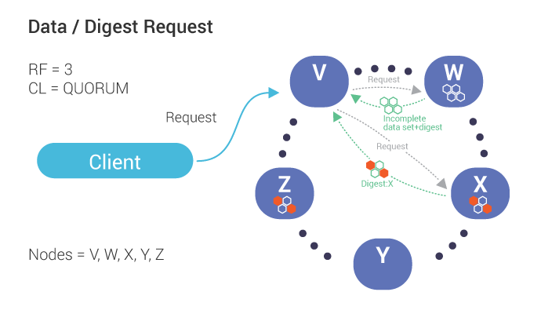
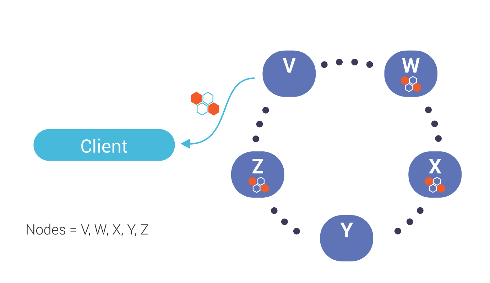
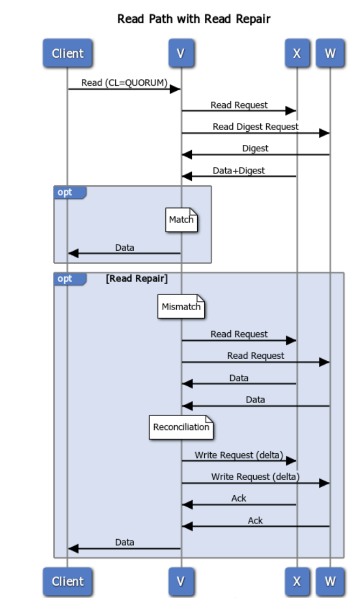

ScyllaDB Read Repair
=====================

Read repair serves as an anti-entropy mechanism during read path.

On read operations, ScyllaDB runs a process called :term:`read repair<Read Repair>`, to ensure that replicas are updated with most recently updated data. Such repairs during read path run automatically, asynchronously, and in the background.  

Note however, that if digest mismatch is detected before consistency level is reached, that repair will run in the foreground.

A normal read operation works according to the scenarios described in our :doc:`Fault Tolerance documentation </architecture/architecture-fault-tolerance>`.

Read Request
^^^^^^^^^^^^
This image illustrates the flow of a read request, when data is out of sync, and a background read repair process is triggered.

1. Our coordinator, *V*,  **requests data** (including digest) from one node, *W*, which is out of date.

2. The coordinator also **requests digests** from the number of nodes up to the consistency level (in this case, *Quorum* or 2) which, in this case, includes Node *X*.

3. If the digests from all replicas match, the coordinator responds to the client with the read data. If there is a mismatch (shown above), a :term:`read repair<Read Repair>` is performed.

Read Repair
^^^^^^^^^^^
See the appendices below for the detailed flow. 

1. Triggered by a mismatch in digest response from replicas (see above), the co-ordinator, in this case, node *V*, **sends requests (for the full data set)** to the same sub set of replicas participates in the read  (up to the consistency level). 

.. image:: 2_read_repair.png

2. During :term:`reconciliation<Reconciliation>`, the co-ordinator (Node *V*) compares full data sets, and **sends updates back** to the out-of-date nodes.

.. image:: 3_read_repair.png

3. Once all updated replicas successfully have responded, the co-ordinator **returns the merged data set** to the client.

* :doc:`ScyllaDB Anti-Entropy </architecture/anti-entropy/index/>`

Appendix 
^^^^^^^^
Flows created with `websequencediagrams.com <http://websequencediagrams.com>`_.

