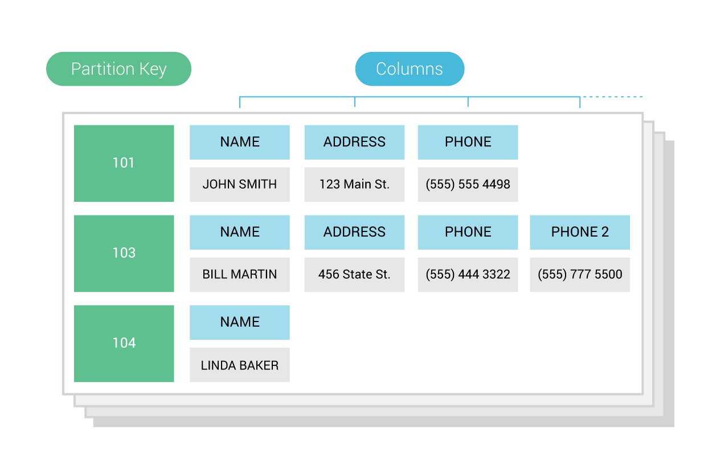

ScyllaDB Ring Architecture - Overview
======================================

ScyllaDB is a database that scales out and up. ScyllaDB adopted much of its distributed scale-out design from the Apache Cassandra project (which adopted distribution concepts from Amazon Dynamo and data modeling concepts from Google BigTable).

In the world of big data, a single node cannot hold the entire dataset and thus, a cluster of nodes is needed.

A ScyllaDB :term:`cluster<Cluster>` is a collection of :term:`nodes<Node>`, or ScyllaDB instances, visualized as a ring. All of the nodes should be homogeneous using a shared-nothing approach. This article describes the design that determines how data is distributed among the cluster members.

A ScyllaDB :term:`keyspace<Keyspace>` is a collection of tables with attributes that define how data is replicated on nodes.   A keyspace is analogous to a database in SQL. When a new keyspace is created, the user sets a numerical attribute, the :term:`replication factor<Replication Factor (RF)>`, that defines how data is replicated on nodes. For example, an :abbr:`RF (Replication Factor)` of 2 means a given token or token range will be stored on 2 nodes (or replicated on one additional node).   We will use an RF value of 2 in our examples.

A :term:`table<Table>` is a standard collection of columns and rows, as defined by a schema. Subsequently, when a table is created, using CQL (Cassandra Query Language) within a keyspace, a primary key is defined out of a subset of the table’s columns.

The table in the diagram below can thus be defined in CQL as follows:

.. code-block:: SQL

   CREATE TABLE users (
        ID int,
        NAME text,
        ADDRESS text,
        PHONE text,
        PHONE_2 text,
        PRIMARY KEY (ID)
   );

In a CQL table definition, the :term:`primary key<Primary Key>` clause specifies, at a minimum, a single column :term:`partition key<Partition key>` and may also specify :term:`clustering key<Clustering Key>` columns.  The primary key uniquely identifies each partition/row combination in the table, while the clustering keys dictate how the data (rows) are sorted within a given partition. For more information, see our CQL :ref:`documentation <create-table-statement>`.

A **row** is a container for columns associated with a primary key.   In other words, a primary key represents one or more columns needed to fetch data from a CQL table.  

A :term:`token<Token>` is a value in a range, used to identify both nodes and partitions.  The :term:`partition key<Partition key>` is the unique identifier for a partition, and represented as a token which is hashed from the :term:`primary key<Primary Key>`.

A :term:`partition<Partition>` is a subset of data that is stored on a node and replicated across nodes.   There are two ways to consider a partition.  In **CQL**, a partition appears as a group of sorted rows, and is the unit of access for queried data, given that most queries access a single partition. On the **physical layer**, a partition is a unit of data stored on a node and is identified by a :term:`partition key<Partition Key>`.

In the diagram above,  there are 3 partitions shown, with the partition keys of **101**, **103**, and **104**.

A :term:`partition key<Partition key>` is the primary means of looking up a set of rows that comprise a partition.  A partition key serves to identify the node in the cluster that stores a given partition, as well as to distribute data across nodes in a cluster.

The :term:`partitioner<Partitioner>`, or **partition hash function**, using a partition key, determines where data is stored on a given node in the cluster.  It does this by computing a token for each partition key. By default, the partition key is hashed using the Murmur3 hashing function.

.. image:: ring-architecture-2.png

The hashed output of the partition key determines its placement within the cluster. 

.. image:: ring-architecture-3.png

The figure above illustrates an example 0-1200 token range divided evenly amongst a three node cluster.

ScyllaDB, by default, uses the Murmur3 partitioner. With the MurmurHash3 function, the 64-bit hash values (produced for the partition key) range from  |From| to |To|.  This explains why there are also negative values in our ``nodetool ring`` output below.

.. image:: ring-architecture-4.png

In the drawing above, each number represents a token range.  With a replication factor of 2, we see that each node holds one range from the previous node, and one range from the next node.  
 
Note, however, that ScyllaDB exclusively uses a Vnode-oriented architecture.  A :term:`Virtual node` represents a contiguous range of tokens owned by a single ScyllaDB node.  A physical node may be assigned multiple, non-contiguous Vnodes.

ScyllaDB’s implementation of a Vnode oriented architecture provides several advantages.  First of all, rebalancing a cluster is no longer required when adding or removing nodes. Secondly, as rebuilding can stream data from all available nodes (instead of just the nodes where data would reside on a one-token-per-node setup), ScyllaDB can rebuild faster.

.. image:: ring-architecture-5.png

The proportion of Vnodes assigned to each node in a cluster is configurable in the ``num_tokens`` setting of ``scylla.yaml``; the default is ``256``.

You can use the ``nodetool`` command to describe different aspects of your nodes, and the token ranges they store.  For example,  

``$ nodetool ring <keyspace>``

Outputs all tokens of a node, and displays the :doc:`token ring information </operating-scylla/nodetool-commands/ring>`.  It produces output as follows for a single datacenter:

.. code-block:: shell

   Datacenter: datacenter1
   =======================
   Address     Rack        Status State   Load            Owns                Token                                       
                                                                            9156964624790153490                         
   172.17.0.2  rack1       Up     Normal  110.52 KB       66.28%            -9162506483786753398                        
   172.17.0.3  rack1       Up     Normal  127.32 KB       66.69%            -9154241136797732852                        
   172.17.0.4  rack1       Up     Normal  118.32 KB       67.04%            -9144708790311363712                        
   172.17.0.4  rack1       Up     Normal  118.32 KB       67.04%            -9132191441817644689                        
   172.17.0.3  rack1       Up     Normal  127.32 KB       66.69%            -9080806731732761568                        
   172.17.0.3  rack1       Up     Normal  127.32 KB       66.69%            -9017721528639019717 
   ...

Here we see that, for each token,  it shows the address of the node, which rack it is on, the status (``Up`` or ``Down``), the state, the load, and the token.   The ``Owns`` column shows the percentage of the ring (the keyspace) actually handled by that node.

``$ nodetool describering <keyspace>``

Shows the token ranges of a given keyspace.  That output, on a three node cluster,  looks like this:

.. code-block:: shell

   Schema Version:082bce63-be30-3e6b-9858-4fb243ce409c
   TokenRange: 
   TokenRange(start_token:9143256562457711404, end_token:9156964624790153490, endpoints:[172.17.0.4], rpc_endpoints:[172.17.0.4], endpoint_details:[EndpointDetails(host:172.17.0.4, datacenter:datacenter1, rack:rack1)])
   TokenRange(start_token:9081892821497200625, end_token:9111351650740630104, endpoints:[172.17.0.4], rpc_endpoints:[172.17.0.4], endpoint_details:[EndpointDetails(host:172.17.0.4, datacenter:datacenter1, rack:rack1)])
   ...

We can also get information on our cluster with 

``$ nodetool describecluster``

.. code-block:: shell

   Cluster Information:
      Name: Test Cluster
      Snitch: org.apache.cassandra.locator.SimpleSnitch
      Partitioner: org.apache.cassandra.dht.Murmur3Partitioner
      Schema versions:
         082bce63-be30-3e6b-9858-4fb243ce409c: [172.17.0.2, 172.17.0.3, 172.17.0.4]

Learn more in the `Cluster Node Ring lesson <https://university.scylladb.com/courses/scylla-essentials-overview/lessons/architecture/topic/cluster-node-ring/>`_ on ScyllaDB University

.. include:: /rst_include/apache-copyrights.rst

