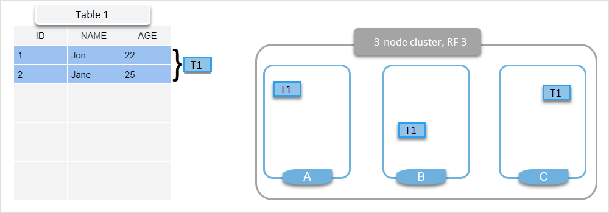
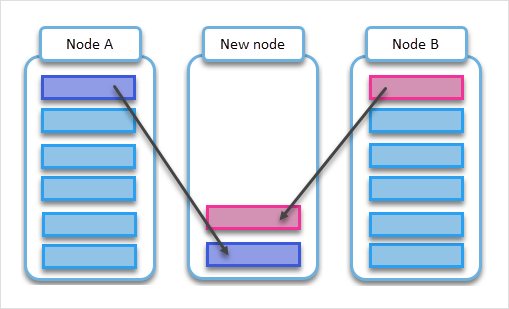

=========================================
Data Distribution with Tablets
=========================================

A ScyllaDB cluster is a group of interconnected nodes. The data of the entire 
cluster has to be distributed as evenly as possible across those nodes.

ScyllaDB is designed to ensure a balanced distribution of data by storing data
in tablets. When you add or remove nodes to scale your cluster, add or remove
a datacenter, or replace a node, tablets are moved between the nodes to keep
the same number on each node. In addition, tablets are balanced across shards
in each node.

This article explains the concept of tablets and how they let you scale your
cluster quickly and seamlessly.

Data Distribution
-------------------

ScyllaDB distributes data by splitting tables into tablets. Each tablet has 
its replicas on different nodes, depending on the RF (replication factor). Each
partition of a table is mapped to a single tablet in a deterministic way. When you
query or update the data, ScyllaDB can quickly identify the tablet that stores
the relevant partition. 

The following example shows a 3-node cluster with a replication factor (RF) of
3. The data is stored in a table (Table 1) with two rows. Both rows are mapped
to one tablet (T1) with replicas on all three nodes.

.. TODO - Add a section about tablet splitting when there are more triggers,
   like throughput. In 6.0, tablets only split when reaching a threshold size
   (the threshold is based on the average tablet data size).

Load Balancing
==================

ScyllaDB autonomously moves tablets to balance the load. This process
is managed by a load balancer mechanism and happens independently of
the administrator. The tablet load balancer decides where to migrate
the tablets, either within the same node to balance the shards or across 
the nodes to balance the global load in the cluster.

As a table grows, each tablet can split into two, creating a new tablet.
The load balancer can migrate the split halves independently to different nodes
or shards.

The load-balancing process takes place in the background and is performed
without any service interruption.

Scaling Out
=============

A tablet can be dynamically migrated to an existing node or a newly added
empty node. Paired with consistent topology updates with Raft, tablets allow
you to add multiple nodes simultaneously. After nodes are added to the cluster,
existing nodes stream data to the new ones, and the system load eventually
converges to an even distribution as the process completes. 

With tablets enabled, manual cleanup is not required.
Cleanup is performed automatically per tablet,
making tablets-based streaming user-independent and safer.

In addition, tablet cleanup is lightweight and efficient, as it doesn't
involve rewriting SStables on the existing nodes, which makes data ownership 
changes faster. This dramatically reduces 
the impact of cleanup on the performance of user queries.

The following diagrams show migrating tablets from heavily loaded nodes A and B
to a new node.

.. _tablets-enable-tablets: 

Enabling Tablets
-------------------

ScyllaDB now uses tablets by default for data distribution.
Enabling tablets by default when creating new keyspaces is
controlled by the :confval:`enable_tablets` option. However, tablets only work if
supported on all nodes within the cluster.

When creating a new keyspace with tablets enabled by default, you can still opt-out
on a per-keyspace basis. The recommended ``NetworkTopologyStrategy`` for keyspaces
remains *required* even if tablets are disabled.

You can create a keyspace with tablets
disabled with the ``tablets = {'enabled': false}`` option:

.. code:: cql

    CREATE KEYSPACE my_keyspace
    WITH replication = {
        'class': 'NetworkTopologyStrategy',
        'replication_factor': 3
    } AND tablets = {
        'enabled': false
    };

When creating a new keyspace with tablets disabled by default, you can still opt-in
on a per-keyspace basis. The recommended ``NetworkTopologyStrategy`` for keyspaces
remains *required* when using tablets.

You can create a keyspace with tablets enabled with the ``tablets = {'enabled': true}`` option:

.. code:: cql

    CREATE KEYSPACE my_keyspace
    WITH replication = {
        'class': 'NetworkTopologyStrategy',
        'replication_factor': 3
    } AND tablets = {
        'enabled': true
    };

.. warning::

    You cannot ALTER a keyspace to enable or disable tablets.
    The only way to update the tablet support for a keyspace is to DROP it
    (losing the schema and data) and then recreate it after redefining 
    the keyspace schema with ``tablets = { 'enabled': false }`` or 
    ``tablets = { 'enabled': true }``.

Limitations and Unsupported Features
--------------------------------------

The following ScyllaDB features are not supported if a keyspace has tablets
enabled:

* Counters
* Change Data Capture (CDC)
* Lightweight Transactions (LWT)
* Alternator (as it uses LWT)

If you plan to use any of the above features, CREATE your keyspace
:ref:`with tablets disabled <tablets-enable-tablets>`.

Resharding in keyspaces with tablets enabled has the following limitations:

* ScyllaDB does not support reducing the number of shards after node restart.
* ScyllaDB does not reshard data on node restart. Tablet replicas remain
  allocated to the old shards on restart and are subject to background
  load-balancing to additional shards after restart completes and the node 
  starts serving CQL.
