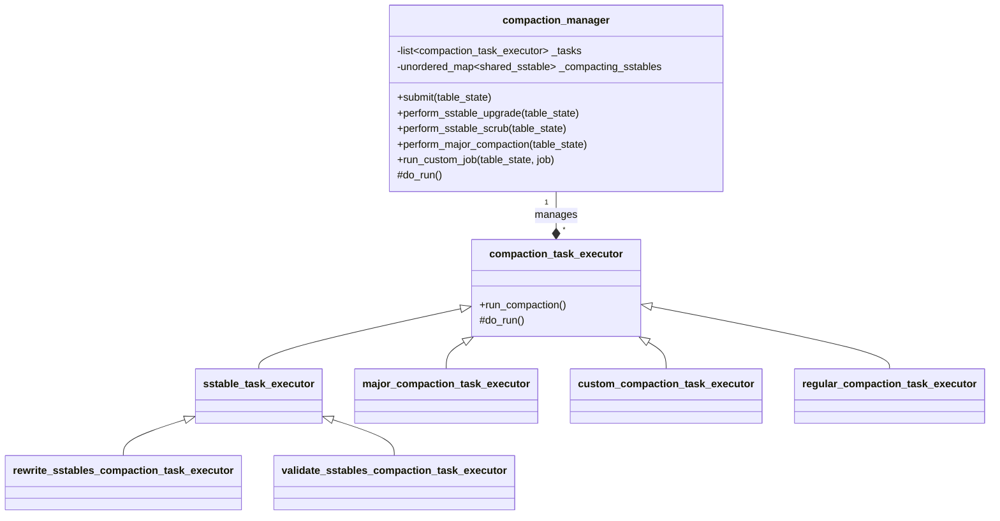
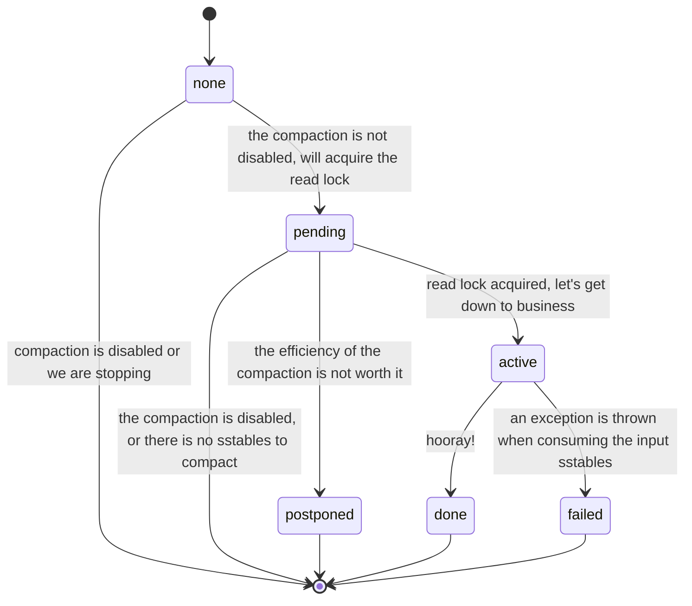

# The Compaction Manager

We model different maintenance operations around SSTables as different kinds of
compaction task executor. What they do is read SSTables, process them and write the
processed version.

`compaction_manager` keeps all the ongoing compaction tasks in its task queue,
so that it is able to check if a certain operation is being performed on
given table.

When a task is about to run, the `compaction_manager` sets its state to `none`:

But the regular compaction is an exception, it repeats the compaction by itself until
nothing is worthy compacting. In other words, it does not finish the compaction when
its state moves to `done` , instead, it moves back to `pending` and check if there
is any sstable to be compacted, and return only if there is no more jobs.
