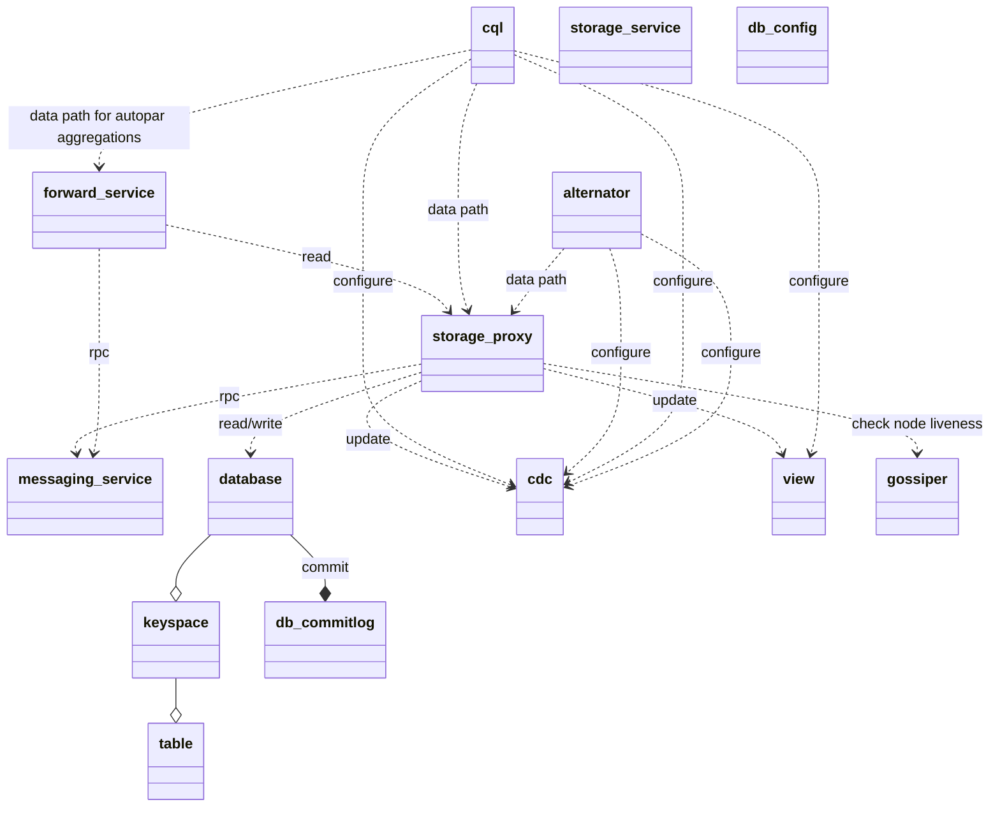

ScyllaDB Module Index
=====================

Following is a rough diagram how the various modules in ScyllaDB interact.

```mermaid
classDiagram

class storage_proxy
class messaging_service
class database
class keyspace
class table
class cql
class cdc
class view
class alternator
class forward_service
class storage_service
class gossiper
class db_config
class db_commitlog

storage_proxy ..> database : read/write
storage_proxy ..> messaging_service : rpc
storage_proxy ..> cdc : update
storage_proxy ..> gossiper: check node liveness
storage_proxy ..> view : update
cql ..> cdc : configure
cql ..> view : configure
alternator ..> cdc : configure
cql ..> forward_service : data path for autopar aggregations
forward_service ..> storage_proxy : read
forward_service ..> messaging_service : rpc
cql ..> storage_proxy : data path
alternator ..> storage_proxy : data path
database --* db_commitlog : commit

cql ..> cdc : configure
alternator ..> cdc : configure

database --o keyspace
keyspace --o table

```
