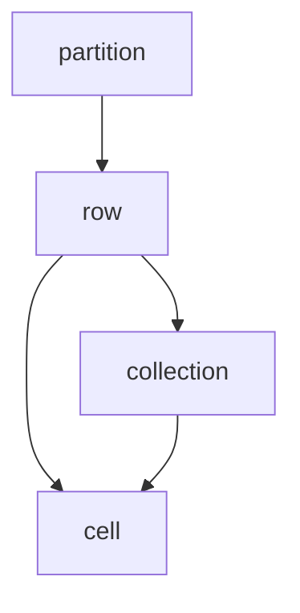
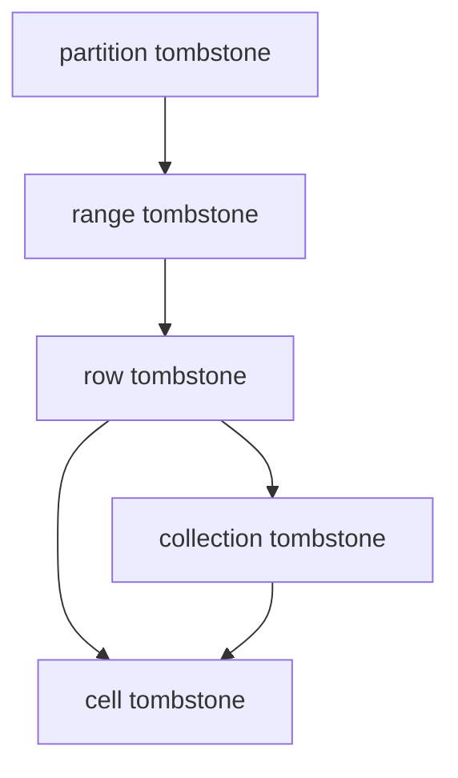

# Tombstones

This document explains what tombstones are, how they used and how they are are created in ScyllaDB.

## Introduction

In an LSM Tree data structure, deleting data directly is not possible.
Instead, deleting a key is translated to a write of a special deletion marker for said key.
When the key and its deletion marker are compacted together, the key and any data it may have is dropped as a result.

In ScyllaDB these deletion markers are called "tombstones".

A tombstone has the following fields:

```c++
struct tombstone {
    api::timestamp_type timestamp;
    gc_clock::time_point deletion_time;
}
```

The `timestamp` field is used to determine whether the tombstone covers some live data.
If `tombstone.timestamp >= live_data.timestamp`, the data is covered by the tombstone and it is considered dead.
In ScyllaDB, every cell has its own timestamp, so this coverage check happens on a cell level.
It is possible that in a given row, some cells are covered, while others are not and they remain live.

The `deletion_time` is used to determine whether the tombstone is eligible for garbage collection.
Once a tombstone was compacted together with *all* data it could possibly cover and therefore all such data was dropped, it is no longer useful and can be garbage collected (dropped).
Tombstone garbage collection involves complex rules, for more details see the [Tombstone Garbage Collection](./tombstone.md#tombstone-garbage-collection) chapter.

## Tombstone Hierarchy

Tombstones and data form a hierarchical structure, where tombstones can cover data on the same level and below, but not above.
The tombstone hierarchy follows the data hierarchy, which looks like this:


Tombstone hierarchy:


Partition tombstones applies to everything in the partition, including the static row.

The range tombstone applies to a clustering range, so it can apply to multiple rows.

Collections have a collection tombstone which applies to all elements in the collection.
Collections members are similar to regular cells, they can be live or dead (cell tombstone).
In the ScyllaDB type system, in addition to the `list`, `set` and `map` collection types, `tuple` and `UDT` are also stored as collections so the same rules apply to them as well.

When determining whether some entity is live or not, one has to consider all tombstones that are above this entity in the tombstone hierarchy.
For example, to determine whether a regular cell is live or not, one has to calculate the following tombstone: `partition tombstone + range tombstone + row tombstone`.
Addition of tombstones is simply choosing the one higher timestamp:
```c++
tombstone operator+(tombstone a, tombstone b) {
    return a.timestamp > b.timestamp ? a : b;
}
```

Missing tombstones (there is no deletion) have the special `timestamp` value of `api::missing_timestamp`, which compares less than any other timestamp value.

## How Are Tombstones Created?

Creating the higher-level tombstones (row or above) is fairly intuitive and involves a `DELETE FROM` statement as one would expect.
But when it comes to cells and collections, tombstones can be created as a result of many different statements.

Given the following table as an example:
```CQL
CREATE TABLE ks.tbl (pk text, ck1 int, ck2 int, v1 int, v2 map<int, int>, PRIMARY KEY (pk, ck1, ck2));
```

Below we will examine how each kind of tombstone can be created with concrete example.
Each example will have a CQL statement which creates the tombstone followed by a [SELECT * FROM MUTATION_FRAGMENTS()](https://opensource.docs.scylladb.com/stable/operating-scylla/admin-tools/select-from-mutation-fragments.html) query showing the created tombstone.

### Partition Tombstone

```CQL
DELETE FROM ks.tbl WHERE pk = 'partition tombstone';

SELECT * from MUTATION_FRAGMENTS(ks.tbl) WHERE pk = 'partition tombstone';

 pk                  | mutation_source | partition_region | ck1 | ck2 | position_weight | metadata                                                                            | mutation_fragment_kind | value
---------------------+-----------------+------------------+-----+-----+-----------------+-------------------------------------------------------------------------------------+------------------------+-------
 partition tombstone |      memtable:0 |                0 |     |     |                 | {"tombstone":{"timestamp":1743054972857790,"deletion_time":"2025-03-27 05:56:12z"}} |        partition start |  null
 partition tombstone |      memtable:0 |                3 |     |     |                 |                                                                                null |          partition end |  null

(2 rows)
```

### Range Tombstone

Delete a range:
```CQL
DELETE FROM ks.tbl WHERE pk = 'range tombstone 1' AND ck1 = 0 AND ck2 > 100 AND ck2 < 200;

SELECT * FROM MUTATION_FRAGMENTS(ks.tbl) WHERE pk = 'range tombstone 1';

 pk                | mutation_source | partition_region | ck1 | ck2 | position_weight | metadata                                                                            | mutation_fragment_kind | value
-------------------+-----------------+------------------+-----+-----+-----------------+-------------------------------------------------------------------------------------+------------------------+-------
 range tombstone 1 |      memtable:0 |                0 |     |     |                 |                                                                    {"tombstone":{}} |        partition start |  null
 range tombstone 1 |      memtable:0 |                2 |   0 | 100 |               1 | {"tombstone":{"timestamp":1743055013006807,"deletion_time":"2025-03-27 05:56:53z"}} | range tombstone change |  null
 range tombstone 1 |      memtable:0 |                2 |   0 | 200 |              -1 |                                                                    {"tombstone":{}} | range tombstone change |  null
 range tombstone 1 |      memtable:0 |                3 |     |     |                 |                                                                                null |          partition end |  null

(4 rows)
```

Delete a prefix -- only a prefix of all the clustering columns is restricted:
```CQL
DELETE FROM ks.tbl WHERE pk = 'range tombstone 2' AND ck1 = 1;

SELECT * FROM MUTATION_FRAGMENTS(ks.tbl) WHERE pk = 'range tombstone 2';

 pk                | mutation_source | partition_region | ck1 | ck2 | position_weight | metadata                                                                            | mutation_fragment_kind | value
-------------------+-----------------+------------------+-----+-----+-----------------+-------------------------------------------------------------------------------------+------------------------+-------
 range tombstone 2 |      memtable:0 |                0 |     |     |                 |                                                                    {"tombstone":{}} |        partition start |  null
 range tombstone 2 |      memtable:0 |                2 |   1 |     |              -1 | {"tombstone":{"timestamp":1743055505954714,"deletion_time":"2025-03-27 06:05:05z"}} | range tombstone change |  null
 range tombstone 2 |      memtable:0 |                2 |   1 |     |               1 |                                                                    {"tombstone":{}} | range tombstone change |  null
 range tombstone 2 |      memtable:0 |                3 |     |     |                 |                                                                                null |          partition end |  null

(4 rows)
```

Internally, range tombstones are represented by so-called "range tombstone change" objects.
There are two such objects: one at the start of the range tombstone (the lower bound key) and one at the end of the range tombstone (the higher bound key).
A range tombstone takes effect between its start and end bounds.
A partition can have any number of range tombstones, but there is always at least two, the starting one and a last one.
The last range tombstone in a partition always has an empty tombstone, this mark the remaining range of the partition as having no range tombstone, or in other words it "resets" the current tombstone.
The range tombstone end object resets the tombstone to the null-tombstone (no deletion).
Despite  every range tombstone having a start and end range tombstone change objects, it is possible for a partition to have an odd number of such objects.
This happens when range tombstones overlap:
```CQL
DELETE FROM ks.tbl WHERE pk = 'range tombstone 3' AND ck1 = 0 AND ck2 > 100 AND ck2 < 200;

DELETE FROM ks.tbl WHERE pk = 'range tombstone 3' AND ck1 = 0 AND ck2 > 150 AND ck2 < 300;

SELECT * FROM MUTATION_FRAGMENTS(ks.tbl) WHERE pk = 'range tombstone 3';

 pk                | mutation_source | partition_region | ck1 | ck2 | position_weight | metadata                                                                            | mutation_fragment_kind | value
-------------------+-----------------+------------------+-----+-----+-----------------+-------------------------------------------------------------------------------------+------------------------+-------
 range tombstone 3 |      memtable:0 |                0 |     |     |                 |                                                                    {"tombstone":{}} |        partition start |  null
 range tombstone 3 |      memtable:0 |                2 |   0 | 100 |               1 | {"tombstone":{"timestamp":1743164183543439,"deletion_time":"2025-03-28 12:16:23z"}} | range tombstone change |  null
 range tombstone 3 |      memtable:0 |                2 |   0 | 150 |               1 | {"tombstone":{"timestamp":1743164186551458,"deletion_time":"2025-03-28 12:16:26z"}} | range tombstone change |  null
 range tombstone 3 |      memtable:0 |                2 |   0 | 300 |              -1 |                                                                    {"tombstone":{}} | range tombstone change |  null
 range tombstone 3 |      memtable:0 |                3 |     |     |                 |                                                                                null |          partition end |  null

(5 rows)
```

In the range [(0, 150), (0, 200)] the two range tombstones overlap, so one of them takes precedence (overwrites the other) -- the later one.

Range tombstone change objects always have a position which is *before* or *after* a certain key, never a position where they are *at* a key.
This becomes evident when looking at the `position_weight` column in the mutation dump.
Range tombstone changes always have a position weight of either `1` or `-1`.
Regular rows always have a position weight of `0`.
Position weight is relevant when comparing two positions which have the same clustering key.
In this case the position weight is the tie-breaker: comparing the position weight of the two respective positions will determine the comparison result.

### Row Tombstone

```CQL
DELETE FROM ks.tbl WHERE pk = 'row tombstone' AND ck1 = 5 AND ck2 = 5;

SELECT * FROM MUTATION_FRAGMENTS(ks.tbl) WHERE pk = 'row tombstone';

 pk            | mutation_source | partition_region | ck1 | ck2 | position_weight | metadata                                                                                                                                                                                      | mutation_fragment_kind | value
---------------+-----------------+------------------+-----+-----+-----------------+-----------------------------------------------------------------------------------------------------------------------------------------------------------------------------------------------+------------------------+-------
 row tombstone |      memtable:0 |                0 |     |     |                 |                                                                                                                                                                              {"tombstone":{}} |        partition start |  null
 row tombstone |      memtable:0 |                2 |   5 |   5 |               0 | {"tombstone":{"timestamp":1743055543508176,"deletion_time":"2025-03-27 06:05:43z"},"shadowable_tombstone":{"timestamp":1743055543508176,"deletion_time":"2025-03-27 06:05:43z"},"columns":{}} |         clustering row |    {}
 row tombstone |      memtable:0 |                3 |     |     |                 |                                                                                                                                                                                          null |          partition end |  null

(3 rows)
```

The row tombstone also has a `shadowable_tombstone` object included in it. More on this in the [Shadowable Tombstone](./tombstone.md#shadowable-tombstone) chapter.

### Regular Cell Tombstone

Delete regular cell with `DELETE` statement:
```CQL
DELETE v1 FROM ks.tbl WHERE pk = 'cell tombstone 1' AND ck1 = 0 AND ck2 = 0;

SELECT * FROM MUTATION_FRAGMENTS(ks.tbl) WHERE pk = 'regular cell tombstone 1';

 pk                       | mutation_source | partition_region | ck1 | ck2 | position_weight | metadata                                                                                                                  | mutation_fragment_kind | value
--------------------------+-----------------+------------------+-----+-----+-----------------+---------------------------------------------------------------------------------------------------------------------------+------------------------+-------------
 regular cell tombstone 1 |      memtable:0 |                0 |     |     |                 |                                                                                                          {"tombstone":{}} |        partition start |        null
 regular cell tombstone 1 |      memtable:0 |                2 |   0 |   0 |               0 | {"columns":{"v1":{"is_live":false,"type":"regular","timestamp":1743056112215870,"deletion_time":"2025-03-27 06:15:12z"}}} |         clustering row | {"v1":null}
 regular cell tombstone 1 |      memtable:0 |                3 |     |     |                 |                                                                                                                      null |          partition end |        null

(3 rows)
```

When it comes to cell tombstones (be that regular or collection cells), there is no longer a separate tombstone object.
Instead, a cell is either live or dead (see `is_live` in the `metadata` column). If `is_live=false`, the cell is a dead cell -- also called a cell tombstone.

Deleting a cell, or setting it to `null` has the same effect.

Delete regular cell with `UPDATE` statement:
```CQL
UPDATE ks.tbl SET v1 = null WHERE pk = 'regular cell tombstone 2' AND ck1 = 0 AND ck2 = 0;

SELECT * FROM MUTATION_FRAGMENTS(ks.tbl) WHERE pk = 'regular cell tombstone 2';

 pk                       | mutation_source | partition_region | ck1 | ck2 | position_weight | metadata                                                                                                                  | mutation_fragment_kind | value
--------------------------+-----------------+------------------+-----+-----+-----------------+---------------------------------------------------------------------------------------------------------------------------+------------------------+-------------
 regular cell tombstone 2 |      memtable:0 |                0 |     |     |                 |                                                                                                          {"tombstone":{}} |        partition start |        null
 regular cell tombstone 2 |      memtable:0 |                2 |   0 |   0 |               0 | {"columns":{"v1":{"is_live":false,"type":"regular","timestamp":1743056276318904,"deletion_time":"2025-03-27 06:17:56z"}}} |         clustering row | {"v1":null}
 regular cell tombstone 2 |      memtable:0 |                3 |     |     |                 |                                                                                                                      null |          partition end |        null

(3 rows)
```

Delete regular cell with `INSERT` statement:
```CQL
INSERT INTO ks.tbl (pk, ck1, ck2, v1) VALUES ('regular cell tombstone 3', 0, 0, null);

SELECT * FROM MUTATION_FRAGMENTS(ks.tbl) WHERE pk = 'regular cell tombstone 3';

 pk                       | mutation_source | partition_region | ck1 | ck2 | position_weight | metadata                                                                                                                                                          | mutation_fragment_kind | value
--------------------------+-----------------+------------------+-----+-----+-----------------+-------------------------------------------------------------------------------------------------------------------------------------------------------------------+------------------------+-------------
 regular cell tombstone 3 |      memtable:0 |                0 |     |     |                 |                                                                                                                                                  {"tombstone":{}} |        partition start |        null
 regular cell tombstone 3 |      memtable:0 |                2 |   0 |   0 |               0 | {"marker":{"timestamp":1743056345463644},"columns":{"v1":{"is_live":false,"type":"regular","timestamp":1743056345463644,"deletion_time":"2025-03-27 06:19:05z"}}} |         clustering row | {"v1":null}
 regular cell tombstone 3 |      memtable:0 |                3 |     |     |                 |                                                                                                                                                              null |          partition end |        null

(3 rows)
```

### Collection Tombstone

Delete collection with `DELETE` statement:
```CQL
DELETE v2 FROM ks.tbl WHERE pk = 'collection tombstone 1' AND ck1 = 0 AND ck2 = 0;

SELECT * FROM MUTATION_FRAGMENTS(ks.tbl) WHERE pk = 'collection tombstone 1';

 pk                     | mutation_source | partition_region | ck1 | ck2 | position_weight | metadata                                                                                                          | mutation_fragment_kind | value
------------------------+-----------------+------------------+-----+-----+-----------------+-------------------------------------------------------------------------------------------------------------------+------------------------+-----------
 collection tombstone 1 |      memtable:0 |                0 |     |     |                 |                                                                                                  {"tombstone":{}} |        partition start |      null
 collection tombstone 1 |      memtable:0 |                2 |   0 |   0 |               0 | {"columns":{"v2":{"tombstone":{"timestamp":1743056564590040,"deletion_time":"2025-03-27 06:22:44z"},"cells":[]}}} |         clustering row | {"v2":[]}
 collection tombstone 1 |      memtable:0 |                3 |     |     |                 |                                                                                                              null |          partition end |      null

(3 rows)
```

Setting the collection to `null` has the same effect, just like for regular cells.

Delete collection with `UPDATE` statement:
```CQL
UPDATE ks.tbl SET v2 = null WHERE pk = 'collection tombstone 2' AND ck1 = 0 AND ck2 = 0;

SELECT * FROM MUTATION_FRAGMENTS(ks.tbl) WHERE pk = 'collection tombstone 2';

 pk                     | mutation_source | partition_region | ck1 | ck2 | position_weight | metadata                                                                                                          | mutation_fragment_kind | value
------------------------+-----------------+------------------+-----+-----+-----------------+-------------------------------------------------------------------------------------------------------------------+------------------------+-----------
 collection tombstone 2 |      memtable:0 |                0 |     |     |                 |                                                                                                  {"tombstone":{}} |        partition start |      null
 collection tombstone 2 |      memtable:0 |                2 |   0 |   0 |               0 | {"columns":{"v2":{"tombstone":{"timestamp":1743056668558340,"deletion_time":"2025-03-27 06:24:28z"},"cells":[]}}} |         clustering row | {"v2":[]}
 collection tombstone 2 |      memtable:0 |                3 |     |     |                 |                                                                                                              null |          partition end |      null

(3 rows)
```

Delete collection with `INSERT` statement:
```CQL
INSERT INTO ks.tbl (pk, ck1, ck2, v2) VALUES ('collection tombstone 3', 0, 0, null);

SELECT * FROM MUTATION_FRAGMENTS(ks.tbl) WHERE pk = 'collection tombstone 3';

 pk                     | mutation_source | partition_region | ck1 | ck2 | position_weight | metadata                                                                                                                                                  | mutation_fragment_kind | value
------------------------+-----------------+------------------+-----+-----+-----------------+-----------------------------------------------------------------------------------------------------------------------------------------------------------+------------------------+-----------
 collection tombstone 3 |      memtable:0 |                0 |     |     |                 |                                                                                                                                          {"tombstone":{}} |        partition start |      null
 collection tombstone 3 |      memtable:0 |                2 |   0 |   0 |               0 | {"marker":{"timestamp":1743056946866432},"columns":{"v2":{"tombstone":{"timestamp":1743056946866431,"deletion_time":"2025-03-27 06:29:06z"},"cells":[]}}} |         clustering row | {"v2":[]}
 collection tombstone 3 |      memtable:0 |                3 |     |     |                 |                                                                                                                                                      null |          partition end |      null

(3 rows)
```

Collection tombstones are also generated when a collection is fully overwritten.

Collection tombstone generated by full overwrite, using the `UPDATE` statement:
```CQL
UPDATE ks.tbl SET v2 = {1: 12, 2: 44} WHERE pk = 'collection tombstone 4' AND ck1 = 0 AND ck2 = 0;

SELECT * FROM MUTATION_FRAGMENTS(ks.tbl) WHERE pk = 'collection tombstone 4';

 pk                     | mutation_source | partition_region | ck1 | ck2 | position_weight | metadata                                                                                                                                                                                                                                                                               | mutation_fragment_kind | value
------------------------+-----------------+------------------+-----+-----+-----------------+----------------------------------------------------------------------------------------------------------------------------------------------------------------------------------------------------------------------------------------------------------------------------------------+------------------------+------------------------------------------------------------
 collection tombstone 4 |      memtable:0 |                0 |     |     |                 |                                                                                                                                                                                                                                                                       {"tombstone":{}} |        partition start |                                                       null
 collection tombstone 4 |      memtable:0 |                2 |   0 |   0 |               0 | {"columns":{"v2":{"tombstone":{"timestamp":1743057841587097,"deletion_time":"2025-03-27 06:44:01z"},"cells":[{"key":"1","value":{"is_live":true,"type":"regular","timestamp":1743057841587098}},{"key":"2","value":{"is_live":true,"type":"regular","timestamp":1743057841587098}}]}}} |         clustering row | {"v2":[{"key":"1","value":"12"},{"key":"2","value":"44"}]}
 collection tombstone 4 |      memtable:0 |                3 |     |     |                 |                                                                                                                                                                                                                                                                                   null |          partition end |                                                       null

(3 rows)
```

Collection tombstone generated by full overwrite, using the `INSERT` statement:
```CQL
INSERT INTO ks.tbl (pk, ck1, ck2, v2) VALUES ('collection tombstone 5', 0, 0, {1: 12, 2: 44});

SELECT * FROM MUTATION_FRAGMENTS(ks.tbl) WHERE pk = 'collection tombstone 5';

 pk                     | mutation_source | partition_region | ck1 | ck2 | position_weight | metadata                                                                                                                                                                                                                                                                                                                       | mutation_fragment_kind | value
------------------------+-----------------+------------------+-----+-----+-----------------+--------------------------------------------------------------------------------------------------------------------------------------------------------------------------------------------------------------------------------------------------------------------------------------------------------------------------------+------------------------+------------------------------------------------------------
 collection tombstone 5 |      memtable:0 |                0 |     |     |                 |                                                                                                                                                                                                                                                                                                               {"tombstone":{}} |        partition start |                                                       null
 collection tombstone 5 |      memtable:0 |                2 |   0 |   0 |               0 | {"marker":{"timestamp":1743057913516603},"columns":{"v2":{"tombstone":{"timestamp":1743057913516602,"deletion_time":"2025-03-27 06:45:13z"},"cells":[{"key":"1","value":{"is_live":true,"type":"regular","timestamp":1743057913516603}},{"key":"2","value":{"is_live":true,"type":"regular","timestamp":1743057913516603}}]}}} |         clustering row | {"v2":[{"key":"1","value":"12"},{"key":"2","value":"44"}]}
 collection tombstone 5 |      memtable:0 |                3 |     |     |                 |                                                                                                                                                                                                                                                                                                                           null |          partition end |                                                       null

(3 rows)
```

### Collection Cell Tombstone

Collection cell tombstone behave like regular cell tombstones for the most part.

Delete collection cell with `DELETE` statement:
```CQL
DELETE v2[1] FROM ks.tbl WHERE pk = 'collection cell tombstone 1' AND ck1 = 0 AND ck2 = 0;

SELECT * FROM MUTATION_FRAGMENTS(ks.tbl) WHERE pk = 'collection cell tombstone 1';

 pk                          | mutation_source | partition_region | ck1 | ck2 | position_weight | metadata                                                                                                                                                  | mutation_fragment_kind | value
-----------------------------+-----------------+------------------+-----+-----+-----------------+-----------------------------------------------------------------------------------------------------------------------------------------------------------+------------------------+-----------------------------------
 collection cell tombstone 1 |      memtable:0 |                0 |     |     |                 |                                                                                                                                          {"tombstone":{}} |        partition start |                              null
 collection cell tombstone 1 |      memtable:0 |                2 |   0 |   0 |               0 | {"columns":{"v2":{"cells":[{"key":"1","value":{"is_live":false,"type":"regular","timestamp":1743057941371233,"deletion_time":"2025-03-27 06:45:41z"}}]}}} |         clustering row | {"v2":[{"key":"1","value":null}]}
 collection cell tombstone 1 |      memtable:0 |                3 |     |     |                 |                                                                                                                                                      null |          partition end |                              null

(3 rows)
```

Delete collection cell with `UPDATE` statement:
```CQL
UPDATE ks.tbl SET v2[1] = null WHERE pk = 'regular cell tombstone 2' AND ck1 = 0 AND ck2 = 0;

SELECT * FROM MUTATION_FRAGMENTS(ks.tbl) WHERE pk = 'collection cell tombstone 2';

 pk                          | mutation_source | partition_region | ck1 | ck2 | position_weight | metadata                                                                                                                                                  | mutation_fragment_kind | value
-----------------------------+-----------------+------------------+-----+-----+-----------------+-----------------------------------------------------------------------------------------------------------------------------------------------------------+------------------------+-----------------------------------
 collection cell tombstone 2 |      memtable:0 |                0 |     |     |                 |                                                                                                                                          {"tombstone":{}} |        partition start |                              null
 collection cell tombstone 2 |      memtable:0 |                2 |   0 |   0 |               0 | {"columns":{"v2":{"cells":[{"key":"1","value":{"is_live":false,"type":"regular","timestamp":1743058010855333,"deletion_time":"2025-03-27 06:46:50z"}}]}}} |         clustering row | {"v2":[{"key":"1","value":null}]}
 collection cell tombstone 2 |      memtable:0 |                3 |     |     |                 |                                                                                                                                                      null |          partition end |                              null

(3 rows)
```

Individual collection cells cannot be deleted (or overwritten) by `INSERT` statement.

## TTL and Tombstones

Cells which have [TTL](https://opensource.docs.scylladb.com/stable/cql/time-to-live.html) become cell tombstones after they expire.

```CQL
INSERT INTO ks.tbl (pk, ck1, ck2, v1) VALUES ('expired cell', 0, 0, 1) USING TTL 1;

SELECT * FROM MUTATION_FRAGMENTS(ks.tbl) WHERE pk = 'expired cell';

 pk           | mutation_source | partition_region | ck1 | ck2 | position_weight | metadata                                                                                                                                                                                                        | mutation_fragment_kind | value
--------------+-----------------+------------------+-----+-----+-----------------+-----------------------------------------------------------------------------------------------------------------------------------------------------------------------------------------------------------------+------------------------+------------
 expired cell |      memtable:0 |                0 |     |     |                 |                                                                                                                                                                                                {"tombstone":{}} |        partition start |       null
 expired cell |      memtable:0 |                2 |   0 |   0 |               0 | {"marker":{"timestamp":1743058565262883,"ttl":"1s","expiry":"2025-03-27 06:56:06z"},"columns":{"v1":{"is_live":true,"type":"regular","timestamp":1743058565262883,"ttl":"1s","expiry":"2025-03-27 06:56:06z"}}} |         clustering row | {"v1":"1"}
 expired cell |      memtable:0 |                3 |     |     |                 |                                                                                                                                                                                                            null |          partition end |       null

(3 rows)
```

Even though the cell has already expired, it still appears as live, because expired cells are converted to cell tombstones by compaction.
To determine whether an expired cell is really live or not, one has to look at the `expiry` and compare it with the current time.
If `expiry <= now()`, the cell is expired and it will be treated as a dead cell by compaction.

Reads also compact the data, so if we read this partition, the cell will not show up in the results:
```CQL
SELECT * FROM ks.tbl WHERE pk = 'expired cell';

 pk | ck1 | ck2 | v1 | v2
----+-----+-----+----+----

(0 rows)
```

After flushing and compacting the table, the expired cell is now converted to a cell tombstone:
```CQL
SELECT * FROM MUTATION_FRAGMENTS(ks.tbl) WHERE pk = 'expired cell';

 pk           | mutation_source                                                                                                  | partition_region | ck1 | ck2 | position_weight | metadata                                                                                                                                                          | mutation_fragment_kind | value
--------------+------------------------------------------------------------------------------------------------------------------+------------------+-----+-----+-----------------+-------------------------------------------------------------------------------------------------------------------------------------------------------------------+------------------------+-------------
 expired cell | sstable:/var/lib/scylla/data/ks/tbl-b0f65c600ad611f0811d8550c417dfcd/me-3gox_0jgn_1gq5c20k31rxg89le0-big-Data.db |                0 |     |     |                 |                                                                                                                                                  {"tombstone":{}} |        partition start |        null
 expired cell | sstable:/var/lib/scylla/data/ks/tbl-b0f65c600ad611f0811d8550c417dfcd/me-3gox_0jgn_1gq5c20k31rxg89le0-big-Data.db |                2 |   0 |   0 |               0 | {"marker":{"timestamp":1743058565262883},"columns":{"v1":{"is_live":false,"type":"regular","timestamp":1743058565262883,"deletion_time":"2025-03-27 06:56:05z"}}} |         clustering row | {"v1":null}
 expired cell | sstable:/var/lib/scylla/data/ks/tbl-b0f65c600ad611f0811d8550c417dfcd/me-3gox_0jgn_1gq5c20k31rxg89le0-big-Data.db |                3 |     |     |                 |                                                                                                                                                              null |          partition end |        null

(3 rows)
```

## Row Marker

The row marker is an object that is part of a the row.
It stores no data, but it has a timestamp, it can have a TTL and it also interacts with tombstones, just like data.
Row markers are considered when determining whether a row is empty: a row is considered non-empty when it has no cells, but it has a live row marker.
Such rows will show up in `SELECT` statement results as empty rows, with only key columns having values.
The row marker has a special interaction with the [shadowable tombstone](./tombstone.md#shadowable-tombstone).
This special interaction will be examined in detail in the next chapter.

Row markers are created by `INSERT` statements:
```CQL
INSERT INTO ks.tbl (pk, ck1, ck2, v1) VALUES ('row marker 1', 0, 0, 1);

SELECT * FROM MUTATION_FRAGMENTS(ks.tbl) WHERE pk = 'row marker 1';

 pk           | mutation_source | partition_region | ck1 | ck2 | position_weight | metadata                                                                                                                  | mutation_fragment_kind | value
--------------+-----------------+------------------+-----+-----+-----------------+---------------------------------------------------------------------------------------------------------------------------+------------------------+------------
 row marker 1 |      memtable:0 |                0 |     |     |                 |                                                                                                          {"tombstone":{}} |        partition start |       null
 row marker 1 |      memtable:0 |                2 |   0 |   0 |               0 | {"marker":{"timestamp":1743060450523155},"columns":{"v1":{"is_live":true,"type":"regular","timestamp":1743060450523155}}} |         clustering row | {"v1":"1"}
 row marker 1 |      memtable:0 |                3 |     |     |                 |                                                                                                                      null |          partition end |       null

(3 rows)
```

Specifying only the key columns in the `INSERT` statement will only create a row marker, but no content for the row:
```CQL
INSERT INTO ks.tbl (pk, ck1, ck2) VALUES ('row marker 2', 0, 0);
SELECT * FROM MUTATION_FRAGMENTS(ks.tbl) WHERE pk = 'row marker 2';

 pk           | mutation_source | partition_region | ck1 | ck2 | position_weight | metadata                                               | mutation_fragment_kind | value
--------------+-----------------+------------------+-----+-----+-----------------+--------------------------------------------------------+------------------------+-------
 row marker 2 |      memtable:0 |                0 |     |     |                 |                                       {"tombstone":{}} |        partition start |  null
 row marker 2 |      memtable:0 |                2 |   0 |   0 |               0 | {"marker":{"timestamp":1743060548534072},"columns":{}} |         clustering row |    {}
 row marker 2 |      memtable:0 |                3 |     |     |                 |                                                   null |          partition end |  null

(3 rows)
```

Such a row will appear as an empty row with only the keys having value:
```CQL
SELECT * FROM ks.tbl WHERE pk = 'row marker 2';

 pk           | ck1 | ck2 | v1   | v2
--------------+-----+-----+------+------
 row marker 2 |   0 |   0 | null | null

(1 rows)
```

The `UPDATE` statement doesn't create row markers:
```CQL
UPDATE ks.tbl SET v1 = 1 WHERE pk = 'no row marker' AND ck1 = 0 AND ck2 = 0;
SELECT * FROM MUTATION_FRAGMENTS(ks.tbl) WHERE pk = 'no row marker';

 pk            | mutation_source | partition_region | ck1 | ck2 | position_weight | metadata                                                                          | mutation_fragment_kind | value
---------------+-----------------+------------------+-----+-----+-----------------+-----------------------------------------------------------------------------------+------------------------+------------
 no row marker |      memtable:0 |                0 |     |     |                 |                                                                  {"tombstone":{}} |        partition start |       null
 no row marker |      memtable:0 |                2 |   0 |   0 |               0 | {"columns":{"v1":{"is_live":true,"type":"regular","timestamp":1743060161838151}}} |         clustering row | {"v1":"1"}
 no row marker |      memtable:0 |                3 |     |     |                 |                                                                              null |          partition end |       null

(3 rows)
```

Deleting a row with a row marker will remove the row marker completely:
```CQL
DELETE FROM ks.tbl WHERE pk = 'row marker 2' AND ck1 = 0 AND ck2 = 0;

SELECT * FROM MUTATION_FRAGMENTS(ks.tbl) WHERE pk = 'row marker 2';

 pk           | mutation_source | partition_region | ck1 | ck2 | position_weight | metadata                                                                                                                                                                                      | mutation_fragment_kind | value
--------------+-----------------+------------------+-----+-----+-----------------+-----------------------------------------------------------------------------------------------------------------------------------------------------------------------------------------------+------------------------+-------
 row marker 2 |      memtable:0 |                0 |     |     |                 |                                                                                                                                                                              {"tombstone":{}} |        partition start |  null
 row marker 2 |      memtable:0 |                2 |   0 |   0 |               0 | {"tombstone":{"timestamp":1743060872181113,"deletion_time":"2025-03-27 07:34:32z"},"shadowable_tombstone":{"timestamp":1743060872181113,"deletion_time":"2025-03-27 07:34:32z"},"columns":{}} |         clustering row |    {}
 row marker 2 |      memtable:0 |                3 |     |     |                 |                                                                                                                                                                                          null |          partition end |  null

(3 rows)

SELECT * FROM ks.tbl WHERE pk = 'row marker 2';

 pk | ck1 | ck2 | v1 | v2
----+-----+-----+----+----

(0 rows)
```

## Shadowable Tombstone

The shadowable tombstone is a special tombstone that is used by [materialized views](https://opensource.docs.scylladb.com/stable/features/materialized-views.html).
Just like the regular row tombstone, it applies to the content of the row, but it has a special interaction with the [row marker](./tombstone.md#row-marker).
The shadowable tombstone can be covered by row markers.
In other words: when a row has both a row marker and a shadowable tombstone and `row_marker.timestamp > shadowable_tombstone.timestamp`, the row marker covers the shadowable tombstone and the latter is dropped, just like data covered by tombstones are dropped.

Notice that in the [row tombstone](./tombstone.md#row-tombstone) and other examples, whenever the row has an active tombstone, it also has a `shadowable_tombstone` object.
This is to keep things simple internally: the final row tombstone is always calculated as `row_tombstone + shadowable_tombstone`. Normally, the timestamp of the two matches -- the shadowable tombstone is not set separately.

Shadowable tombstones cannot be created directly via CQL, they are only created by materialized view updates.

Given the following materialized view, created on the tombstone example table:
```CQL
CREATE MATERIALIZED VIEW ks.mv AS SELECT * FROM ks.tbl WHERE v1 IS NOT NULL AND ck1 IS NOT NULL AND ck2 IS NOT NULL PRIMARY KEY (pk, v1, ck1, ck2);
```

Inserting a row to the base table will create a corresponding entry in the materialized view:
```CQL
INSERT INTO ks.tbl (pk, ck1, ck2, v1) VALUES ('shadowable tombstone', 0, 0, 1);

SELECT * FROM MUTATION_FRAGMENTS(ks.mv) WHERE pk = 'shadowable tombstone';

 pk                   | mutation_source | partition_region | v1 | ck1 | ck2 | position_weight | metadata                                               | mutation_fragment_kind | value
----------------------+-----------------+------------------+----+-----+-----+-----------------+--------------------------------------------------------+------------------------+-------
 shadowable tombstone |      memtable:0 |                0 |    |     |     |                 |                                       {"tombstone":{}} |        partition start |  null
 shadowable tombstone |      memtable:0 |                2 |  1 |   0 |   0 |               0 | {"marker":{"timestamp":1743061930471880},"columns":{}} |         clustering row |    {}
 shadowable tombstone |      memtable:0 |                3 |    |     |     |                 |                                                   null |          partition end |  null

(3 rows)
```

When changing the value of `v1` in the base table row, the materialized view has to first delete the old instance of the view row and then insert a new one.
The old instance with the now non-existent `v1=1` key is deleted with a shadowable tombstone:
```CQL
INSERT INTO ks.tbl (pk, ck1, ck2, v1) VALUES ('shadowable tombstone', 0, 0, 2);

SELECT * FROM MUTATION_FRAGMENTS(ks.mv) WHERE pk = 'shadowable tombstone';

 pk                   | mutation_source | partition_region | v1 | ck1 | ck2 | position_weight | metadata                                                                                                                                                           | mutation_fragment_kind | value
----------------------+-----------------+------------------+----+-----+-----+-----------------+--------------------------------------------------------------------------------------------------------------------------------------------------------------------+------------------------+-------
 shadowable tombstone |      memtable:0 |                0 |    |     |     |                 |                                                                                                                                                   {"tombstone":{}} |        partition start |  null
 shadowable tombstone |      memtable:0 |                2 |  1 |   0 |   0 |               0 | {"tombstone":{},"shadowable_tombstone":{"timestamp":1743061930471880,"deletion_time":"2025-03-27 07:53:00z"},"marker":{"timestamp":1743061930471880},"columns":{}} |         clustering row |    {}
 shadowable tombstone |      memtable:0 |                2 |  2 |   0 |   0 |               0 |                                                                                                             {"marker":{"timestamp":1743061980019472},"columns":{}} |         clustering row |    {}
 shadowable tombstone |      memtable:0 |                3 |    |     |     |                 |                                                                                                                                                               null |          partition end |  null

(4 rows)
```

Note how the regular row tombstone is `null` and only the shadowable tombstone is active.

Re-inserting `v1=1` into the base-row will now delete the `v1=2` instance of the row with a shadowable tombstone and it will insert a new `v1=1` row into the view, with a fresh row marker, which eliminates the previously inserted shadowable tombstone:
```CQL
INSERT INTO ks.tbl (pk, ck1, ck2, v1) VALUES ('shadowable tombstone', 0, 0, 1);

SELECT * FROM MUTATION_FRAGMENTS(ks.mv) WHERE pk = 'shadowable tombstone';

 pk                   | mutation_source | partition_region | v1 | ck1 | ck2 | position_weight | metadata                                                                                                                                                           | mutation_fragment_kind | value
----------------------+-----------------+------------------+----+-----+-----+-----------------+--------------------------------------------------------------------------------------------------------------------------------------------------------------------+------------------------+-------
 shadowable tombstone |      memtable:0 |                0 |    |     |     |                 |                                                                                                                                                   {"tombstone":{}} |        partition start |  null
 shadowable tombstone |      memtable:0 |                2 |  1 |   0 |   0 |               0 |                                                                                                             {"marker":{"timestamp":1743062162754870},"columns":{}} |         clustering row |    {}
 shadowable tombstone |      memtable:0 |                2 |  2 |   0 |   0 |               0 | {"tombstone":{},"shadowable_tombstone":{"timestamp":1743061980019472,"deletion_time":"2025-03-27 07:56:02z"},"marker":{"timestamp":1743061980019472},"columns":{}} |         clustering row |    {}
 shadowable tombstone |      memtable:0 |                3 |    |     |     |                 |                                                                                                                                                               null |          partition end |  null

(4 rows)
```

This special interaction of the shadowable tombstone and the row marker is important because view rows use the base-row's timestamps.
So when inserting a new row into the view, it can use old timestamps.
Having a regular row tombstone around, from a previous key change, could accidentally delete content from this newly inserted row.
So by having the row marker override the shadowable tombstone, we have a way to "undo" past deletions and "resurrect" old instances of a view row.

## Tombstone Garbage Collection

Tombstones are only valuable as long as there exists data that they cover.
After compaction has merged all instances of the covered data with the tombstone, the tombstone stops being useful.
It is now garbage and ScyllaDB wants to get rid of it. This is called tombstone garbage collection (tombstone GC in short) or tombstone purging.
Garbage collecting a tombstone can cause data resurrection if not done properly:
* If data still exists on the local replica, which the tombstone covers, this data will be resurrected if the tombstone is garbage collected before the tombstone could take effect on it.
* Some other replica in the cluster may have missed the delete, if the tombstone is garbage collected before a repair could propagate it to such replicas, these replicas will resurrect the data.

Data resurrection means that some data that was deleted by the user, reappears again later, as if it wasn't deleted.
Data resurrection is considered a serious failure of the database, as serious as data loss.

Based on the two different ways improper tombstone garbage collection can cause data resurrection, there are two conditions that have to be fulfilled for a tombstone to become eligible for garbage collection:
1) The database have to make sure the tombstone was compacted together with **all** data it covers and that all such data was consequently dropped. In other words, there is no data entity such that `entity.timestamp <= tombstone.timestamp`.
2) The tombstone was replicated to **all** replicas for the partition it is part of. In other words, in a table with RF=N, all N replicas have seen this tombstone and applied it to their data.

Once these two conditions are met, the tombstone is eligible for garbage collection and can be purged (dropped).

### Overlap Check

To ensure the condition (1), compaction does so-called "overlap checks" for every tombstone. The overlap check is done per partition: the result of the overlap check for a given partition is applied to all tombstones in this partition.
An overlap check consists of checking every other data source, getting the smallest timestamp of live data they have for they checked partition.
Once this `min_timestamp` is obtained from all other data sources, the smallest of these is used to compare it against the timestamp of tombstones in this partition.
A tombstone is considered to have passed the overlap check, if `min_timestamp > tombstone.timestamp`.
In other words, we know that **all** data in **all** other data sources only have data which is not covered by this tombstone -- because they have higher timestamps.

In ScyllaDB the following data sources exists:
* SSTable(s)
* Row Cache
* Memtable(s)
* Commitlog

When compacting in any of the data sources, overlap checks have to be done against all other data sources.
Furthermore, when compacting an SSTable, overlap checks have to be done against other SSTables that don't participate in the current compaction.
There is one exception here: the row cache represents the content of the SSTables, so when compacting the cache, no overlap checks are required against SSTables.

### Expiry

To ensure condition (2), ScyllaDB uses the `deletion_time` field of tombstones, which is a wall-clock time of when the tombstone was written.
This deletion time is used to check whether enough time has passed for this tombstone to be considered safe to garbage collect, or in other words, whether it has "expired".
For tombstones which are created from TTL'd data, the `deletion_time` is the time the TTL'd data was written, not the time when the data expired.
This is because the TTL'd data can start to be replicated in the cluster as soon as it is written in live TTL'd form already.

There are different methods to check whether a tombstone is "old enough" to be considered expired.

The most advanced method involves keeping a record of repairs.
When a tombstone is considered for garbage collection, the time of the last repair is obtained from this record.
This happens on a partition granularity.
This last repair time is then used to determine whether the tombstone is eligible for garbage collection: if the tombstone was written *before* the last repair, it is considered eligible for garbage collection.

A much simpler method, the one used historically by both Apache Cassandra and ScyllaDB, is a simple timeout based one.
Each table has `gc_grace_seconds` table attribute, which is a fixed time window, during which the user is expected to perform at least one full repair.
For example, with a `gc_grace_seconds=864000` (10 days), it is assumed that the user repaired their cluster thoroughly at least once, so that any tombstone that is 10 days old is guaranteed to have been propagated to all replicas already.
In this system, the elibility for garbage collection of a tombstone is simply checking that it is at least `gc_grace_seconds` old. If so, it is considered expired.

See [Tombstones GC options](https://opensource.docs.scylladb.com/stable/cql/ddl.html#tombstones-gc-options) for more details on different modes of expiry.

### Overlap Check Elision

This is an optimization designed to allow the row cache to garbage collect some tombstones that overlap with live data in the memtable.
Some workloads will result in the memtable receiving new writes with timestamps from the past. These past timestamp will overlap with the timestamps of tombstones in the row cache, preventing the cache from garbage collecting these tombstones. As a result, the row cache will accumulate tombstones, increasing the latencies of reads.
One such workload is Materialized Views, which reuses past timestamps to resurrect rows that were previously deleted with a [shadowable tombstone](./tombstone.md#shadowable-tombstone). A single such row, with an old timestamp, can prevent all tombstone garbage collection in the partition it lives in, as all later tombstones will overlap with it.
Once [expired](./tombstone.md#expiry), a tombstone is known not cover any writes, new or old. If a write is known to originate from a time when a tombstone was already expired, it is safe to assume that the tombstone will not overlap with this write logically, even if the timestamps do overlap.
Using this knowledge, ScyllaDB can elide the overlap check with a data source, if all writes contained therein are known to originate from a time when the tombstone was already expired.
To make use of this, memtables now store a logical *expiry threshold*, which is a snapshot of the tombstone expiry state at the time the memtable was created.
Using this, we can later check if a given tombstone was already expired at the time the memtable was created. If yes, the tombstone's garbage collection can elide the overlap check with this memtable.
