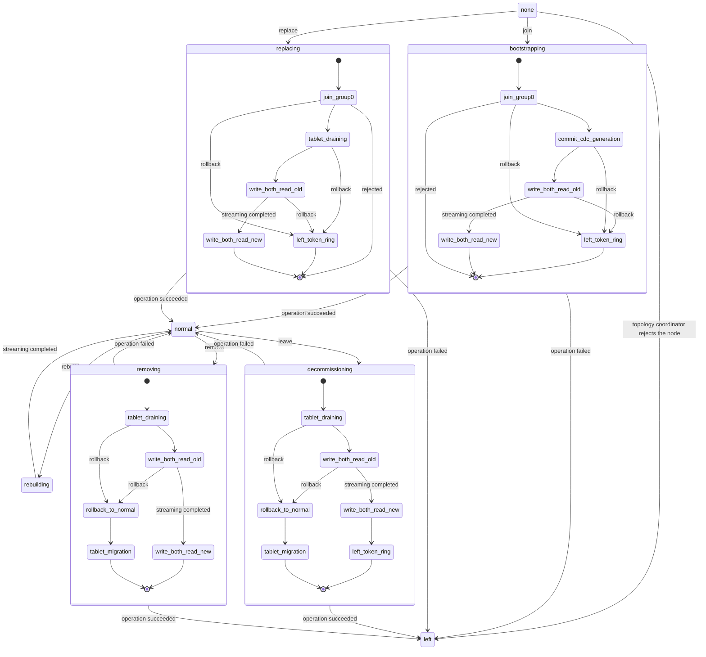
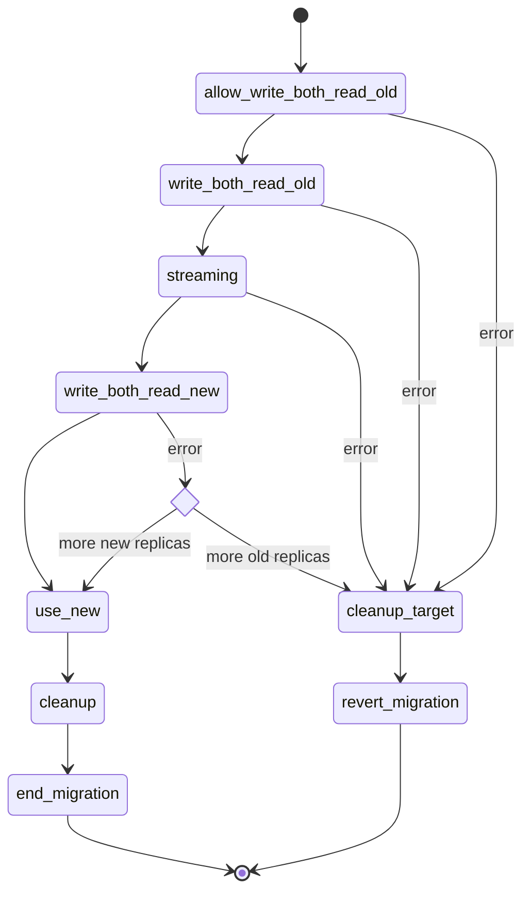

# Topology state machine

The topology state machine tracks all the nodes in a cluster,
their state, properties (topology, tokens, etc) and requested actions.

Node state can be one of those:
- `none`             - the new node joined group0 but did not bootstrapped yet (has no tokens and data to serve)
- `bootstrapping`    - the node is currently in the process of streaming its part of the ring
- `decommissioning`  - the node is being decommissioned and stream its data to nodes that took over
- `removing`         - the node is being removed and its data is streamed to nodes that took over from still alive owners
- `replacing`        - the node replaces another dead node in the cluster and it data is being streamed to it
- `rebuilding`       - the node is being rebuild and is streaming data from other replicas
- `normal`           - the node does not do any streaming and serves the slice of the ring that belongs to it
- `left`             - the node left the cluster and group0

Nodes in state left are never removed from the state.

Nodes in state `left` may still appear as tablet replicas in host_id-based replica sets
(`effective_replication_map::get_replicas()`), but they never appear in IP-based replica sets, e.g. those returned by
`effective_replication_map::get_natural_endpoints()`.

State transition diagram for nodes:



A node state may have additional parameters associated with it. For instance
'replacing' state has host id of a node been replaced as a parameter.

Additionally to specific node states, there entire topology can also be in a transitioning state:

- `commit_cdc_generation` - a new CDC generation data was written to internal tables earlier
    and now we need to commit the generation - create a timestamp for it and tell every node
    to start using it for CDC log table writes.
- `write_both_read_old` - one of the nodes is in a bootstrapping/decommissioning/removing/replacing state.
    Writes are going to both new and old replicas (new replicas means calculated according to modified
    token ring), reads are using old replicas.
- `write_both_read_new` - as above, but reads are using new replicas.
- `left_token_ring` - the decommissioning node left the token ring, but we still need to wait until other
    nodes observe it and stop sending writes to this node. Then, we tell the node to shut down and remove
    it from group 0. We also use this state to rollback a failed bootstrap or decommission.
- `rollback_to_normal` - the decommission or removenode operation failed. Rollback the operation by
    moving the node we tried to decommission/remove back to the normal state.

When a node bootstraps, we create new tokens for it and a new CDC generation
and enter the `commit_cdc_generation` state. Once the generation is committed,
we enter `write_both_read_old` state. After the entire cluster learns about it,
streaming starts. When streaming finishes, we move to `write_both_read_new`
state and again the whole cluster needs to learn about it and make sure that no
reads that started before this point exist in the system. Finally we remove the
transitioning state.

Decommission, removenode and replace work similarly, except they don't go through
`commit_cdc_generation`.

The state machine may also go only through the `commit_cdc_generation` state
after getting a request from the user to create a new CDC generation if the
current one is suboptimal (e.g. after a decommission).

Committed CDC generations are continually published to user-facing description
tables. This process is concurrent with the topology state transitioning and
does not block its further progress.

The state machine also maintains a map of topology requests per node.
When a request is issued to a node the entry is added to the map. A
request is one of the topology operation currently supported: `join`,
`leave`, `replace`, `remove` and `rebuild`. A request may also have parameters
associated with it which are also stored in a separate map.

Note that some nodes may require work but the topology as a whole does not
transition. An example of this is the `rebuilding` state which does not change
the topology but requires streaming data.

Separately from the per-node requests, there is also a 'global' request field
for operations that don't affect any specific node but the entire cluster,
such as `check_and_repair_cdc_streams`.

# Load balancing

If there is no work for the state machine, tablet load balancer is invoked to
check if we need to rebalance. If so, it computes an incremental tablet migration
plan, persists it by moving tablets into transitional states, and moves the state machine
into the tablet migration track. All this happens atomically from the perspective
of group0 state machine.

The tablet migration track also invokes the load balancer and starts new migrations
to keep the cluster saturated with streaming. The load balancer is invoked
on transition of tablet stages, and also continuously as long as it generates
new migrations.

If there is a pending topology change request during tablet migration track,
the load balancer will not be invoked to allow for current migrations to drain,
after which the state machine will exit the tablet migration track and allow pending topology
operation to start.

The tablet migration track excludes with other topology changes, so node operations
will have to wait for tablet migration track to finish before they can take over
the state machine.

The reason why the load balancer is part of the main state machine and excludes with other topology
changes is that we want to share the infrastructure for fencing between vnode-based topology
changes and tablet migration. This calls for some way to mutually exclude the two so that they
don't interfere with each other. The simplest is to make them part of the same state machine.

When the topology state machine is not in the tablet_migration track, it is guaranteed
that there are no tablet transitions in the system.

Tablets are migrated in parallel and independently.

There is a variant of tablet migration track called tablet draining track, which is invoked
as a step of certain topology operations (e.g. decommission, removenode). Its goal is to readjust tablet replicas
so that a given topology change can proceed. For example, when decommissioning a node, we
need to migrate tablet replicas away from the node being decommissioned.
Tablet draining happens before making changes to vnode-based replication.

## Node replace with tablets

Tablet replicas on the replaced node are rebuilt after the replacing node is already in the normal state and
the replaced node is in the left state.

Until old replicas are rebuilt, the availability in the cluster is reduced. If another node becomes unavailable, we
may have two unavailable replicas for some tablets. Admin needs to know that and not start rolling restart for example.
To avoid surprises, the replaced node waits on boot for tablet replicas to finish rebuilding
so that admin sees the replace as finished after availability was restored.

### Impact on repair

When tablet is rebuilt in the background after replace, its primary replica may be on the node which is no
longer in topology. This means that running repair -pr on all nodes will not repair such a tablet, but it's safe
with regards to tombstone gc because by default expiry is decided per table per token range
based on actual repair time of that range. Unrepaired tablets will not have their token range marked as repaired.

If tombstone gc mode is set to timeout, make sure all tablets are repaired within gc_grace_seconds
e.g. run full table repair with tablet migration disabled.

# Tablet transitions

Tablets can undergo a process called "transition", which performs some maintenance action on the tablet which is
globally driven by the topology change coordinator and serialized per-tablet. Transition can be one of:

 * migration - tablet replica is moved from one shard to another on a different node

 * intranode_migration - tablet replica is moved from one shard to another within the same node

 * rebuild - new tablet replica is rebuilt from existing ones, possibly dropping old replica afterwards (on node removal or replace)

Each tablet has its own state machine for keeping state of transition stored in group0 which is part of the tablet state. It involves
these properties of a tablet:
  - replicas: the old replicas of a table (also set when not in transition)
  - new_replicas: the new replicas of a tablet which will become current after transition
  - stage: determines which replicas should be used by requests on the coordinator side, and which
           action should be taken by the state machine executor.
  - transition: the kind of tablet transition (migration, rebuild, etc.). Affects the behavior of stages and actions
    performed in those stages.

Currently, the tablet state machine is driven forward by the tablet migration track of the
topology state machine.

The "stage" serves two major purposes:

1. Firstly, it determines which action should be taken by the topology change coordinator on behalf
   of the tablet before it can move to the next step. When stage is advanced, it means that
   expected invariants about cluster-wide state relevant to the tablet, associated with the next stage, hold.

2. Also, stage affects which replicas are used by the coordinator for reads and writes.
   Replica selectors are stored in tablet_transition_info::writes and tablet_transition_info::reads,
   which are directly derived from the stage stored in system tables.

The invariants of stages, which hold as soon as the stage is committed to group0:

1. allow_write_both_read_old

    Precondition: transition info in group0 is filled with information about migration.

2. write_both_read_old

    Precondition: All old and new replicas:

    1. see the transition info from step 1 via local token metadata and effective replication maps.

    2. are prepared for receiving writes for the local tablet replica.

3. streaming

    Precondition: All writes that will be stored by any replica in the old or the new set,
    which are executed on behalf of a successful request, will reach CL in both old and new replica sets.
    This ensures that when step 4 is reached, the new replica set will reflect all successful writes
    either by the means of coordinator replication or by the means of streaming.

4. write_both_read_new

    Precondition: New tablet replicas contain all the writes which reached the matching leaving tablet replicas
    before step 3.

5. use_new

    Precondition: All read requests started after this, and which complete successfully, use the new replica set.

6. cleanup

    Precondition: No write request will reach tablet replica in the database layer which does not belong to the new replica set.

State transition diagram for tablet migration stages:


The above state transition state machine is the same for different tablet transition kinds: migration, intranode_migration, rebuild.

The behavioral difference between "migration" and "intranode_migration" transitions is in the way "streaming" stage
is performed. In case of intra-node migration, streaming is done by fast duplication of data by creating hard links to
sstable files on the destination shard. Original sstable files on the source shard will be removed by the standard "cleanup" stage.

Invariants:

1. [INV-TABL-1] When tablet is not in transition, the storage layer (database) on any node contains writes for keys which
    belong to the tablet only if that shard is one of the current tablet replicas.
    During transition, previous replicas may contain writes.

2. [INV-TABL-2] There is at most one transition per tablet happening at a time in the cluster. Operations started
   on behalf of previous transitions can still run in the cluster, but they can have no side effects. This is ensured
   by the proper use of the topology guard mechanism (see the "Topology guards" section).

# Tablet splitting

Each table has its resize metadata stored in group0.

Resize metadata is composed of:
  - resize_type: it's the resize decision type, and can be either of 'split', 'merge' or 'none'
  - resize_seq_number: a sequence number that globally identifies the resize; it's monotonically increasing
and increased by one on every new decision.

In order to determine if a table needs resize, the load balancer will calculate the average tablet size
for a given table, which can be done by dividing average table size[1] by the tablet count.

[1]: The average size of a table is the total size across all DCs divided by the number of replicas across
all DCs.

A table will need split if its average size surpasses the split threshold, which is 100% of the target
tablet size, which defaults to 5G. The reasoning is that after split we want average size to return
to the target size. By the same reason, merge threshold is 50% of target size.

The load balancer might also decide to cancel an ongoing split if it realizes that after split, a merge
will be needed. It does that, to avoid some back-and-forth, which is wasteful. Revoking an ongoing
decision is done by setting resize metadata with type 'none'.

When the load balancer decides to split a table, it sets resize_type field in metadata with 'split' and
sets resize_seq_number with the next sequence number, which is the current seq number -- loaded from
tablet metadata -- increased by 1.

All table replicas will listen for the need to split with a replica component named split monitor, that
wakes up on replication map updates, checks the need for split, and if so, it will start segregating the
storage of every tablet replica into left and right sides of the token range spanned by an individual
tablet. When a tablet replica has completed this work, it will then communicate its ready completion
status with the coordinator by loading (mirroring) the resize_seq_number from tablet metadata into its
local state,  which is pulled periodically by the coordinator.

When the coordinator realizes all tablet replicas have completed the splitting work, the load balancer
emits a decision to finalize the split request. The finalization is serialized with migration, as
doubling tablet count would interfere with the migration process.

When the state machine leaves the migration track, and there are tablets waiting for tablet split to
be finalized, the topology will transition into `tablet_split_finalization` state. At this moment, there will
be no migration running in the system. A global token metadata barrier is executed to make sure that no
process e.g. repair will be holding stale metadata when finalizing split. After that, the new tablet map,
which is a result of splitting each preexisting tablet into two, is committed to group0.
The replicas will react to that by remapping its compaction groups into a new set which is, at least,
twice as large as the old one.

# Sharding with tablets

Each table can have different shard assignment for a given token computed from the placement of tablet replicas,
from table's tablet_map.

Generic code should not use static sharders, which only work with vnode-based tables. So it should not use
schema::get_sharder() or dht::static_shard_of(). It should use erm::get_sharder() instead:

    table& t;
    auto erm = t.erm();
    dht::sharder& sharder = erm->get_sharder(); // valid as long as erm is alive

A sharder obtained from effective_replication_map reflects the tablet_map in that particular version of topology.

Since effective_replication_map_ptr blocks topology barriers, it should not be held for long. If the
code is long-running but doesn't need to work with a particular topology version, it should use auto_refreshing_sharder.
It is a sharder implementation which automatically switches to the latest effective_replication_map_ptr of the table when it changes.

   dht::auto_refreshing_sharder sharder(table.shared_from_this());

If you use auto_refreshing_sharder, the results of sharder methods may be invalid after preemption point,
since effective_replication_map instance used to obtain the results may no longer be alive. This
means that operations which use such a sharder may escape from topology barrier and not be waited for.
Such users should ensure that barriers synchronize with those operations in some other ways, for
example by using the topology guard mechanism.

Reads and writes may use different shards on a given host during intra-node tablet migration. Local
replica acts as a coordinator for writes, which should respect the write replica set selector.
This selector is reflected in the set of shards returned by the sharder. But since the selectors for reads
may be different than for writes, the sharder provides separate methods for reads and writes. Reads should
use sharder::shard_for_reads(), while writes should use sharder::shard_for_writes().

## Tracking replica-side requests

Do I have to hold effective_replication_map_ptr around reading on the replica side?

No, it's enough that coordinator side holds it. If the coordinator side is no longer there,
there are no consequences to that read, so waiting for the read is not necessary.

Do I have to hold to effective_replication_map_ptr around writing on the replica side?

Yes. Topology coordinator needs to wait for all writes to a tablet replica before cleaning it up to uphold [INV-TABL-1].
Holding on to effective_replication_map_ptr on the coordinator side is not enough since the coordinator may
already time-out or restart.

Alternatively, if the writes are done on behalf of a topology operation (e.g. tablet migration), it's enough to use
the topology guard mechanism, and hold the guard around writes instead of effective_replication_map_ptr.

## Important differences from the static sharding

Unlike with static sharding, shards for a given key can change during node's life time.
This happens on tablet migration.

Unlike with static sharding, consecutive tokens are not owned by consecutive shards (modulo shard count).

## Shard assignment stability

When tablet is not in transition, each host may contain at most one tablet replica, so there is a single shard for a given
token and tablet sharder returns that shard, or shard 0 if there is no replica (for consistency with the current API).

The sharder reports a given shard to be the owning shard for a given token as long as either the previous or next
replica set has replica on that shard.

This is necessary regardless of what the current read or write selectors in the tablet_transition_info
are. The coordinator may use a different version of effective_replication_map. It may route read request to the leaving
replica when the leaving replica already sees the write_both_read_new stage. The read should still be served successfully
from the leaving tablet replica. Because of that, sharder responses should be stable throughout transition as to not
cause discrepancy between the coordinator-side view of topology and the replica-side view.
During transitions which are not intra-node migrations the coordinator decisions about target replica set may vary,
affected by read and write selectors, but replica-side decisions about shard ownership are constant.

Intra-node migration is the opposite. Coordinator-side decisions are constant but replica-side decisions of the sharder vary.
A node may have two shard-replicas for a given token, but it's enough to read from one of them. The sharder returns the
replica based on the current read selector. Similarly for writes, the sharder returns the set of owning shards based
on the current write selector. It may return either the previous shard, the next shard, or both.
Since coordinator decisions are not affected by stage changes during intra-node migration, this instability doesn't
cause discrepancy between coordinator-side decisions and replica-side decisions.

Also, due to fencing and barriers, coordinator-side version may be behind the replica-side version by at most one
stage transition. It may also be ahead of the replica-side version by at most one stage transition.

## Tablet replica placement vs sharding

There is a distinction between tablet replica placement on given shard and the shard used for routing requests.
A shard may be a replica of a tablet, but dht::sharder may not consider this shard for reads or writes yet.

For example, in allow_write_both_read_old stage, the pending replica is not used by the sharder for reads or writes yet.
The purpose of the stage is to ensure that tablet replica is prepared for receiving requests before any coordinator
routes requests to it. Similarly, when migration ends, requests stop being routed to the leaving replica before
tablet replica is cleaned up. So sharder may not return that shard for reads or writes but it still may be a replica of a tablet.

In general, dht::sharder is used for routing requests, so it should not be used to determine whether local shard
is a replica of a tablet. This is determined by tablet_map::has_replica().

# Topology guards

In addition to synchronizing with data access operations (e.g. CQL requests), we need to synchronize with
operations started by the topology change coordinator like streaming, repair, etc.
Those are distributed operations which involve several nodes.

The goal of tracking such operations is to make sure that they don’t have any side-effects beyond the
topology change process (e.g. tablet migration) they were started in. This invariant is the basis for
reasoning about correctness. For example, if streaming which started in migration X runs concurrently
with later repair migration Y of the same tablet, we can run into consistency issues,
e.g. old streaming can resurrect deleted data.

Example scenario:

    1. Tablet T has replicas {A, B, C}
    2. Write (w1) of key K1 is replicated everywhere
    3. Start migration of tablet T replica from A to D
    4. Migration fails, but leaves behind an async part (s1) which later sends w1 to D
    5. Migration is retried and completes
    6. Write (w2) of Key K1 which deletes the key is replicated everywhere {D, B, C}
    7. Tablet T is repaired
    8. Tombstone for w2 is garbage-collected on D
    9. s1 is applied to D, and resurrects K1 (bad!)

For tablets, the time window of those migrations is much smaller than with vnodes, because tablet migrations
are started automatically and tablets themselves are smaller so operations complete faster.

We don't want to use tracking by effective_replication_map_ptr for streaming, because we want to allow
unrelated migrations to start concurrently with streaming of some tablet. Using effective_replication_map_ptr
precludes that because it blocks the global token metadata barrier, so the tablet state machine would not be
able to make progress.

The solution is to use a tracking mechanism called topology guards, which is built on top of the concept of
"sessions" managed in group0.

Each topology operation runs under a unique global session, identified by UUID. Session life cycle is controlled by
the topology change coordinator, and part of the group0 state machine. For example, for streaming, session is created
when entering the "streaming" stage, and cleared when entering the next stage. Each stage which needs a session gets
its own unique session id assigned by the topology change coordinator. For tablets, session id is stored with
a given tablet in tablet_transition_info. Retried operations running within the same stage use the same session.

When topology operation starts, it picks up the current session id from group0 (e.g. tablet_transition_info::session)
and keeps it in the object called frozen_topology_guard. This object acts as a permit which identifies the scope of the operation.
It is propagated everywhere where the operation may have side effects. It must be materialized into a topology_guard object around
sections which do have side effects. Materialization will succeed only if the session is still open. If it succeeds,
the topology_guard will keep the session guard alive, which is tracked under the local session object.

When topology change coordinator moves to the next stage, it clears the session in group0. The next stage will
execute a global token metadata barrier, which does two things: (1) executes a raft read barrier and (2) waits
for all guards created under no longer open sessions to be released. Doing (1) ensures that the local node
sees that the session should be closed. The local state machine will initiate close on all sessions which are
no longer present in group0. Doing (2) ensures that any operation started under no longer open sessions is finished.
So executing a global token metadata barrier ensures that only operations started under still open sessions are running
or can start later. Stale RPCs which carry the permit of an already closed session will be rejected after the barrier
when they try to materialize the permit into topology_guard.

Because sessions are managed in group0, there is no room for races between topology change coordinator's decisions
about sessions and actual state of sessions on each node. Each node follows the group0 history, and will arrive at the same view
about sessions. Also, stale topology coordinators cannot close or create sessions and mess with the intent of the new coordinator.

Because each tablet uses its own unique session, the global token metadata barrier is not blocked by active streaming.

VNode-based operations also use this mechanism, but they use a single session for the whole topology, as they don't
need any parallelism.

# Topology state persistence table

The in memory state's machine state is persisted in a local table `system.topology`.
The schema of the table is:
```
CREATE TABLE system.topology (
    key text,
    host_id uuid,
    datacenter text,
    ignore_msb int,
    node_state text,
    num_tokens int,
    rack text,
    rebuild_option text,
    release_version text,
    replaced_id uuid,
    ignore_nodes set<uuid>,
    shard_count int,
    tokens set<text>,
    topology_request text,
    transition_state text static,
    committed_cdc_generations set<tuple<timestamp, timeuuid>> static,
    unpublished_cdc_generations set<tuple<timestamp, timeuuid>> static,
    global_topology_request text static,
    global_topology_request_id timeuuid static,
    new_cdc_generation_data_uuid timeuuid static,
    new_keyspace_rf_change_ks_name text static,
    new_keyspace_rf_change_data frozen<map<text, text>> static,
    PRIMARY KEY (key, host_id)
)
```
This is a single-partition table, with `key = 'topology'`.

Each node has a clustering row in the table where its `host_id` is the clustering key. The row contains:
- `host_id`            -  id of the node
- `datacenter`         -  a name of the datacenter the node belongs to
- `rack`               -  a name of the rack the node belongs to
- `ignore_msb`         -  the value of the node's `murmur3_partitioner_ignore_msb_bits` parameter
- `shard_count`        -  the node's `smp::count`
- `release_version`    -  the node's `version::current()` (corresponding to a Cassandra version, used by drivers)
- `node_state`         -  current state of the node (as described earlier)
- `topology_request`   -  if set contains one of the supported node-specific topology requests
- `tokens`             -  if set contains a list of tokens that belongs to the node
- `replaced_id`        -  if the node replacing or replaced another node here will be the id of that node
- `ignore_nodes`       -  if set contains a list of ids of nodes ignored during the remove or replace operation
- `rebuild_option`     -  if the node is being rebuild contains datacenter name that is used as a rebuild source
- `num_tokens`         -  the requested number of tokens when the node bootstraps

There are also a few static columns for cluster-global properties:
- `transition_state` - the transitioning state of the cluster (as described earlier), may be null
- `committed_cdc_generations` - the IDs of the committed CDC generations
- `unpublished_cdc_generations` - the IDs of the committed yet unpublished CDC generations
- `global_topology_request` - if set, contains one of the supported global topology requests
- `global_topology_request_id` - if set, contains global topology request's id, which is a new group0's state id
- `new_cdc_generation_data_uuid` - used in `commit_cdc_generation` state, the time UUID of the generation to be committed
- `upgrade_state` - describes the progress of the upgrade to raft-based topology.
- 'new_keyspace_rf_change_ks_name' - the name of the KS that is being the target of the scheduled ALTER KS statement 
- 'new_keyspace_rf_change_data' - the KS options to be used when executing the scheduled ALTER KS statement

# Join procedure

In topology on raft mode, new nodes need to go through a new handshake procedure
before they can join the cluster, including joining group 0. The handshake
happens during raft discovery and replaced the old `GROUP0_MODIFY_CONFIG`.

Because the upgrade procedure to raft-based topology is not fully automatic,
we support joining the cluster in the old way if the cluster is not upgraded yet.
The [relevant section](#choosing-how-to-join-a-cluster) describes how a node
decides which operation to use.

Two RPC verbs are introduced:

- `JOIN_NODE_REQUEST`
  Sent by the node that wishes to join the cluster. It contains some basic
  information about the node that will have to be verified. Some of them
  can be verified by the node that receives the RPC - which can result in
  an immediate failure of the RPC -  but others need to be verified
  by the topology coordinator.

- `JOIN_NODE_RESPONSE`
  Sent by the topology coordinator back to the joining node. It contains
  coordinator's decision about the node - whether the request was accepted
  or rejected.

The procedure is not retryable. If the joining node crashes before finishing it,
it might get rejected after restart. In order to retry adding the node, the data
directory must be deleted first.

*The procedure*

If the node didn't join group 0, it sends `JOIN_NODE_REQUEST` to any existing
node in the cluster. The receiving node can either:
- Accept the request and tell the new node to wait for `JOIN_NODE_RESPONSE`.
- Reject the request. This can happen if:
  - The request does not satisfy some validity checks done by the receiving node
    (e.g. cluster name does not match),
  - There already is an existing request to join this node (which can happen if
    the node crashed during the previous attempt to join),
  - The node is already a part of the cluster,
  - The node was removed from the cluster.

The new node should not process `JOIN_NODE_RESPONSE` RPC until it is explicitly
ordered by node that handles `JOIN_NODE_REQUEST`. This is necessary so that
it doesn't accidentally process a join response from a previous attempt, if
there was any. Similarly, the group 0 server must not be started on the new node
until the `JOIN_NODE_REQUEST` RPC succeeds, otherwise, if it crashes during
the prodecude and disables some features before restart it might receive some
commands it is not prepared to understand.

The topology coordinator will read the request from `system.topology`. It will
perform additional verification that couldn't be done by the recipient
of `JOIN_NODE_REQUEST` (e.g. check whether the node supports all cluster
features). Then:
- If verification was successful, the node will be transitioned to `join_group0`
  state, then added to group 0 and `JOIN_NODE_RESPONSE` will be sent by
  the topology coordinator. Afterwards, the usual bootstrap/replace procedure
  continues.
- If verification was unsuccessful, topology coordinator will move the node
  to `left` state and then send a `JOIN_NODE_RESPONSE` to the joining node,
  rejecting it. 

In case of failures like timeouts, connection issues, etc., the topology
coordinator keeps retrying. Eventually, it can give up and just move the new
node to the `left` state, either due to a timeout or an operator intervention,
but this is not implemented yet.

# Choosing how to join a cluster

A bootstrapping node needs to determine whether to use raft topology operations
or not. In order to do so, group 0 discovery is performed which establishes
whether the node is supposed to create a new cluster or join an existing one:

- If the node creates a new cluster, it bootstraps in raft topology mode.
- If the node joins an existing cluster, it learns about a node which is already
  a part of the group 0. Such a node will already know whether the cluster
  operates in raft topology mode or not. It then issues `JOIN_NODE_QUERY`
  RPC which tells the new node how it should join the cluster.

# Upgrade from legacy topology to raft-based topology

Upgrading existing clusters to use raft-based topology operations is supported.
The process is not fully automatic because it needs to be triggered by the administrator
after making sure that no topology operations are running at the moment. This
limitation might be lifted in the future, and the procedure will trigger
automatically after making sure that it's safe to do so.

From the admin's point of view, the steps are as follows:

- Upgrade all nodes in the cluster to the newest version
- Wait until the `SUPPORTS_CONSISTENT_TOPOLOGY_CHANGES` feature becomes enabled
  and an appropriate message about the cluster being ready for upgrade is printed
- Trigger the upgrade via `POST /storage_service/raft_topology/upgrade` HTTP route
- Monitor progress of the upgrade via `GET /storage_service/raft_topology/upgrade`
  or via observing the logs
- After all nodes report `done` via the GET endpoint, the upgrade has fully finished

The `upgrade_state` static column in `system.topology` serves the key role
in coordinating the upgrade. It goes through the following states in the following
order:

- `not_upgraded` (or just null) - in this state, nodes wait for upgrade to be
  started by the administrator. Invoking the `POST /storage_service/raft_topology/upgrade`
  route changes the state from `not_upgraded` to `build_coordinator_state`

After going out of the `not_upgraded` state, the current raft leader starts its
topology coordinator fiber and coordinates the remaining steps:

- `build_coordinator_state` - the topology coordinator reads the contents
  of the local gossiper state and builds the initial state of `system.topology`.
  A new CDC generation is created in and inserted to `system.cdc_generations_v3`.
- `done` - upgrade is done and the state is fully built, the topology coordinator
  can perform topology operations.

# Raft topology recovery

If a disaster happens and a majority of nodes are lost, changes to the group 0
state are no longer possible and a manual recovery procedure needs to be performed.
Our current procedure starts by switching all nodes to a special "recovery" mode
in which nodes do not use raft at all. In this mode, dead nodes are supposed
to be removed from the cluster via `nodetool removenode`. After all dead nodes
are removed, state related to group 0 is deleted and nodes are restarted in
regular mode, allowing the cluster to re-form group 0.

Topology on raft fits into this procedure in the following way:

- When nodes are restarted in recovery mode, they revert to gossiper-based
  operations. This allows to perform `nodetool removenode` without having
  a majority of nodes. In this mode, `system.topology` is *not* updated, so
  it becomes outdated at the end.
- Before disabling recovery mode on the nodes, the `system.topology` table
  needs to be truncated on all nodes. This will cause nodes to revert to
  legacy topology operations after exiting recovery mode.
- After re-forming group 0, the cluster needs to be upgraded again to raft
  topology by the administrator.
