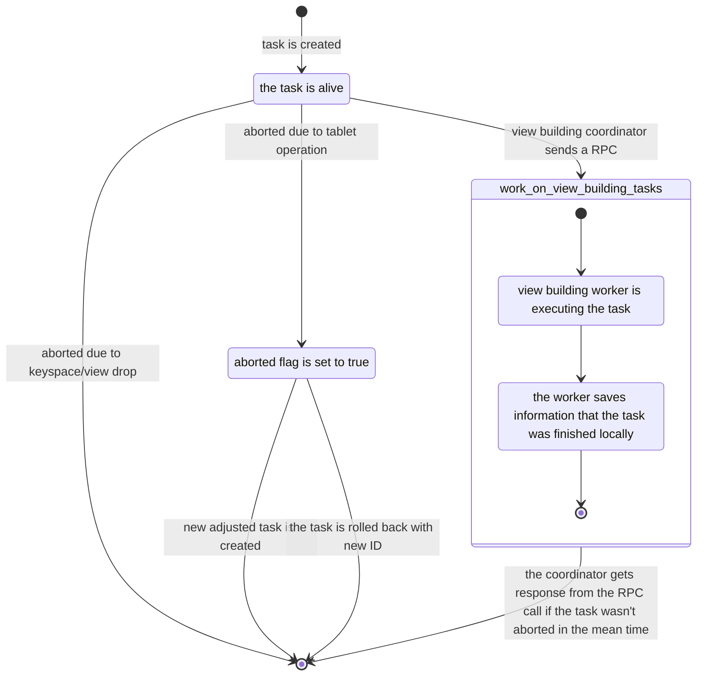

# View building coordinator

The view building coordinator is responsible for building views from tablet-based keyspaces.

In contrast to vnode-based views, which are built by node-local view builder,
the view building coordinator is a single entity within the whole cluster, 
running on the raft leader alongside the topology coordinator.

The coordinator state is stored in following group0 tables and 
it's loaded into `view_building_state_machine` while group0 state is applied.

Currently the coordinator processes at most only one base table at the time, building all views for this base table.

## View building task

Whole view building process is split into smaller view building tasks.
Each task is associated with particular tablet replica `(host_id, shard, tablet_id)` of a certain base table.

There are 2 types of tasks:
- `build_range` - generate view updates from the tablet replica of the base table to build view
- `process_staging` - process (generate view updates and move to base directory) 
                      all staging sstables associated with the tablet replica of the base table

View building tasks are created when:
- `build_range` tasks:
  - a view/index is created
  - during tablet operations
    - at the end of tablet migration / merge or split / keyspace RF change
    - during rollback if the operation failed
  - keyspace RF was increased
- `process_staging` tasks:
  - a staging sstable was registered to `view_building_worker`

### Lifetime of a task

The group0 state stores only tasks that haven't been completed yet or were aborted but haven't been cleaned up yet.

When a task is created, it is stored in group0 state (`system.view_building_tasks`) to be processed in the future.
Then at some point, the view building cooridnator will decide to process it by sending a [`work_on_view_building_tasks` RPC](#rpc) to a worker.
Unless the task was aborted, the worker will eventually reply that the task was finished. After the coordinator gets the response from the worker,
it temporarily saves list of ids of finished tasks and removes those tasks from group0 state (pernamently marking them as finished) in 200ms intervals. (*)
This batching of removing finished tasks is done in order to reduce number of generated group0 operations.

On the other hand, view buildind tasks can can also be aborted due to 2 main reasons:
- a keyspace/view was dropped
- tablet operations (see [tablet operations section](#tablet-operations))
In the first case we simply delete relevant view building tasks as they are no longer needed.
But if a task needs to be aborted due to tablet operation, we're firstly setting the `aborted` flag to true. We need to do this because we need the task informations
to created a new adjusted tasks (if the operation succeeded) or rollback them (if the operation failed).
Once a task is aborted by setting the flag, this cannot be revoked, so rolling back a task means creating its duplicate and removing the original task.

(*) - Because there is a time gap between when the coordinator learns that a task is finished (from the RPC response) and when the task is marked as completed,
      it is possible that the coordinator may lose this information (e.g. due to Raft leader change). But each view building worker keeps track of finished tasks locally,
      so when a new coordinator will send an RPC with the same view building tasks, the worker will immediately response that those tasks were completed.
      In the worst case, when both the coordinator and worker nodes are restarted, we can completely lose that information and will have to redo the work.
      However, view building tasks are idempotent.

View building task struct:
```c++
struct view_building_task {
    enum class task_type {
        build_range,
        process_staging,
    };

    utils::UUID id;
    task_type type;
    bool aborted;

    table_id base_id;
    table_id view_id; // is default value when `type == task_type::process_staging`
    locator::tablet_replica replica;
    locator::tablet_id tid;
};
```

State machine:



## Schema 

The most important table is `system.view_building_tasks`, which stores all unfinished view building tasks 
```sql
CREATE TABLE system.view_building_tasks (
    key text,
    id timeuuid,
    type text,
    aborted boolean,
    base_id uuid,
    view_id uuid,         -- NULL for "process_staging" tasks
    base_tablet_id bigint,
    host_id uuid,         -- Host of the tablet replica
    shard int,            -- Shard of the tablet replica
    PRIMARY KEY (key, id)
)
```

The view building coordinator stores currently processing base table in `system.scylla_local` 
under `view_building_processing_base` key. 
The entry is managed by group0.

Once the view is built, an entry in `system.built_views` is created. Before the view building coordinator,
this table was node-local one. But now the table is partially managed by group0, 
meaning that all entries from tablet-based keyspaces are managed by group0 and
entries from vnode-based keyspaces are still node local.

## View building worker

The view building worker is node-local service responsible for executing view building tasks.
It handles [work on view building tasks RPC](#rpc) and responses the coordinator once the tasks are finished.
The worker also observes the group0 state to notice when tasks are aborted (by deleting them or by setting the aborted flag).

The worker groups multiple view building tasks into a batch and it can execute only one batch per shard
(it's the coordinator responsibility to schedule only batch per tablet replica).

Tasks can be in one batch only if they have the same:
- type
- base_id
- tablet replica
- tablet id

### RPC

The view building worker doesn't mark tasks as finished (it doesn't do group0 operation with one exception).
Instead, it saves ids of finished tasks and it is the coordinator who asks the worker
what is the result of some tasks using following RPC call:

```c++
verb [[cancellable]] work_on_view_building_tasks(raft::term_t term, shard_id shard, std::vector<utils::UUID> tasks_ids) -> std::vector<utils::UUID>
```

The worker registers handler for the RPC, which:
- attaches to the tasks and waits for the result
- returns result when the tasks are finished

## Tablet operations

The view building coordinator needs to react to following tablet operations:
- tablet migration / move_tablet REST API
  - For each task which `base_id == tablet operation table_id` and `replica == source replica` and tablet ids are matched:
    - Abort the task
    - Create new task on destination replica
- tablet resize
  - For each task which `base_id == tablet operation table_id`:
    - In case of tablet split: abort the task and create new tasks with new tablet ids `n -> (2n, 2n+1)`
    - In case of tablet merge: abort the task and create new task with new tablet id `n -> n/2` if such task doesn't exist
- keyspace RF change / add_tablet_replica REST API / del_tablet_replica REST API
  - In case of RF decrease: abort tasks on abandoning replicas
  - In case of RF increase: create tasks for new replica 
    - (Maybe this can be optimized? It depends on how data is copied to the new replicas)

In all of the cases, the tasks are aborted at the start of the operation
and new tasks are created at the end.
In case of failure, new copies of aborted tasks are created during rollback.

## Staging sstables

The view building coordinator can also handle staging sstables using `process_staging` view building tasks.
We do this because we don't want to start generating view updates from a staging sstable prematurely,
before the writes are directed to the new replica (https://github.com/scylladb/scylladb/issues/19149).

Firstly, `db::view::check_needs_view_update_path()` now returns `db::view::sstable_destination_decision`,
instead of bool value determining if the sstable should go to base or staging directory.

```c++
enum class sstable_destination_decision {
    normal_directory,               // use normal sstable directory
    staging_directly_to_generator,  // use staging directory and notify view building worker
    staging_managed_by_vbc          // use staging directory and register the sstable to view update generator
};
```

For vnode-based sstables, the function works the same, but for tablet-based sstables the logic is:
- Does the table have any views?
  - NO: use normal directory
- Are all views not started or built yet?
  - YES: use normal directory
- Is any view started but not finished yet?
  - YES: create view building tasks for this sstable
- All views built
  - If the streaming reason is repair: create view building tasks for this sstable
  - Otherwise: use normal directory
