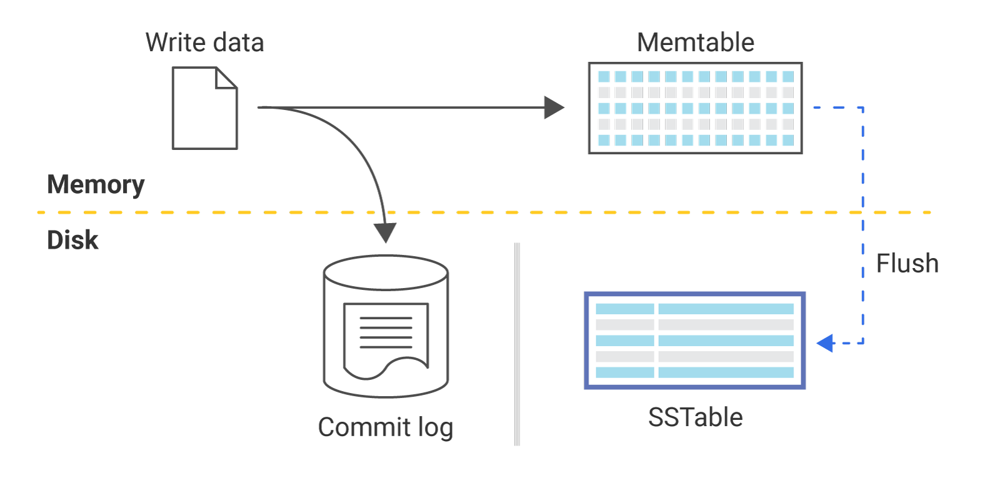
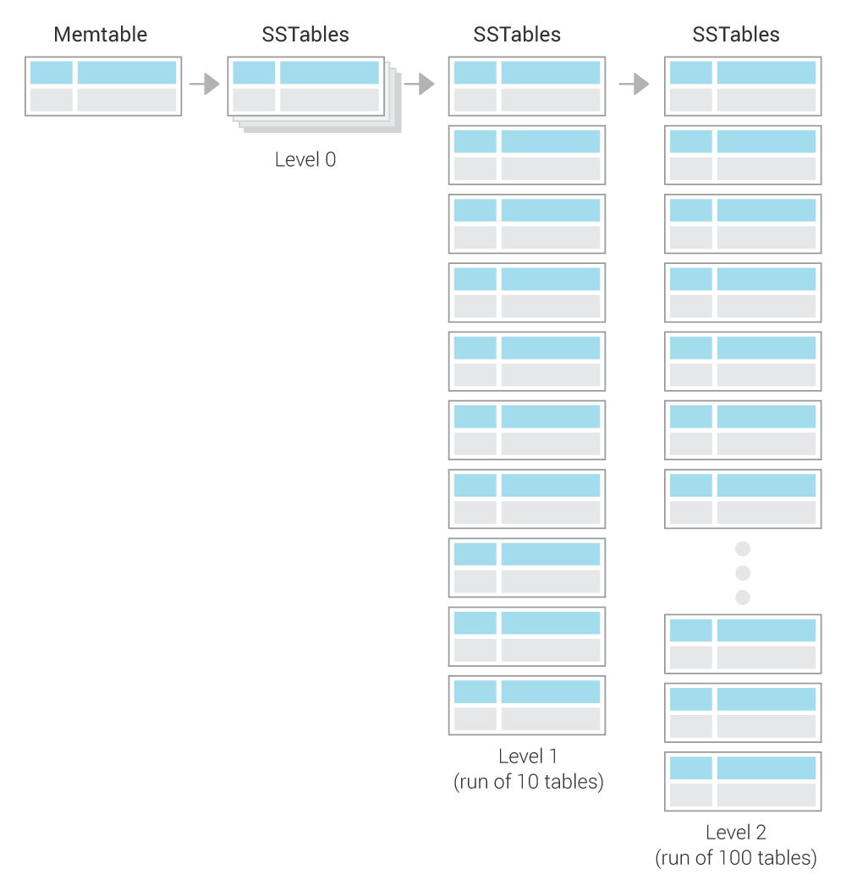
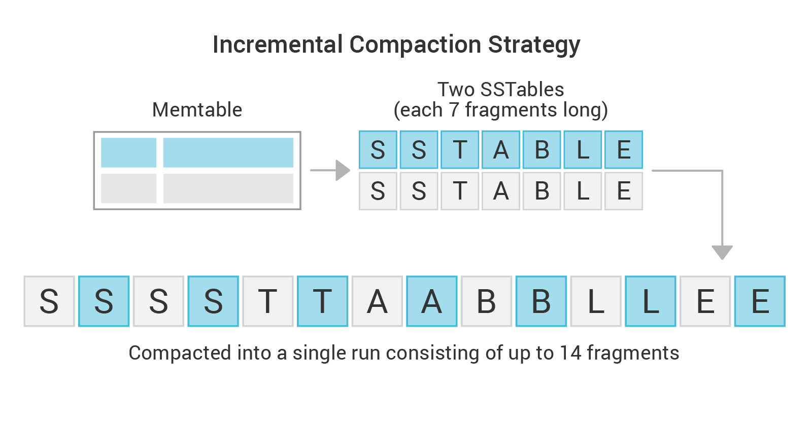

Compaction
==========

This document gives a high level overview of Compaction, focusing on what compaction is, and how it works. There is a different document that covers the :doc:`CQL syntax </cql/compaction>` for setting a compaction strategy. There is also another document, :doc:`Compaction Strategy Matrix </architecture/compaction/compaction-strategies>`, that covers how to decide which strategy works best.

How ScyllaDB Writes Data
------------------------

ScyllaDB’s write path follows the well-known **Log Structured Merge (LSM)** design for efficient writes that are immediately available for reads. ScyllaDB is not the first project to use this method. Popular projects to use this method include Lucene Search Engine, Google BigTable, and Apache Cassandra.

ScyllaDB writes its updates to a :term:`memory table (MemTable)<MemTable>`, and when that becomes too big, it is flushed to a new file. This file is sorted to make it easy to search and later merge. This is why the tables are known as Sorted String Tables or :term:`SSTables<SSTable>`.

In time, two major problems start to appear. First, data in one SSTable which is later modified or deleted in another SSTable wastes space as both tables are present in the system. Second, when data is split across many SSTables, read requests are processed slower as many SSTables need to be read. ScyllaDB mitigates the second problem by using a bloom filter and other techniques to avoid reading from SSTables that do not include the desired partition. However, as the number of SSTables grows, inevitably so do the number of disk blocks from which we need to read on every read query. For these reasons, as soon as enough SSTables have accumulated, ScyllaDB performs a :term:`compaction<Compaction>`.

Compaction Overview
-------------------

Compaction merges several SSTables into new SSTable(s) which contain(s) only the live data from the input SSTables. Merging several sorted files to get a sorted result is an efficient process, and this is the main reason why SSTables are kept sorted.
 
There are two types of compactions:

* Minor Compaction
   ScyllaDB automatically triggers a compaction of some SSTables, according to a :term:`compaction strategy<Compaction Strategy>` (as described below). This is the recommended method.

* Major Compaction
   A user triggers (using nodetool) a compaction over all SSTables, merging the individual tables according to the selected compaction strategy.  

.. caution:: It is always best to allow ScyllaDB to automatically run minor compactions. Major compactions can exhaust resources, increase operational costs, and take up valuable disk space. This requires you to have 50% more disk space than your data unless you are using :ref:`Incremental compaction strategy (ICS) <incremental-compaction-strategy-ics>`. 

View Compaction Statistics
--------------------------

ScyllaDB has tools you can use to see the status of your compactions. These include nodetool (:doc:`compactionhistory </operating-scylla/nodetool-commands/compactionhistory>`  and :doc:`compactionstats </operating-scylla/nodetool-commands/compactionstats>`)  and the Grafana dashboards which are part of the `ScyllaDB Monitoring Stack <https://monitoring.docs.scylladb.com/>`_ which display the compaction statistics on a per cluster and per node basis.  Compaction errors can be seen in the `logs <https://manager.docs.scylladb.com/stable/config/scylla-manager-config.html>`_. 

Compaction strategy
-------------------

A compaction strategy is what determines which of the SSTables will be compacted, and when. The following compaction strategies are available and are described in greater detail below. For a matrix which compares each strategy to its workload, refer to :doc:`Compaction Strategy Matrix </architecture/compaction/compaction-strategies>`

* `Leveled compaction strategy (LCS)`_ - the system uses small, fixed-size (by default 160 MB) SSTables divided into different levels and  lowers both Read and Space Amplification. 
* :ref:`Incremental compaction strategy (ICS) <incremental-compaction-strategy-ics>` - Uses runs of sorted, fixed size (by default 1 GB) SSTables in a similar way that LCS does, organized into size-tiers.  It has low space amplification due to the reduction of temporary space overhead is reduced to a constant manageable level.
* `Time-window compaction strategy (TWCS)`_ - designed for time series data and puts data in time order. TWCS uses ICS to prevent accumulating  SSTables in a window not yet closed. When the window closes, TWCS works towards reducing the SSTables in a time window to one.

How to Set a Compaction Strategy
................................

Compaction strategies are set as part of the ``CREATE`` or ``ALTER`` statement when creating or altering tables. Refer to the :doc:`CQL syntax </cql/compaction>` for details. 

.. caution:: Changing the parameters for compaction strategies or changing from one strategy to another (using the ``ALTER`` statement) can create issues. See `Changing Compaction Strategies or Properties`_ for more information. 

.. _leveled-compaction-strategy-lcs:

Leveled Compaction Strategy (LCS)
---------------------------------

Leveled Compaction uses small, fixed-size (by default 160 MB) SSTables divided into different levels. Each level represents a run of a number of SSTables.

A run of SSTables
.................

A **run** is a :term:`log-structured-merge (LSM)<Log-structured-merge (LSM)>` term for a large SSTable split into several smaller SSTables. In other words, a run is a collection of SSTables with non-overlapping key ranges. The benefit of a run is that when a compaction is done, only parts of it (small individual SSTables) are compacted and deleted. Following a compaction, SSTables are smaller and there is no need to compact a huge SSTable all at once.

The compaction method works as follows:

1. New SSTables (created from MemTables) are created in **Level 0**. All other levels are each a run of SSTables, of exponentially increasing size as follows:

   -  **Level 1** is a run of 10 SSTables (160 MB each table * 10)
   -  **Level 2** is a run of 100 SSTables (160 MB each table * 100), etc.

2. When there are 4 SSTables in Level 0, they are compacted with the 10 SSTables in Level 1. This compaction works as follows:

   -  Read in parallel 4 SSTables in level 0 and 10 in Level 1.
   -  Write new SSTables for Level 1 (replacing the 10 old tables which were compacted).
   -  Instead of creating one large SSTable, several SSTables are written as follows: One SSTable is created. When it reaches the size limit (160 MB), a new table starts. As the data is merged on the sorted keys, this generates a run (see `A run of SSTables`_), with non-overlapping key ranges.

3. If after the compaction from Level 0 into Level 1, if there are at least 10 SSTables in Level 1, the excess SSTables from Level 1 are compacted and put into Level 2 as follows:

   -  Take one SSTable from Level 1 (this SSTable will be deleted after the compaction)
   -  Look at this SSTable’s key range, and find all SSTables in Level 2 which overlap with it. Typically, there are about 12 of these (the Level 1 SSTable spans roughly 1/10th of the keys, while each Level 2 SSTable spans roughly 1/100th of the keys, so 10 Level 2 SSTables will overlap the Level 1 SSTable’s range, plus two more on the edges).
   -  As before, compact the 1 SSTable from Level 1 and the 12 SSTables from Level 2 and create new SSTables in Level 2 (and delete the 1+12 original SSTables).
   -  If after this compaction of Level 1 into Level 2, there are excess SSTables in Level 2 (as Level 2 can only take 100 tables), merge them into Level 3.

.. _incremental-compaction-strategy-ics:

Incremental Compaction Strategy (ICS)
-------------------------------------
ICS merges SSTables of approximately the same size.
It splits each large SSTable into a run of sorted, fixed-size (by default 1 GB) SSTables (a.k.a. fragments) in the same way that LCS does, except it treats the entire run and not the individual SSTables as the sizing file. As the run-fragments are small, the SSTables compact quickly, allowing individual SSTables to be removed as soon as they are compacted.  This approach uses low amounts of memory and temporary disk space.

The strategy works as follows:

#. ICS looks for candidates for compaction that are similar in size. These candidates are called ``Input Runs``.

   * The input runs may contain one or more SSTables each.

#. ICS compacts two or more similar-sized input runs into a single ``Output run`` (* See note_ ).
#. Incremental Compaction progressively works on two or more fragments at a time, one from each input run.

   * It reads mutations from all input fragments and merges them together into a single output fragment.
   * As long as the resulting fragment is smaller than the ``sstable_size_in_mb``, no further action is needed.
   * If the fragment is larger than the ``sstable_size_in_mb``:

     1. Stop when the size threshold is reached, and seal the output fragment.
     2. Create a new run fragment and continue compacting the remaining input fragments, until the size threshold is reached.
     3. When an input fragment is exhausted, take it out of the list of SSTables to compact, and delete it from disk.
     4. Repeat until there are no input fragments left.

#. Take all of the output fragments and feed them back into compaction as an SSTable run.
#. Stop when all fragments from input runs were exhausted and released.

.. _note:
.. note:: To prevent data resurrection in case scylla crashes in the middle of compaction, ICS may possibly write an auxiliary run containing purgeable tombstones in addition to the output run containing live data.
   These tombstones are kept on disk while there are SSTables containing data that the tombstones may shadow. Once compaction is done, deleting all shadowed data from all SSTables, the purgeable tombstones are purged and the SSTables holding them are removed from storage.

.. image:: ics-incremental-compaction.png

.. _time-window-compactionstrategy-twcs:

Time-window Compaction Strategy (TWCS)
--------------------------------------

Time-Window Compaction Strategy is designed for handling time series workloads. It compacts SSTables within each time window. SSTables from different time windows are never compacted together.

.. include:: /rst_include/warning-ttl-twcs.rst

The strategy works as follows:

1. A time window is configured. The window is determined by the compaction window size :ref:`compaction_window_size <twcs-options>`  and the time unit (:ref:`compaction_window_unit <twcs-options>`).
2. SSTables created within the time window are compacted.
3. Once a time window ends, take all SSTables which were created during the time window and compact the data into one SSTable.
4. The final resulting SSTable is never compacted with other time-windows’ SSTables.

With this explanation, if the time window was for one day, at the end of the day, the SSTables accumulated for that day only would be compacted into one SSTable.

When time-series data gets out of order
.......................................

The primary motivation for TWCS is to separate data on disk by timestamp and to allow fully expired SSTables to drop more efficiently. This efficiency stops when data is written to SSTables out of order, with new data and old data in the same SSTable. Out of order data can appear in the same SSTable in two ways:

* If the user mixes old data and new data in the traditional write path, the data is commingled in the MemTables and flushed into the same SSTable, where it will remain commingled.
* If the user’s read requests for old data causes read repairs that pull the old data into the current MemTable. The data is commingled in the MemTables and flushed into the same SSTable, where it will remain commingled.

While TWCS tries to minimize the impact of commingled data, users should attempt to avoid this behavior. Specifically, users should avoid queries that explicitly set the timestamp. It is recommended to run frequent repairs (which streams data in such a way that it does not become commingled).

Changing Compaction Strategies or Properties
--------------------------------------------

Changing the Threshold in LCS
.............................

There can be cases where, following a compaction, tables are created in a level which are not compacted for a considerable amount of time.
For example, a user has tables which are using LCS. There are 5 levels of tables at present and the ``SSTable_size_in_mb`` is 5MB. The user changes this threshold to 160MB.  Following this change, there is only enough data to actually get an L3 on the same node. The data in the SSTables in L4 will get starved and will not get compacted. To avoid this, LCS tries to include those starved high level SSTables in future compactions. If after been 25 compaction rounds, a level was not compacted, it is brought in to the next compaction.

Changing to Time Window Compaction Strategy (TWCS)
..................................................

If you want to enable TWCS on existing data, you may consider running a major compaction first, placing all existing data into a single (old) window. Subsequent newer writes will then create typical SSTables as expected.

Changing the Time Window in TWCS
................................

If you want to change the time window you can do so, but keep in mind that this change may trigger additional compactions as adjacent windows are joined together. If the window size is decreased (for example, from 24 hours to 12 hours), then the existing SSTables will not be modified. Note as well that TWCS can not split existing SSTables into multiple windows.

Which Strategy is best to use
-----------------------------
Use the table in :ref:`Which strategy is best <which-strategy-is-best>` to determine the right strategy for your needs.

References
----------
* :doc:`CQL Reference for Compaction </cql/compaction>`

* :doc:`How to Choose a Compaction Strategy </architecture/compaction/compaction-strategies>`.

* `Blog: ScyllaDB’s Compaction Strategies Series: Write Amplification in Leveled Compaction <https://www.scylladb.com/2018/01/31/compaction-series-leveled-compaction/>`_