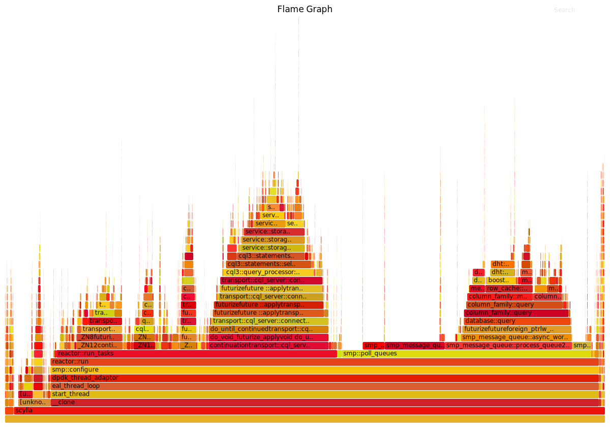

=====================================
Debug your database with Flame Graphs
=====================================

Flame Graphs are used as a debugging tool to identify latency and the part of the execution path that takes most of the CPU time. 
Use Flame Graphs when you:

* Need to understand which ScyllaDB code path/functions are using the most time. For instance, when you have latency issues.
* Need to compare time spent in particular ScyllaDB code paths/functions on different shards. For instance, when you have latency issues on one CPU but not on the other.

Run a Flame Graph
-----------------

**Procedure**

#. Install flamegraph and flamegraph-stackcollapse-perf

   From DNF

   .. code-block:: shell

      dnf install flamegraph.noarch flamegraph-stackcollapse-perf.noarch
   
   If the above packages are not available in you distribution's repositories, you can clone the FlameGraph git repository
 
   .. code-block:: shell

      git clone https://github.com/brendangregg/FlameGraph
      cd FlameGraph

#. Run the following perf commands, using :doc:`Map CPU to ScyllaDB Shards </kb/map-cpu>`  and :doc:`Using the perf utility with ScyllaDB </kb/use-perf>` for reference.

   .. code-block:: shell

      sudo perf record --call-graph dwarf -C <CPU on which you are onrecording>
      sudo perf script | stackcollapse-perf.pl | flamegraph.pl > some_name.svg
   
#. The result is an .svg file that is not just a picture but a dynamic diagram where you can search, zoom in, and zoom out. In order to enjoy a Flame Graph properly with all of its features you can open it in a browser such as Chrome or Firefox. 

Tips
----

* On the CPU you are recording, try to load ScyllaDB to consume 100% of the CPU runtime. Otherwise you’ll see a lot of OS functions related to the idle time handling

* Recording on all shards (e.g. using “perf record” -p parameter) may lead to confusing results recording the same symbol called from different threads (shards). This is not recommended.

