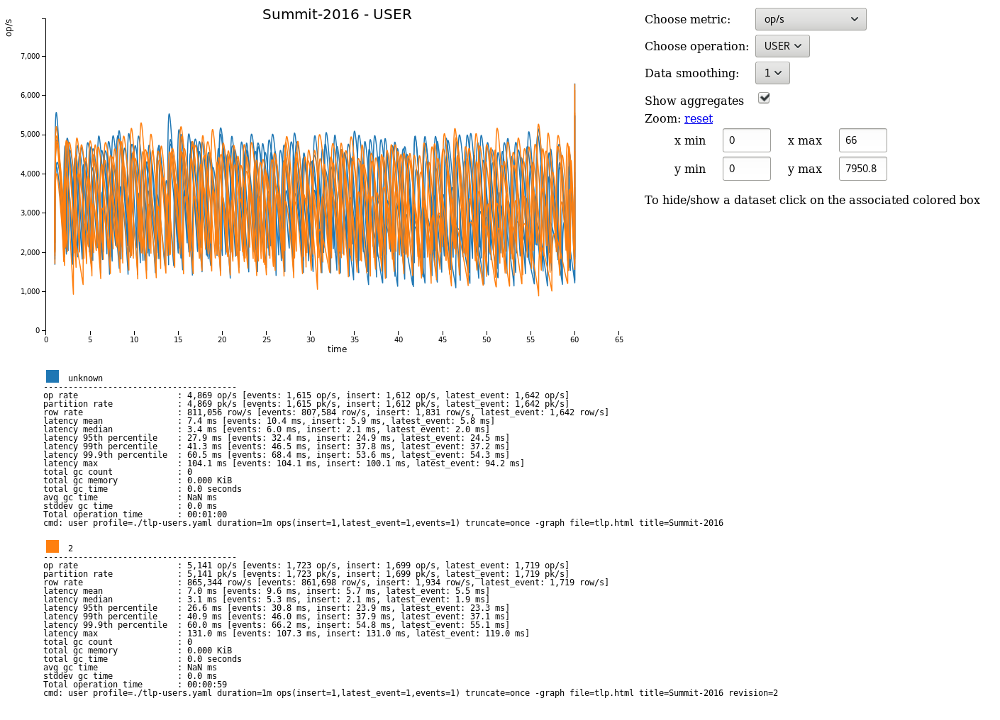

Cassandra Stress
================

The cassandra-stress tool is used for benchmarking and load testing both Scylla and Cassandra clusters. The cassandra-stress tool also supports testing arbitrary CQL tables and queries to allow users to benchmark their data model.

This documentation focuses on user mode as this allows the testing of your actual schema.

Usage
----- 

There are several operation types:

* write-only, read-only, and mixed workloads of standard data
* write-only and read-only workloads for counter columns
* user configured workloads, running custom queries on custom schemas
* The syntax is cassandra-stress <command> [options]. If you want more information on a given command or options, just run cassandra-stress help 

Commands:

read: Multiple concurrent reads - the cluster must first be populated by a write test.

write: Multiple concurrent writes against the cluster.

mixed: Interleaving of any basic commands, with configurable ratio and distribution - the cluster must first be populated by a write test.

counter_write: Multiple concurrent updates of counters.

counter_read: Multiple concurrent reads of counters. The cluster must first be populated by a counterwrite test.

user: Interleaving of user provided queries, with configurable ratio and distribution.

help: Print help for a command or option.

print: Inspect the output of a distribution definition.

legacy: Legacy support mode.

Primary Options:

-pop: Population distribution and intra-partition visit order.

-insert: Insert specific options relating to various methods for batching and splitting partition updates.

-col: Column details such as size and count distribution, data generator, names, comparator and if super columns should be used.

-rate: Thread count, rate limit or automatic mode (default is auto).

-mode: Thrift or CQL with options.

-errors: How to handle errors when encountered during stress.

-sample: Specify the number of samples to collect for measuring latency.

-schema: Replication settings, compression, compaction, etc.

-node: Nodes to connect to.

-log: Where to log progress to, and the interval at which to do it.

-transport: Custom transport factories.

-port: The port to connect to cassandra nodes on.

-sendto: Specify a stress server to send this command to.

-graph: Graph recorded metrics.

-tokenrange: Token range settings.

User mode
---------

User mode allows you to use your stress your own schemas. This can save time in the long run rather than building an application and then realising your schema doesn’t scale.

Profile
.......

User mode requires a profile defined in YAML. Multiple YAML files may be specified in which case operations in the ops argument are referenced as specname.opname.

An identifier for the profile:

.. code-block:: cql

   specname: staff_activities

The keyspace for the test:

.. code-block:: cql

   keyspace: staff

CQL for the keyspace. Optional if the keyspace already exists:

.. code-block:: cql

   keyspace_definition: |
   CREATE KEYSPACE stresscql WITH replication = {'class': 'SimpleStrategy', 'replication_factor': 3};

The table to be stressed:

.. code-block:: cql

   table: staff_activities

CQL for the table. Optional if the table already exists:

.. code-block:: cql

   table_definition: |
   CREATE TABLE staff_activities (
   name text,
   when timeuuid,
   what text,
   PRIMARY KEY(name, when, what)
   )

Optional meta information on the generated columns in the above table. The min and max only apply to text and blob types. The distribution field represents the total unique population distribution of that column across rows:

.. code-block:: cql

   columnspec:
   - name: name
     size: uniform(5..10) # The names of the staff members are between 5-10 characters
     population: uniform(1..10) # 10 possible staff members to pick from
   - name: when
     cluster: uniform(20..500) # Staff members do between 20 and 500 events
   - name: what
     size: normal(10..100,50)

Supported types are:

An exponential distribution over the range [min..max]:

.. code-block:: cql

   EXP(min..max)

An extreme value (Weibull) distribution over the range [min..max]:

.. code-block:: cql

   EXTREME(min..max,shape)

A gaussian/normal distribution, where mean=(min+max)/2, and stdev is (mean-min)/stdvrng:

.. code-block:: cql

   GAUSSIAN(min..max,stdvrng)

A gaussian/normal distribution, with explicitly defined mean and stdev:

.. code-block:: cql

   GAUSSIAN(min..max,mean,stdev)

A uniform distribution over the range [min, max]:

.. code-block:: cql

   UNIFORM(min..max)

A fixed distribution, always returning the same value:

.. code-block:: cql

   FIXED(val)

If preceded by ~, the distribution is inverted

Defaults for all columns are size: uniform(4..8), population: uniform(1..100B), cluster: fixed(1)

Insert distributions:

.. code-block:: cql

   insert:
   # How many partition to insert per batch
   partitions: fixed(1)
   # How many rows to update per partition
   select: fixed(1)/500
   # UNLOGGED or LOGGED batch for insert
   batchtype: UNLOGGED

Currently all inserts are done inside batches.

Read statements to use during the test:

.. code-block:: cql

   queries:
      events:
         cql: select *  from staff_activities where name = ?
         fields: samerow
      latest_event:
         cql: select * from staff_activities where name = ?  LIMIT 1
         fields: samerow

Running a user mode test:

.. code-block:: cql

   cassandra-stress user profile=./example.yaml duration=1m "ops(insert=1,latest_event=1,events=1)" truncate=once

This will create the schema then run tests for 1 minute with an equal number of inserts, latest_event queries and events queries. Additionally the table will be truncated once before the test.

The full example can be found here yaml

Running a user mode test with multiple yaml files:

.. code-block::

   cassandra-stress user profile=./example.yaml,./example2.yaml duration=1m “ops(ex1.insert=1,ex1.latest_event=1,ex2.insert=2)” truncate=once

This will run operations as specified in both the example.yaml and example2.yaml files. example.yaml and example2.yaml can reference the same table
although care must be taken that the table definition is identical (data generation specs can be different).

.. Lightweight transaction support
.. ...............................

.. cassandra-stress supports lightweight transactions. In this it will first read current data from Cassandra and then uses read value(s) to fulfill lightweight transaction condition(s).

.. Lightweight transaction update query:

.. .. code-block:: cql

..    queries:
..      regularupdate:
..          cql: update blogposts set author = ? where domain = ? and published_date = ?
..          fields: samerow
..      updatewithlwt:
..          cql: update blogposts set author = ? where domain = ? and published_date = ? IF body = ? AND url = ?
..          fields: samerow

Graphing
........

Graphs can be generated for each run of stress.

To create a new graph:

.. code-block:: cql

   cassandra-stress user profile=./stress-example.yaml "ops(insert=1,latest_event=1,events=1)" -graph file=graph.html title="Awesome graph"

To add a new run to an existing graph point to an existing file and add a revision name:

.. code-block:: cql

   cassandra-stress user profile=./stress-example.yaml duration=1m "ops(insert=1,latest_event=1,events=1)" -graph file=graph.html title="Awesome graph" revision="Second run"

FAQ
...

How do you use NetworkTopologyStrategy for the keyspace?

Use the schema option making sure to either escape the parenthesis or enclose in quotes:

.. code-block:: cql

   cassandra-stress write -schema "replication(strategy=NetworkTopologyStrategy,datacenter1=3)"

How do you use SSL?

Use the transport option:

.. code-block:: cql

   cassandra-stress "write n=100k cl=ONE no-warmup" -transport "truststore=$HOME/jks/truststore.jks truststore-password=cassandra"

.. include:: /rst_include/apache-copyrights.rst

