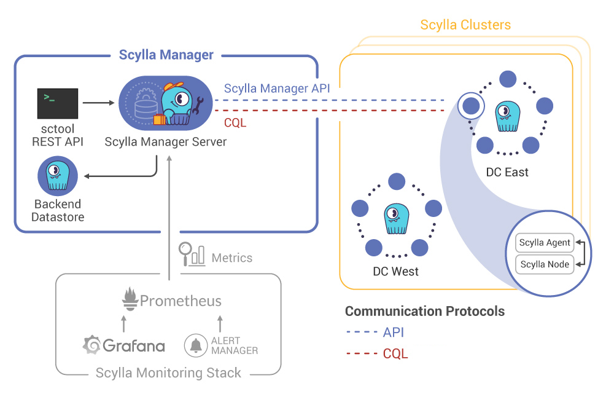

============
Architecture
============

.. include:: /operating-scylla/manager/_common/note-versions.rst

Scylla Manager is a product for database operations automation.
It can manage multiple Scylla clusters and run cluster-wide tasks in a controlled and predictable way.
Scylla Manager discovers cluster topology and is aware of nodes belonging to different datacenters.

Deployment
==========

Scylla Manager consists of three components:

* Server - a daemon that exposes REST API
* sctool - a command-line interface (CLI) for interacting with the Server over the REST API
* Agent - a small executable, installed on each Scylla node. The Server communicates with the Agent over REST HTTPS. The Agent communicates with the local Scylla node over the REST HTTP.

The Server persists its data to a Scylla cluster that can run locally or run on an external cluster
(see :doc:`Use a remote database for Scylla Manager <use-a-remote-db>` for details).

Optionally (but recommended), you can add Scylla Monitoring Stack to enable reporting of Scylla Manager metrics and alerts. 

The diagram below presents a logical view of Scylla Manager with a remote backend datastore managing multiple Scylla Clusters situated in datacenters.

Each node has two connections with the Scylla Manager Server:

* REST API connection - used for Scylla Manager and Scylla Manager Agent activities
* CQL connection - used for the Scylla :doc:`Health Check <health-check>`

Scylla Manager uses the following ports:

======  ============================================  ========
Port    Description                                   Protocol
======  ============================================  ========
10001   Scylla Manager Agent REST API                 TCP
------  --------------------------------------------  --------
56080   Scylla Manager HTTP (default)                 HTTP
------  --------------------------------------------  --------
56443   Scylla Manager HTTPS (default)                HTTPS
------  --------------------------------------------  --------
56090   Scylla Manager Prometheus API                 HTTP
------  --------------------------------------------  --------
56090   Scylla Manager Agent Prometheus API           TCP
======  ============================================  ========

Additional Resources
====================

* :doc:`Install Scylla Manager <install>`
* :doc:`Install Scylla Manager Agent <install-agent>`
* :doc:`sctool Reference <sctool>`
