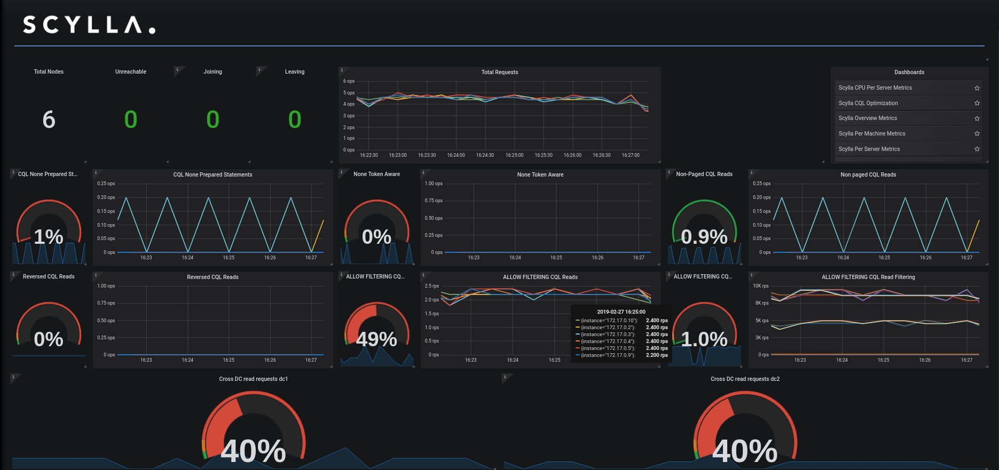

The CQL Optimization Dashboard
==============================

The CQL Optimization Dashboard is a tool to help identify potentials issues with queries, data model and driver.

    **The CQL Optimization Dashboard**

The dashboard holds gauges and graphs. When inspecting the system, we like the gauge to be near zero and the graphs as low as possible.

.. note::  Besides your queries, there are queries generated by the cql driver and internal queries to the system tables which can be misleading when testing with low traffic.

The following sections describe each of the dashboard's panel

Prepared Statements
^^^^^^^^^^^^^^^^^^^

:ref:`Prepared statements <prepared-statements>` are queries that are first defined as a template with place holders for the values and then that template is used
multiple times with different values.

Using prepared statements has the following benefits:

* The database only needs to parse the query once
* The driver can route the query to the right node
* Using place-holders and values is safer and prevents CQL-Injection

The **CQL Non-Prepared Queries** Gauge shows the percentage of queries that are not prepared.

The **CQL Non-Prepared Queries** Graph shows the rate of the queries. Make sure both are low.

Token Aware
^^^^^^^^^^^

Scylla is a distributed database, with each node contains only part of the data - a range of the token ring.
Ideally, a query would reach the node that holds the data (one of the replicas), failing to do so would mean the coordinator
will need to send the query internally to a replica, result with a higher latency,
and more resources usage.

Typically, your driver would know how to route the queries to a replication node, but using non-prepared statements, non-token-aware driver
or load-balance can cause the query to reach a node that is not a replica.

The **Non-Token Aware** Gauge shows the percentage of queries that reached a node that does not hold that data (a node that is not a replica-node).

The **Non-Token Aware Queries** Graph shows the rate of the queries that did not reach a replica-node, make sure both are low.

Paged Queries
^^^^^^^^^^^^^

By default, read queries are paged, this means that Scylla will break the results into multiple chunks limiting the reply size.
Non-Paged queries require all results be returned in one result increasing the overall load of the system and clients and should be avoided.

The **Non-Paged CQL Reads** Gauge shows the percentage of non-paged read queries that did not use paging.

The **Non-Paged CQL Reads** Graph shows the rate of the non-paged queries, make sure both are low.

Reversed CQL Reads
^^^^^^^^^^^^^^^^^^

Scylla supports compound primary keys with a clustering column, this kind of primary keys allows an efficient way
to return sorted results that are sorted by the clustering column.

Querying with an order different than the order the ``CLUSTERING ORDER BY`` was defined is inefficient and should be avoided.

For example, look at the following table:

.. code-block:: shell

    CREATE TABLE ks1.table_demo (
       category text,
       type int,
       PRIMARY KEY (category, type))
    WITH CLUSTERING ORDER BY (type DESC);

The following query uses reverse order:

.. code-block:: shell

    select * from ks1.table_demo where category='cat1' order by type ASC;

The **Reversed CQL Reads** Gauge shows the percentage of read queries that use ``ORDER BY`` that is different than the ``CLUSTERING ORDER BY``.

The **Reversed CQL Reads** Graph shows the rate of the read queries that use ``ORDER BY`` that is different than the ``CLUSTERING ORDER BY``, make sure both are low.

ALLOW FILTERING
^^^^^^^^^^^^^^^

Scylla supports server side data filtering that is not based on the primary key. This means Scylla would read data and then filter and
return part of it to the user. Data that is read and then filtered is an overhead to the system.

These kinds of queries can create a big load on the system, and should be used with care.

The CQL optimization dashboard, check for two things related to queries that use ``ALLOW FILTERING`` how many such queries exist and how much of the data that was read was
dropped before returning to the client.

The **ALLOW FILTERING CQL Reads** Gauge shows the percentage of read queries that use ``ALLOW FILTERING``.

The **ALLOW FILTERING CQL Reads** Graph shows the rate of the read queries that use ``ALLOW FILTERING``, make sure both are low.

The **ALLOW FILTERING Filtered Rows** Gauge shows the percentage of rows that were read and then filtered, this is an indication of the additional overhead to the system.

The **ALLOW FILTERING Filtered Rows** Graph shows multiple graphs: the rows that were read, the rows that matched and the rows that were dropped. Rows that
were dropped are an additional overhead to the system.

Cross DC read requests
^^^^^^^^^^^^^^^^^^^^^^
.. note::
   The CQL Optimization Dashboard relies on the definition of nodes per Data Center in the Monitoring Stack (prometheus/scylla_servers.yml) to match the Data Center names used in Scylla Cluster.
   If this is not the case, you will see the wrong result.

In a typical situation, a client performs a read from the nearest data-center and that query is performed local to the data-center.
A read request that ends up causing traffic between data-centers adds additional overhead to the system.

The **Cross DC read requests** Gauge shows the percentage of read queries that caused a request to an external data-center, make sure it is low or zero.

Cross shard
^^^^^^^^^^^
Scylla uses a shared-nothing model that shards all requests onto individual cores. Scylla runs one application thread-per-core, and depends on explicit message passing, not shared memory between threads.
This design avoids slow, unscalable lock primitives and cache bounces.

Ideally, each request to a Scylla node reaches the right core (shard), avoiding internal communication between cores.
This is not always the case, for example, when using a non-shard-aware Scylla driver (see more here_)

.. _here: /using-scylla/drivers/index/

New panels in the CQL Optimization dashboard were added to help identify cross-shard traffic.

The **Cross Shard** Gauge shows the percentage of queries that reach a shard that does not hold the data.

The **Cross Shard Queries** Graph shows the rate of the queries that did not reach a shard with the data, make sure both are low.

