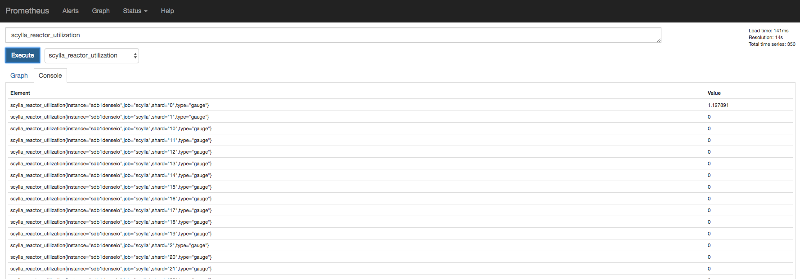

Deploying Scylla Monitoring Stack Without Docker
================================================

.. include:: /operating-scylla/monitoring/_common/note-versions.rst

The following instructions will help to deploy :doc:`Scylla Monitoring Stack <monitoring-stack>` in cases where you can not use the recommended Docker version.

Please note, Scylla recommends you use the Docker version as it will provide you with the most updated, current Scylla Monitoring system.

.. include:: min-prod-hw.rst

The main item to set an alert on is the available disk space in the monitoring system. Data is indefinitely accrued on the Prometheus data directory. The current monitoring solution does not churn data.

Install Scylla Monitor
----------------------

The following procedure uses a ``CentOS 7`` based instance

1. Download the latest Scylla Monitoring Stack release.

``wget https://github.com/scylladb/scylla-monitoring/archive/scylla-monitoring-3.4.tar.gz``

2. Open the tar

``tar -xvf scylla-monitoring-3.4.tar.gz``

Install Alertmanager
--------------------

Tested with alertmanager 0.20.0 version

1. Install `alertmanager`_

..  _`alertmanager` : https://prometheus.io/download/

.. code-block:: shell

   wget https://github.com/prometheus/alertmanager/releases/download/v0.20.0/alertmanager-0.20.0.linux-amd64.tar.gz
   tar -xvf alertmanager-0.20.0.linux-amd64.tar.gz

2. Copy the following file: ``rule_config.yml`` from ``scylla-monitoring-scylla-monitoring-3.4/prometheus`` directory to ``alertmanager.yml`` in the alertmanager installation directory.

For example:

.. code-block:: shell

   cp -p /home/centos/scylla-monitoring-scylla-monitoring-3.4/prometheus/rule_config.yml /home/centos/alertmanager-0.20.0.linux-amd64/alertmanager.yml

3. Start the Alertmanager

For example:

.. code-block:: shell

   cd alertmanager-0.20.0.linux-amd64
   ./alertmanager

4. Verify that Alertmanager is up and running, point your browser to the Alertmanager IP:Port

For example:

.. code-block:: shell

   http://192.168.135.166:9093/

.. image:: alertmanager.png

Install Prometheus
------------------

Tested with Prometheus version 2.18.1

1. Install `Prometheus`_

..  _`Prometheus` : https://prometheus.io/download/

.. code-block:: shell

   wget https://github.com/prometheus/prometheus/releases/download/v2.18.1/prometheus-2.18.1.linux-amd64.tar.gz
   tar -xvf prometheus-2.18.1.linux-amd64.tar.gz

2. Copy the following files: ``scylla_servers.yml``, ``prometheus.rules.yml`` from ``scylla-monitoring-scylla-monitoring-3.4/prometheus`` directory to Prometheus installation directory.

Copy ``prometheus/prometheus.yml.template`` to ``prometheus.yml``

For example:

.. code-block:: shell

   cp scylla-monitoring-scylla-monitoring-3.4/prometheus/*.yml prometheus-2.18.1.linux-amd64
   cp scylla-monitoring-scylla-monitoring-3.4/prometheus/prometheus.yml.template prometheus-2.18.1.linux-amd64/prometheus.yml

3. Edit the ``prometheus.yml`` file to point to the correct static data sources.

.. note:: Make sure to include the ``honor_labels: false`` parameter in the prometheus.yml file.

.. code-block:: shell

   vi prometheus-2.18.1.linux-amd64/prometheus.yml

Set the alertmanger address and port by replacing ``AM_ADDRESS`` in the file.

For example, if the alertmanager will run on the same host:

.. code-block:: shell

   alerting:
      alertmanagers:
      - static_configs:
          - targets:
              - 127.0.0.1:9093

Edit the `files` entry in the file to point to the correct local file. The files `scylla`, `node_exporter`, and `manager_agent` can all be replaced with the same file, `scylla_servers.yml`.

For example the scrape config for Scylla:

.. code-block:: shell

   global:
     scrape_interval: 5s # By default, scrape targets every 5 second.
     scrape_timeout: 4s # Timeout before trying to scape a target again

     # Attach these labels to any time series or alerts when communicating with
     # external systems (federation, remote storage, Alertmanager).
     external_labels:
       monitor: 'scylla-monitor'

   scrape_configs:
   - job_name: scylla
     honor_labels: false
     file_sd_configs:
       - files:
         - scylla_servers.yml
     relabel_configs:
       - source_labels: [__address__]
         regex:  '([^:]+)'
         target_label: __address__
         replacement: '${1}:9180'

       - source_labels: [__address__]
         regex:  '(.*):.+'
         target_label: instance
         replacement: '${1}'

4. Create and set ``scylla_servers.yml`` file point to your Scylla nodes and ``scylla_manager_server.yml`` file to point to your Scylla Manager.

.. note::
   There is no need to configure ``node_exporter_server``. Instead, in the Prometheus scrape config of the node_exporter
   you can use the same file you used for Scylla, and Prometheus will assume you have a ``node_exporter`` running on each Scylla server.

An example for those files can be found under the Prometheus directory: ``prometheus/scylla_servers.example.yml`` and ``prometheus/scylla_manager_servers.example.yml``

.. note::
   You must have both files even if you are not using Scylla Manager

Add the labels for the cluster and data-center

``scylla_servers.yml``:

For example:

.. code-block:: shell

   cat scylla_servers.yml
   # List Scylla end points

   - targets:
     - 192.168.66.6
     - 192.168.66.244
     labels:
       cluster: cluster1
       dc: dc1
   - targets:
       - 172.17.0.3
     labels:
       cluster: cluster1
       dc: dc2

.. note::
   See the previous note about deprecating the ``node_exporter_servers.yml`` file.

``scylla_manager_server.yml``

For example:

.. code-block:: shell

   - targets:
     - 127.0.0.1:56090

5. Create a data directory for Prometheus to store the metrics data

For example:

.. code-block:: shell

   mkdir prometheus-2.18.1.linux-amd64/mydata

6. Start Prometheus server:

For example:

.. code-block:: shell

   cd prometheus-2.18.1.linux-amd64
   ./prometheus --config.file=prometheus.yml --storage.tsdb.path mydata

Data should start accumulate on: ./mydata

7. Verify that Prometheus is up and running, point your browser to the Prometheus IP:Port

For example:

.. code-block:: shell

   http://192.168.135.166:9090/

.. image:: 1.png

Prometheus console should be visible

8. Verify that the node_exporter and Scylla metrics accumulating in the server by executing a query through the console

For example:

``node_memory_MemFree``

.. image:: 2.png

And

``scylla_reactor_utilization``

At this point, Scylla is emitting the metrics, and Prometheus is able to store them.

Install Grafana
---------------

Tested with Grafna 6.7.3

1. Install Grafana based on the instructions `here`_ make sure to use version 6.7.0 or higher

..  _`here` : http://docs.grafana.org/installation/

It depends if you installed Grafana from a repository (yum install), or if you downloaded the zip version, the directory structure will be
different in the rest of the steps.

2. Access Scylla-Grafana-monitoring directory

``cd scylla-monitoring-scylla-monitoring-3.4/``

3. Copy the plugins to the Grafana plugins directory (by default ``/var/lib/grafana/``)

.. code-block:: shell

   sudo cp -r grafana/plugins /var/lib/grafana/

If you installed Grafana from packages, instead of ``/var/lib/grafana/`` you should copy it to ``public/app`` inside the directory you
opened Grafana in.

For example:

.. code-block:: shell

   cp -r grafana/plugins ../grafana-6.7.3/public/app

4. Provision the Dashboard them

For example Scylla version 4.0 and Scylla manager version 2.0

For Grafana installed with ``yum install``

.. code-block:: shell

   sudo cp grafana/load.yaml /etc/grafana/provisioning/dashboards/
   sudo mkdir -p /var/lib/grafana/dashboards
   sudo cp -r grafana/build/* /var/lib/grafana/dashboards

For Grafana installed from packages

.. code-block:: shell

   cp -p -r grafana/build/* ../grafana-6.7.3/public/build/
   cp -p grafana/load.yaml ../grafana-6.7.3/conf/provisioning/dashboards/load.4.0.yaml
   cp -p grafana/load.yaml ../grafana-6.7.3/conf/provisioning/dashboards/load.manager_2.0.yaml

Edit the ``load.*``  files in ``/home/centos/grafana-6.7.3/conf/provisioning/dashboards/`` for the correct path,
for example ``load.4.0.yaml`` would point to: ``/home/centos/grafana-6.7.3/public/build/ver_4.0`` and the FOLDER will be ``4.0``

5. Set the data source by copy ``datasource.yml`` and edit it

.. code-block:: shell

   sudo cp grafana/datasource.yml /etc/grafana/provisioning/datasources/

For Grafana installed from packages

.. code-block:: shell

   cp -p grafana/datasource.yml /home/centos/grafana-6.7.3/conf/provisioning/datasources/

You should set the Prometheus and the alertmanager IP and port.

For example

.. code-block:: shell

   sudo cat /etc/grafana/provisioning/datasources/datasource.yml
   apiVersion: 1
   datasources:
    - name: prometheus
      type: prometheus
      url: http://192.168.135.167:9090
      access: proxy
      basicAuth: false

    - name: alertmanager
      type: camptocamp-prometheus-alertmanager-datasource
      orgId: 1
      typeLogoUrl: public/img/icn-datasource.svg
      access: proxy
      url: http://192.168.135.166:9093
      password:
      user:
      database:
      basicAuth:
      isDefault:
      jsonData:
        severity_critical: '4'
        severity_high: '3'
        severity_warning: '2'
        severity_info: '1'

6. Start the Grafana service

For Grafana installed with `yum install`

``sudo service grafana-server start``

For Grafana installed from packages:

``cp -p /home/centos/grafana-6.7.3/conf/sample.ini /home/centos/grafana-6.7.3/conf/scylla.ini``

Edit scylla.ini to reflect the right paths in the paths section of the file.

.. code-block:: shell

    plugins = /home/centos/grafana-6.7.3/data/plugins
    provisioning = /home/centos/grafana-6.7.3/conf/provisioning

Start the server:

.. code-block:: shell

    cd /home/centos/grafana-6.7.3/
    ./bin/grafana-server -config /home/centos/grafana-6.7.3/conf/scylla.ini

7. Make sure Grafana is running

Point your browser to the Grafana server port 3000. The assumption is that Grafana and Prometheus are collocated on the same server.

.. image:: grafana.png

