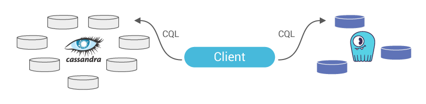
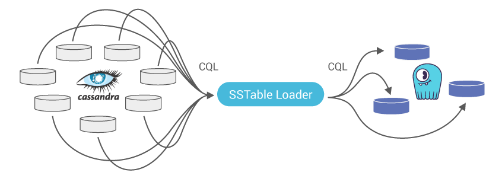

============================================
Apache Cassandra to Scylla Migration Process
============================================

.. note:: The following instructions apply to migrating from Apache Cassandra and **not** from DataStax Enterprise. 
          The DataStax Enterprise SSTable format is incompatible with Apache Cassandra or Scylla SSTable Loader and may not migrate properly.

Migrating data from Apache Cassandra to an eventually consistent data store such as Scylla for a high volume, low latency application and verifying its consistency is a multi-step process.

It involves the following high-level steps:

1. Creating the same schema from Apache Cassandra in Scylla, though there can be some variation
2. Configuring your application/s to perform dual writes (still reading only from Apache Cassandra)
3. Taking a snapshot of all to-be-migrated data from Apache Cassandra
4. Loading the SSTable files to Scylla using the Scylla sstableloader tool + Data validation
5. Verification period: dual writes and reads, Scylla serves reads. Logging mismatches, until a minimal data mismatch threshold is reached
6. Apache Cassandra End Of Life: Scylla only for reads and writes

.. note::

   steps 2 and 5 are required for Live migration only (meaning with ongoing traffic and no downtime).

**Dual Writes:** Application logic is updated to write to both DBs

**Forklifting:** Migrate historical data from Apache Cassandra SSTables to Scylla

.. image:: cassandra-to-scylla-3.png

**Dual Reads:** Ongoing validation of data sync between the two DBs

.. image:: live_migration_timeline.PNG

**Live Migration:** Migrating from DB-OLD to DB-NEW timeline

.. _cassandra-to-scylla-procedure:

Procedure
---------

1. Create manually / Migrate your schema (keyspaces, tables, and user-defined type, if used) on/to your Scylla cluster. When migrating from Apache Cassandra 3.x some schema updates are required (see `limitations and known issues section`_).

   - Export schema from Apache Cassandra: ``cqlsh [IP] "-e DESC SCHEMA" > orig_schema.cql``

   - Import schema to Scylla: ``cqlsh [IP] --file 'adjusted_schema.cql'``

.. _`limitations and known issues section`: #notes-limitations-and-known-issues
                                             
.. note::

   It is recommended to alter the schema of tables you plan to migrate as follows:

   * set compaction ``min_threshold`` to 2, allowing compactions to get rid of duplication faster. Migrating using the sstableloader may create a lot of temporary duplication of the disk. 
   * Increase ``gc_grace_seconds`` (default ten days) to a higher value, ensuring you will not lose tombstones during the migration process. The recommended value is 315360000 (10 years).

   Make sure to change both parameters back to the original value once the migration is done (using ALTER TABLE).

.. note::

   Scylla Open Source 3.0 and later and Scylla Enterprise 2019.1 and later support :doc:`Materialized View(MV) </using-scylla/materialized-views>` and :doc:`Secondary Index(SI) </using-scylla/secondary-indexes>`.

   When migrating data from Apache Cassandra with MV or SI, you can either:

   * Create the MV and SI as part of the schema so that each new insert will be indexed.
   * Upload all the data with sstableloader first, and only then :ref:`create the secondary indexes <create-index-statement>` and :ref:`MVs <create-materialized-view-statement>`.

   In either case, only use the sstableloader to load the base table SSTable. Do **not** load the index and view data - let Scylla index for you.

2. If you wish to perform the migration process without any downtime, please configure your application/s to perform dual writes to both data stores, Apache Cassandra and Scylla (see below code snippet for dual writes). Before doing that, and as general guidance, make sure to use the client-generated timestamp (writetime). If you do not, the data on Scylla and Apache Cassandra can be considered different, while it is the same.

   Note: your application/s should continue reading and writing from Apache Cassandra until the entire migration process is completed, data integrity validated, and dual writes and reads verification period performed to your satisfaction.

**Dual writes and client-generated timestamp Python code snippet**

.. code-block:: shell

 # put both writes (cluster 1 and cluster 2) into a list
     writes = []
     #insert 1st statement into db1 session, table 1
     writes.append(db1.execute_async(insert_statement_prepared[0], values))
     #insert 2nd statement into db2 session, table 2
     writes.append(db2.execute_async(insert_statement_prepared[1], values))
    
     # loop over futures and output success/fail
     results = []
     for i in range(0,len(writes)):
         try:
             row = writes[i].result()
             results.append(1)
         except Exception:
             results.append(0)
             #log exception if you like
             #logging.exception('Failed write: %s', ('Cluster 1' if (i==0) else 'Cluster 2'))
         
     results.append(values)
     log(results)
    
     #did we have failures?
     if (results[0]==0):
         #do something, like re-write to cluster 1
         log('Write to cluster 1 failed')
     if (results[1]==0):
         #do something, like re-write to cluster 2
         log('Write to cluster 2 failed')

 for x in range(0,RANDOM_WRITES):    
     #explicitly set a writetime in microseconds
     values = [ random.randrange(0,1000) , str(uuid.uuid4()) , int(time.time()*1000000) ]
    
     execute( values )

See the full code example `here <https://github.com/scylladb/scylla-code-samples/tree/master/dual_writes>`_

3. On each Apache Cassandra node, take a snapshot for every keyspace using the :doc:`nodetool snapshot </operating-scylla/nodetool-commands/snapshot>` command. This will flush all SSTables to disk and generate a ``snapshots`` folder with an epoch timestamp for each underlying table in that keyspace. 

   Folder path post snapshot: ``/var/lib/cassandra/data/keyspace/table-[uuid]/snapshots/[epoch_timestamp]/``

4. We strongly advise against running the sstableloader tool directly on the Scylla cluster, as it will consume resources from Scylla. Instead you should run the sstableloader from intermediate node/s. To do that, you need to install the ``scylla-tools-core`` package (it includes the sstableloader tool).

   You need to make sure you have connectivity to both the Apache Cassandra and Scylla clusters. There are two ways to do that; both require having a file system in place (RAID is optional):

   - Option 1 (recommended): copy the SSTable files from the Apache Cassandra cluster to a local folder on the intermediate node.

   - Option 2: NFS mount point on the intermediate node to the SSTable files located in the Apache Cassandra nodes.

     - `NFS mount on CentOS <http://www.digitalocean.com/community/tutorials/how-to-set-up-an-nfs-mount-on-centos-6>`_
    
     - `NFS mount on Ubuntu <http://www.digitalocean.com/community/tutorials/how-to-set-up-an-nfs-mount-on-ubuntu-16-04>`_

   1. After installing the relevant pkgs (detailed in the links), edit ``/etc/exports`` file on each Apache Cassandra node and add the following in a single line:

      ``[Full path to snapshot ‘epoch’ folder] [Scylla_IP](rw,sync,no_root_squash,no_subtree_check)``

   2. Restart NFS server ``sudo systemctl restart nfs-kernel-server``

   3. Create a new folder on one of the Scylla nodes and use it as a mount point to the Apache Cassandra node

      Example:

      ``sudo mount [Cassandra_IP]:[Full path to snapshots ‘epoch’ folder] /[ks]/[table]``

      Note: both the local folder or the NFS mount point paths, must end with ``/[ks]/[table]`` format, used by the sstableloader for parsing purposes (see ``sstableloader help`` for more details).

5. If you cannot use intermediate node/s (see the previous step), then you have two options:

   - Option 1: Copy the sstable files to a local folder on one of your Scylla cluster nodes. Preferably on a disk or disk-array which is not part of the Scylla cluster RAID, yet still accessible for the sstableloader tool.

     Note: copying it to the Scylla RAID will require sufficient disk space (Apache Cassandra SSTable snapshots size x2 < 50% of Scylla node capacity) to contain both the copied SSTables files and the entire data migrated to Scylla (keyspace RF should also be taken into account).

   - Option 2: NFS mount point on Scylla nodes to the SSTable files located in the Apache Cassandra nodes (see NFS mount instructions in the previous step). This saves the additional disk space needed for the 1st option.

     Note: both the local folder and the NFS mount point paths must end with ``/[ks]/[table]`` format, used by the sstableloader for parsing purposes (see ``sstableloader help`` for more details).

6. Use the Scylla sstableloader tool (**NOT** the Apache Cassandra one which has the same name) to load the SSTables. Running without any parameters will present the list of options and usage. Most important are the SSTables directory and the Scylla node IP.

Examples:

- ``sstableloader -d [Scylla IP] .../[ks]/[table]``

- ``sstableloader -d [scylla IP] .../[mount point]`` (in ``/[ks]/[table]`` format)

7. We recommend running several sstableloaders in parallel and utilizing all Scylla nodes as targets for SSTable loading. Start with one keyspace and its underlying SSTable files from all Apache Cassandra nodes. After completion, continue to the next keyspace and so on.

   Note: limit the sstableloader speed by using the throttling ``-t`` parameter, considering your physical HW, live traffic load, and network utilization (see sstableloader help for more details).

8. Once you completed loading the SSTable files from all keyspaces, you can use ``cqlsh`` or any other tool to validate the data migrated successfully. We strongly recommend configuring your application to perform both writes and reads to/from both data stores. Apache Cassandra (as is, up to this point) and Scylla (now as primary) for a verification period. Keep track of the number of requests for which the data in both these data stores are mismatched.

9. **Apache Cassandra end of life:** once you are confident in your Scylla cluster, you can flip the flag in your application/s, stop writes and reads against the Cassandra cluster, and make Scylla your sole target/source.

Failure Handling
----------------

**What should I do if sstableloader fails?**

Each loading job is per keyspace/table_name, that means in any case of failure, you need to repeat the loading job. As you are loading the same data (partially loaded before the failure), compactions will take care of any duplication.

**What should I do if an Apache Cassandra node fails?**

If the node that failed was a node you were loading SSTables from, then the sstableloader will also fail. If you were using RF>1 then the data exists on other node/s. Hence you can continue with the sstable loading from all the other Cassandra nodes. Once completed, all your data should be on Scylla.

**What should I do if a Scylla node fails?**

If the node that failed was a node you were loading sstables to, then the sstableloader will also fail. Restart the loading job and use a different Scylla node as your target.

**How to rollback and start from scratch?**

1. Stop the dual writes to Scylla
2. Stop Scylla service ``sudo systemctl stop scylla-server``
3. Use ``cqlsh`` to perform ``truncate`` on all data already loaded to Scylla
4. Start the dual writes again to Scylla
5. Take a new snapshot of all Cassandra nodes
6. Start loading SSTables again to Scylla from the NEW snapshot folder

Notes, Limitations and Known Issues
-----------------------------------

#. The ``Duration`` data type is only supported in Scylla 2.1 and later (`issue-2240 <https://github.com/scylladb/scylla/issues/2240>`_). This is relevant only when migrating from Apache Cassandra 3.X.

#. Changes in table schema from Apache Cassandra 3.0 that requires adjustments for Scylla 2.x, 1.x table schema:

   - Changes in create table (`issue-8384 <https://issues.apache.org/jira/browse/CASSANDRA-8384>`_)
   - ``crc_check_chance`` out of compression options (`issue-9839 <https://issues.apache.org/jira/browse/CASSANDRA-9839>`_)

#. Scylla 2.x CQL client ``cqlsh`` does not display the millisecond values of a ``timestamp`` data type. (`scylla-tools-java/issues #36 <https://github.com/scylladb/scylla-tools-java/issues/36>`_)

#. ``Nodetool tablestats`` partition keys (estimated) number in Scylla, post migration from Apache Cassandra, differs by 20% less up to 120% more than the original amount in Cassandra (`issue-2545 <https://github.com/scylladb/scylla/issues/2545>`_)

#. Scylla 2.x is using Apache Cassandra 2.x file format. This means that migrating from Apache Cassandra 3.x to Scylla 2.x will result in a different storage space of the same data on the Scylla cluster. Scylla 3.x uses the same format as Cassandra 3.x

Counters
^^^^^^^^
In version 2.1, Apache Cassandra changed how the counters work. The previous design had some hard to fix issues, which meant that there is no safe and general way of converting counter data from the old format to the new one. As a result, counter cells created before version 2.1 may contain old-format information even **after** migration to the latest Cassandra version. As Scylla implements only the new counter design, this imposes restrictions on how counters can be migrated from Cassandra.

Copying counter SSTables over to Scylla is unsafe and, by default, disallowed. Even if you use sstableloader, which is a safe way to copy the tables, it will refuse to load data in the legacy format.

**Schema differences between Apache Cassandra 4.x and Scylla 4.x**

The following table illustrates the default schema differences between Apache Cassandra 4.x and Scylla 3.x

Notable differences:

- Since CDC is implemented differently in Cassandra, 'cdc=false' in the Cassandra schema, should be changed to cdc = {'enabled': 'false'}

- additional_write_policy = '99p' is **NOT** supported in Scylla; make sure you remove it from the schema.

- extensions = {} is **NOT** supported in Scylla; make sure you remove it from the schema.

- read_repair = 'BLOCKING' is **NOT** supported in Scylla; make sure you remove it from the schema.

- In the expression compression = {'chunk_length_in_kb': '16', 'class': 'org.apache.cassandra.io.compress.LZ4Compressor'}', replace 'compression" 'class': 'org.apache.cassandra.io.compress.LZ4Compressor' with 'sstable_compression': 'org.apache.cassandra.io.compress.LZ4Compressor' 

- Replace speculative_retry = '99p' with speculative_retry = '99.0PERCENTILE';

    
.. note::

   If you used the same Counter SSTables with Apache Cassandra from before version 2.1, the migration to Scylla would not work
   

**Schema differences between Apache Cassandra 3.x and Scylla 2.x and 1.x**

The following table illustrates the default schema differences between Apache Cassandra 3.x and Scylla 2.x, 1.x

Notable differences:

- 'caching' section is supported in Scylla, yet requires adjustments to the schema (see below).

- 'crc_check_chance' (marked in **bold**) is **NOT** supported in Scylla; make sure you remove it from the schema.

+---------------------------------------------------------------+---------------------------------------------------------------+
|Apache Cassandra 3.10 (uses 3.x Schema)                        |Scylla 2.x 1.x (uses Apache Cassandra 2.1 Schema)              |
+===============================================================+===============================================================+
|.. code-block:: cql                                            |.. code-block:: cql                                            |
|                                                               |                                                               |
| CREATE KEYSPACE mykeyspace WITH replication =                 | CREATE KEYSPACE mykeyspace WITH replication =                 |
| {'class': 'SimpleStrategy', 'replication_factor': '1'}        | {'class': 'SimpleStrategy', 'replication_factor': '1'}        |
| AND durable_writes = true;                                    | AND durable_writes = true;                                    |
|                                                               |                                                               |
| CREATE TYPE mykeyspace.udt_info (                             | CREATE TYPE mykeyspace.udt_info (                             |
| birthday date,                                                | birthday date,                                                |
| nationality text,                                             | nationality text,                                             |
| height int);                                                  | height int);                                                  |
|                                                               |                                                               |
| CREATE TABLE                                                  | CREATE TABLE                                                  |
| mykeyspace.all_types_no_counter_no_duration (                 | mykeyspace.all_types_no_counter_no_duration (                 |
| aascii ascii,                                                 | aascii ascii,                                                 |
| abigint bigint,                                               | abigint bigint,                                               |
| ablob blob,                                                   | ablob blob,                                                   |
| aboolean boolean,                                             | aboolean boolean,                                             |
| adate date,                                                   | adate date,                                                   |
| adecimal decimal,                                             | adecimal decimal,                                             |
| adouble double,                                               | adouble double,                                               |
| afloat float,                                                 | afloat float,                                                 |
| afrozen_udt frozen<udt_info>,                                 | afrozen_udt frozen<udt_info>,                                 |
| ainet inet,                                                   | ainet inet,                                                   |
| aint int,                                                     | aint int,                                                     |
| alist list<int>,                                              | alist list<int>,                                              |
| amap map<int, int>,                                           | amap map<int, int>,                                           |
| aset set<int>,                                                | aset set<int>,                                                |
| asmallint smallint,                                           | asmallint smallint,                                           |
| atext text,                                                   | atext text,                                                   |
| atime time,                                                   | atime time,                                                   |
| atimestamp timestamp,                                         | atimestamp timestamp,                                         |
| atimeuuid timeuuid,                                           | atimeuuid timeuuid,                                           |
| atinyint tinyint,                                             | atinyint tinyint,                                             |
| atuple frozen<tuple<int, text>>,                              | atuple frozen<tuple<int, text>>,                              |
| auuid uuid,                                                   | auuid uuid,                                                   |
| avarchar text,                                                | avarchar text,                                                |
| avarint varint,                                               | avarint varint,                                               |
| PRIMARY KEY (aascii, abigint))                                | PRIMARY KEY (aascii, abigint))                                |
| WITH CLUSTERING ORDER BY (abigint ASC)                        | WITH CLUSTERING ORDER BY (abigint ASC)                        |
| AND bloom_filter_fp_chance = 0.01                             | AND bloom_filter_fp_chance = 0.01                             |
| AND comment = ''                                              | AND comment = ''                                              |
+---------------------------------------------------------------+---------------------------------------------------------------+
|.. code-block:: cql                                            |(Adjust for Apache Cassandra 2.1 schema)                       |
|                                                               |                                                               |
|  AND caching = {'keys': 'ALL','rows_per_partition': 'NONE'}   |.. code-block:: cql                                            |
|  AND compaction = {'class': 'org.apache.cassandra.db.         |                                                               |
|  compaction.SizeTieredCompactionStrategy',                    | AND caching = '{"keys":"ALL","rows_per_partition":"ALL"}'     |
|  'max_threshold': '32', 'min_threshold': '4'}                 | AND compaction = {'class': 'SizeTieredCompactionStrategy'}    |
|  AND compression = {'chunk_length_in_kb': '64','class':       | AND compression = {'sstable_compression':                     |
|  'org.apache.cassandra.io.compress.LZ4Compressor'}            | 'org.apache.cassandra.io.compress.LZ4Compressor'}             |
|  AND speculative_retry = '99PERCENTILE'                       | AND speculative_retry = '99.0PERCENTILE'                      |
+---------------------------------------------------------------+---------------------------------------------------------------+
|**AND crc_check_chance = 1.0**                                 |(Remove from Apache Cassandra 2.1 schema)                      |
+---------------------------------------------------------------+---------------------------------------------------------------+
|.. code-block:: cql                                            |.. code-block:: cql                                            |
|                                                               |                                                               |
| AND dclocal_read_repair_chance = 0.1                          | AND dclocal_read_repair_chance = 0.1                          |
| AND default_time_to_live = 0                                  | AND default_time_to_live = 0                                  |
| AND gc_grace_seconds = 864000                                 | AND gc_grace_seconds = 864000                                 |
| AND max_index_interval = 2048                                 | AND max_index_interval = 2048                                 |
| AND memtable_flush_period_in_ms = 0                           | AND memtable_flush_perios_in_ms = 0                           |
| AND min_index_interval = 128                                  | AND min_index_interval = 128                                  |
| AND read_repair_chance = 0.0;                                 | AND read_repair_chance = 0.0;                                 |
+---------------------------------------------------------------+---------------------------------------------------------------+

More on :doc:`Scylla and Apache Cassandra Compatibility </using-scylla/cassandra-compatibility/>`

Also see the `Migrating to Scylla lesson <https://university.scylladb.com/courses/scylla-operations/lessons/migrating-to-scylla/>`_ on Scylla University.

.. include:: /rst_include/apache-copyrights-index.rst

.. include:: /rst_include/apache-copyrights-index-all-attributes.rst
