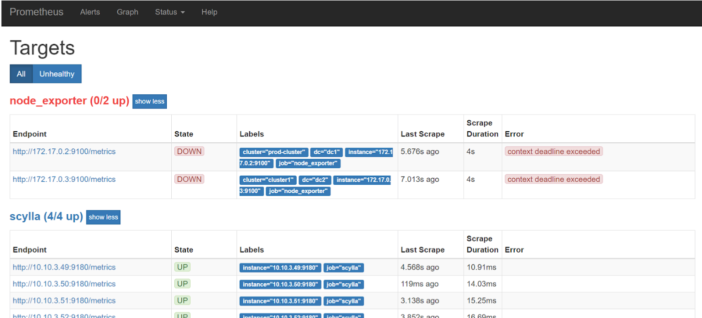
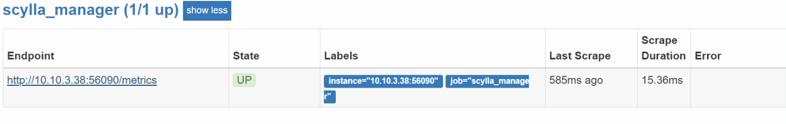

================================================================================
Troubleshooting guide for ScyllaDB Manager and ScyllaDB Monitoring integration
================================================================================

Symptom
-------

Scylla Manager and Scylla Monitoring are installed, but when you look at Scylla Monitoring, the Scylla Manager dashboard shows the status of Scylla Manager as not connected. 

The following procedure contains several tests to pinpoint the integration issue. 

Solution
--------

1. Verify that Scylla Manager Server is up and running. From the Scylla Monitoring node, run the following Scylla Manager commands:

.. code-block:: none

   sctool version
   sctool status -c <CLUSTERNAME>

If you get a response with no errors, Scylla Manager is running.

2. Verify that Scylla Monitoring is running with the Manager Dashboard (Monitoring server) by running the command for monitoring, including the ``-M`` flag, which specifies the Manager Dashboard version. For example, 2.0.

.. code-block:: none

   /start-all.sh -s path/to/scylla_servers.yml -n path/to/node_exporter_servers.yml -d path/to/mydata -v 3.0 -M 2.0

3. From Scylla Monitoring, check the Scylla Manager Dashboard and confirm if the Scylla Manager dashboard shows Scylla Manager as connected. If yes, you do not need to continue. If no, continue to the next step.

4. The issue might be a case where the IP addresses are not synchronized. This happens when Scylla Manager binds the Prometheus API to one IP address and the Prometheus pulls Manager metrics from a different IP address. 

   .. note:: When Monitoring and Manager are running on the same server, this IP might be **different** than 127.0.0.1 (localhost).

   * In  ``/etc/scylla-manager/scylla-manager.yaml``, change the TCP address that Prometheus is bound to the ``IPADDRESS:PORT`` of where Prometheus is running:

   .. code-block:: none

      # Bind prometheus API to the specified TCP address using HTTP protocol.
      # By default it binds to all network interfaces but you can restrict it
      # by specifying it like this 127:0.0.1:5090 or any other combination
      # of ip and port.
      prometheus: '172.17.0.1:5090'

   * In  ``scylla-monitoring/prometheus/scylla_manager_servers.yml``, change the IP address Prometheus uses to pull Scylla Manager metrics from. The IP address is set to ``172.17.0.1:5090`` by default. 

   .. code-block:: none

      - targets:
        - 172.17.0.1:5090

5. If you are not using the Scylla Monitoring stack (Docker), and are using your own Prometheus stack, check that the Scylla Manager target is listed. 
Navigate to: ``http://[Prometheus_IP]:9090/targets (status menu -> targets)``. It may be that only Scylla and Node_Exporter sections are there, and Scylla Manager is missing:

6. If this is the case, you need to add scylla_manager to Prometheus by adding scylla_manager target, as detailed above. Once you do, you should see scylla_manager:

