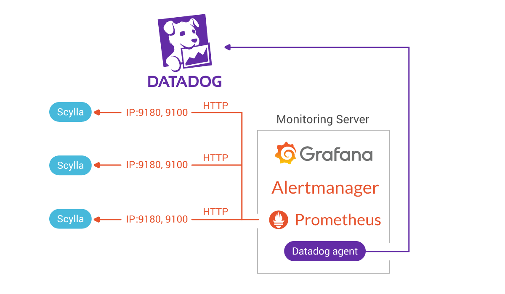

===============================
Integrate ScyllaDB with DataDog
===============================

Datadog is a popular SaaS monitoring service. The default `ScyllaDB Monitoring Stack <https://monitoring.docs.scylladb.com/stable/>`_ for ScyllaDB is based on Prometheus and Grafana. You can export metrics from this stack and into DataDog, using it to monitor ScyllaDB.

The way to do so is running a DataDog Agent to pull metrics from Prometheus and push it to DataDog as follows:

If you are a ScyllaDB Cloud user, you can export your cluster metrics to your own Prometheus and use the same method to export the metrics from Prometheus to DataDog, effectively monitoring your ScyllaDB Cloud cluster with DataDog.

The list below contains integration projects using DataDog to monitor ScyllaDB. If you have monitored ScyllaDB with DataDog and want to publish the results, contact us using the `community forum <https://forum.scylladb.com>`_.

Additional Topics
-----------------

* `Monitoring ScyllaDB with Datadog: A Tale about Datadog – Prometheus integration <https://www.scylladb.com/2019/10/02/monitoring-scylla-with-datadog-a-tale-about-datadog-prometheus-integration/>`_
* `ScyllaDB Integration Page on Datadog's website <https://docs.datadoghq.com/integrations/scylla/>`_ 
* `Datadog Blog <https://www.datadoghq.com/blog/monitor-scylla-with-datadog/>`_
