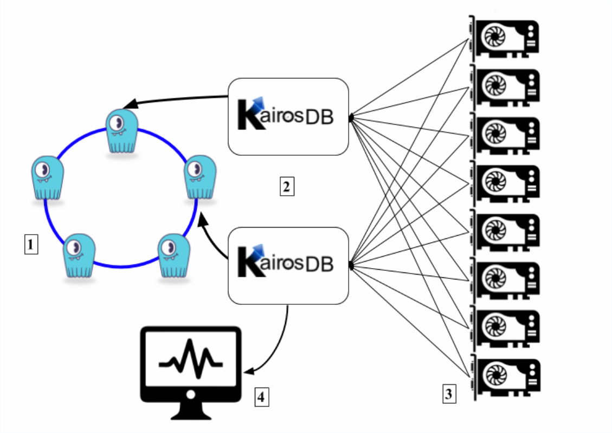

================================
Integrate ScyllaDB with KairosDB
================================

About KairosDB
==============

KairosDB is a fast distributed scalable time-series database. It was initially a rewrite of the original OpenTSDB project, but it evolved into a different system where data management, data processing, and visualization are fully separated. When KairosDB introduced native CQL support in version 1.2.0, we created a performance test for KairosDB and ScyllaDB. Through this process, we discovered how easily both platforms could be integrated with each other. The results are presented here in an example that you can adapt to suit your needs. More information on KairosDB can be found on the KairosDB `website <https://kairosdb.github.io/>`_.

Benefits of integrating KairosDB with ScyllaDB
----------------------------------------------

A highly available time-series solution requires an efficient, tailored frontend framework and a backend database with a fast ingestion rate. KairosDB provides a simple and reliable way to ingest and retrieve sensors’ information or metrics, while ScyllaDB provides a highly reliable, performant, and highly available backend that scales indefinitely and can store large quantities of time-series data.

Use case for integration
------------------------
The diagram below shows a typical integration scenario where several sensors (in this case, GPU temperature sensors) are sending data to KairosDB node(s). The KairosDB nodes are using a ScyllaDB cluster as a backend datastore. To interact with KairosDB, there is a web based UI.

**Legend**

1. ScyllaDB cluster 
2. KairosDB nodes
3. GPU sensors
4. WebUI for KairosDB 

Integration example
===================

Recommendations
---------------
In order to implement this integration example, the following are recommendations:

* It is recommended to deploy KairosDB separately from ScyllaDB, to prevent the databases from competing for resources.
* Make sure to have sufficient disk space, as KairosDB accumulates data files queued on disk. 
* KairosDB requires Java (and JAVA_HOME setting) as per the procedure `here <https://www.digitalocean.com/community/tutorials/how-to-install-java-with-apt-get-on-ubuntu-16-04>`_.

Resource list
-------------
Although your requirements may be different, this example uses the following resources:

* ScyllaDB cluster: 3 x i3.8XL instances
* KairosDB node: m5.2XL instance(s)
* Loaders (python script emulating the sensors): m5.2XL instance(s)
* Disk space 200GB for the KairosDB nodes

Note that in this case, 200GB was sufficient, but your disk space depends on the workload size from the application/s into Kairos and the speed in which KairosDB can handle the load and write it to the ScyllaDB backend datastore.

Integration instructions
------------------------

The commands shown in this procedure may require root user or sudo. 

**Before you begin** 

Verify that you have installed ScyllaDB on a different instance/server and that you know the ScyllaDB server IP address. 

**Procedure**

1. Download KairosDB. This example downloads version 1.2.0. 

.. code-block:: none

   sudo curl -O --location https://github.com/kairosdb/kairosdb/releases/download/v1.2.0/kairosdb-1.2.0-1.tar.gz

2. Extract KairosDB.

.. code-block:: none

   sudo tar xvzf kairosdb-1.2.0-1.tar.gz

3. Configure KairosDB to connect to the ScyllaDB server. 
   Using an editor, open the ``kairosdb/conf/kairosdb.properties`` file and make the following edits: 

   * Comment out the H2 module

     .. code-block:: none

         #kairosdb.service.datastore=org.kairosdb.datastore.h2.H2Module

   * Uncomment the Cassandra module

     .. code-block:: none

         kairosdb.service.datastore=org.kairosdb.datastore.cassandra.CassandraModule

   * In the  ``#Cassandra properties`` section, set the ScyllaDB nodes IP

     .. code-block:: none
   
         kairosdb.datastore.cassandra.cql_host_list=[IP1],[IP2]...

   * Set the :doc:`replication </architecture/architecture-fault-tolerance>` factor (for production purposes use a ScyllaDB cluster with a minimum of RF=3)

     .. code-block:: none
   
         kairosdb.datastore.cassandra.replication={'class': 'NetworkTopologyStrategy','replication_factor' : 3}

   * Set the read and write :doc:`consistency </architecture/architecture-fault-tolerance>` level (for production purposes use write=ONE, read=QUORUM)

     .. code-block:: none

         kairosdb.datastore.cassandra.read_consistency_level=QUORUM
         kairosdb.datastore.cassandra.write_consistency_level=ONE (sufficient for time series workload)

   * In case your ScyllaDB / Cassandra cluster is deployed on multiple data centers, change the local datacenter parameter to match the data center you are using. 

     .. code-block:: none

         kairosdb.datastore.cassandra.local_datacenter=[your_local_DC_name]	

   * Set connections per host to match the # of shards that ScyllaDB utilizes. Check the number of shards by running the following command on your scylla nodes:

     .. code-block:: none

        > cat /etc/scylla.d/cpuset.conf 
        CPUSET="--cpuset 1-15,17-31" 
     
     In this case, ScyllaDB is using 30 CPU threads (out of 32) as 1 physical core is dedicated to interrupts handling. Set the following Kairos connections:

     .. code-block:: none

        kairosdb.datastore.cassandra.connections_per_host.local.core=30
        kairosdb.datastore.cassandra.connections_per_host.local.max=30
        kairosdb.datastore.cassandra.connections_per_host.remote.core=30
        kairosdb.datastore.cassandra.connections_per_host.remote.max=30

   * Set max requests per connection to a smaller value than the default (default = 128). 
     As the client only moves to a new connection after it saturates the first. Setting it to a smaller value will cause it to move to a new connection sooner:

     .. code-block:: none

         kairosdb.datastore.cassandra.max_requests_per_connection.local=8
         kairosdb.datastore.cassandra.max_requests_per_connection.remote=8

   * Set the Kairos batch size (default = 200) and the minimum batch size (default = 100). 
     Testing found that it is necessary to use a smaller value than the default setting. This was because one of ScyllaDB's shard handling batches can spike to 100% CPU when handling a heavy load from Kairos, which leads to write timeout and poor latency results. In the example, we found the best performance when it is set to 50. When we deployed three Kairos nodes, we divided the load so that each node was set to 15. 

     .. code-block:: none

         kairosdb.queue_processor.batch_size=50
         kairosdb.queue_processor.min_batch_size=50

   * Set the ingest executor thread count (default = 10). In our example, we found 20 to yield the best results. 

     .. code-block:: none

         kairosdb.ingest_executor.thread_count=20

   * Optional: enable TTL for data points. Set the Time to Live value. 
     Once the threshold is reached, the data is deleted automatically. If not set, the data is not deleted. TTLs are added to columns as they're inserted. Note that setting the TTL does not affect existing data, only new data. Additional TTL parameters to use at your discretion (see their explanation in the properties file)

     .. code-block:: none

         #kairosdb.datastore.cassandra.datapoint_ttl=31536000 (Time to live in seconds for data points) 

     .. code-block:: none
   
         kairosdb.datastore.cassandra.align_datapoint_ttl_with_timestamp=false

     .. code-block:: none

         kairosdb.datastore.cassandra.force_default_datapoint_ttl=false

4. Using multiple Kairos instances (optional).
   You might need to use more than a single KairosDB instance to push more data into ScyllaDB, as there are some limits in the Cassandra client that prevents a single kairos instance from pushing faster. To deploy multiple Kairos nodes, shard the clients / sensors, and assign several ingesting clients per Kairos node. Note that in this case, the data is not divided, but each Kairos node is assigned to several clients.  

5. Start KairosDB process.
   Change to the bin directory and start KairosDB using one of the following commands:

* To start KairosDB and run it in the foreground:

  .. code-block:: none
   
   > sudo ./kairosdb.sh run

* To run KairosDB as a background process:

  .. code-block:: none

   > sudo ./kairosdb.sh start

* To stop KairosDB when running as a background process:

  .. code-block:: none
   
   > sudo ./kairosdb.sh stop

6. To verify that the KairosDB Schema was created properly in your ScyllaDB cluster, connect to one of the ScyllaDB cluster nodes and open cql shell:

.. code-block:: none

   > cqlsh [node IP]

7. Check that the keyspace and tables were created (default keyspace = kairosdb):

.. code-block:: none

   cqlsh> DESC TABLES
   Keyspace kairosdb
   ----------------
   row_keys       data_points    string_index
   row_key_index  service_index  row_key_time_index

8. Check that the ‘kairosdb’ schema exists and verify the keyspace replication factor:

.. code-block:: none

   cqlsh> DESC KEYSPACE kairosdb 

Ansible playbook
================

A KairosDB deployment Ansible playbook for your use is available `on github <https://github.com/scylladb/scylla-code-samples/tree/master/deploy_kairosdb>`_. It requires that you `install <https://www.digitalocean.com/community/tutorials/how-to-install-and-configure-ansible-on-ubuntu-16-04>`_ Ansible v2.3 or higher and that a ScyllaDB cluster up and running.

Setup Ansible playbook
----------------------
**Procedure**

1. Set the following variables in kairosdb_deploy.yml file:

   * ScyllaDB node(s) IP address(es)
   * Number of shards per node that ScyllaDB utilizes (cat /etc/scylla.d/cpuset.conf)
   * KairosDB batch size - when using a single KairosDB instance with ScyllaDB, while ScyllaDB runs on i3.8XL instance, the value should be set to '50'. When using multiple KairosDB nodes, or when ScyllaDB runs on smaller instances, the value should be lower. If you are using multiple KairosDB nodes, you need to divide the batch size evenly per node.
2. Run the playbook:

   * Run locally: add ``‘localhost ansible_connection=local’`` to the ``/etc/ansible/hosts`` file
   * Run on remote nodes: add an entry for each node’s IP in the  ``/etc/ansible/hosts`` file
   * If you want to enable key checking, in the ansible-playbook kairosdb_deploy.yml file change the ``ANSIBLE_HOST_KEY_CHECKING=False`` to true.

