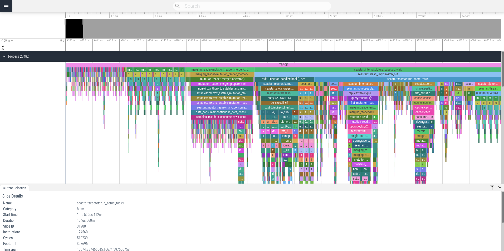
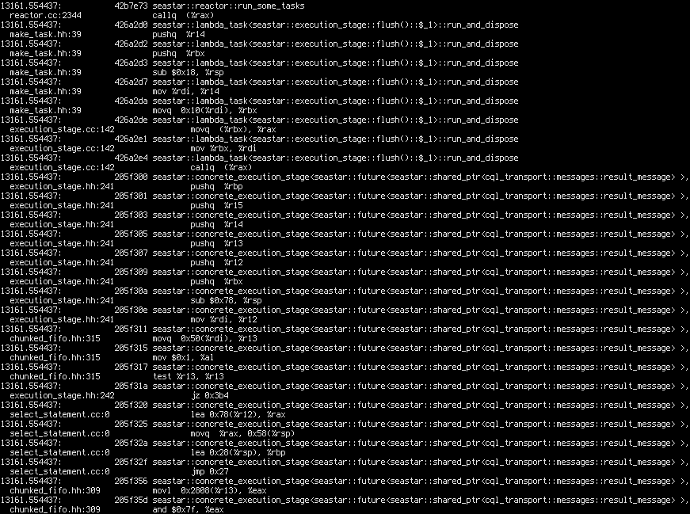

## Introduction

Recent Intel processors feature the "Intel Processor Trace" feature, which can be used to capture the full execution trace of a program.
It is an amazing tool for debugging, optimization and learning how (natively compiled) programs work.

Linux supports Intel PT in `perf`.
This repository contains an exporter of Intel PT traces from `perf` to [Fuchsia trace format](https://fuchsia.dev/fuchsia-src/reference/tracing/trace-format) for convenient viewing in [Perfetto](https://perfetto.dev/).

## Example output (viewed in Perfetto)



## How to use

### Basic usage

First collect the trace with `perf record`. For example, to trace a running process `my_prog`, you can do:

```bash
TRACE_DURATION_SECS=1
PID=$(pgrep --newest --exact my_prog)
sudo perf record -o perf.data -p $PID -e intel_pt/cyc=1/ -- sleep $TRACE_DURATION_SECS
```

(This records both the kernel space and the user space. `perf record` can be configured to only record one
of those, but this tool doesn't support that right now. It shouldn't be hard to add support for that,
but I didn't get around to it.)

The above command will generate a perf.data file. 
Note that tracing all branches with Intel PT like that can output several hundred MiB per second per core.
Be careful with traces longer than a second so that perf.data doesn't clog up your hard drive.

`perf record` offers more options that just "trace everything". For example, you can select "trace start"
and "trace stop" addresses, use snapshot mode to save trace snapshots only on signals and on exit, and more.
Refer to `man perf record` for details.

To decode the trace to `.ftf`, build the dlfilter library with

```bash
cargo build --release
DLFILTER_PATH=$(realpath target/release/libperf2perfetto.so)

```

And run `perf script` with the library passed as a `--dlfilter`. For example with:

```bash
#!/bin/bash
# decode_pt.sh

RELSTART=$1
DURATION=$2
DLFILTER_PATH="$3"
OUT_FILENAME="$4"
MODE="$5"

ABSSTART=$(perf script -f --itrace=i0ns -Ftime -i perf.data | head -n1 | tr -d ':[:space:]')
START=$(echo "$ABSSTART + $RELSTART" | bc)
END=$(echo "$START + $DURATION" | bc)

perf script -f --itrace=bei0ns -i perf.data --dlfilter "$DLFILTER_PATH" --time $START,$END --dlarg "$OUT_FILENAME" --dlarg $MODE
```

Note the `bei0ns`. This causes `perf` to emit "branches" (b), "errors" (e) and "instruction" (i, period 0ns) events.
"branches" have to be emitted for this tool to work. "errors" are optional. They will be printed to stderr for your information only and don't affect the tool.
"instructions" are optional. If they are emitted, they are used to calculate more exact instruction counts, though it slows decoding down quite significantly.
I recommend emitting them.

Usage:
```bash
./decode_pt.sh 0.01 0.03 "$DLFILTER_PATH" out_cyc_0.01-0.04.ftf c
```

This will decode the 10ms-40ms span of the trace (relative to the beginning) from `perf.data` to `out_0.01-0.04.ftf`.
The `c` parameter chooses CPU cycles as the time axis in the output. Other options are `t` (timestamp) and `i` (instructions).

### Instruction and cycle counters

The cycle counts emitted in the output are not exact. The cycle information comes from IntelPT packets, so it has the same granularity
as packets. In other words: during decoding, cycle count is only updated on indirect jumps and some conditional jumps (and periodically every
few thousand cycles). Cycle count for an instruction is calculated by subtracting the cycle count seen on `ret` from the count seen at `call`.
If there was no update between them, the count will be 0. If there were no updates for a long time before `call`, the count will include many cycles
that passed before call. So the count can be wrong in both ways.

You can improve that with `noretcomp` (see below), which will force an update on `ret`. (But trying to achieve granularity finer than a few hundred cycles is
unlikely to get you anywhere due to how out-of-order CPUs work.)

The instruction counts are exact when using `i0ns` (see above). Without it, instruction count is only updated when the cycle count is updated.

### noretcomp

By default `perf record` enables "return compression", which disables the generation of Intel PT packets on `ret` instructions.
Even though the target of `ret` can't be deduced offline in general, well-behaved applications don't modify return addresses,
and the return target can be deduced from preceding calls. This fact can be used to decrease the number (and thus overhead) of
Intel PT packets without losing correctness.

Even if your application is well-behaved, you can consider disabling return compression with `noretcomp=1`, as in `perf record -e intel_pt/cyc=1,noretcomp=1/ ...`.
This will result in more exact instruction and cycle counts, though it will also increase the overhead of tracing (think: from 3% to 5%).

### Output file size

To view the trace, head to https://ui.perfetto.dev/ and open the `.ftf` file.

Avoid very big traces to avoid severe lags in Perfetto. Keep them smaller than several hundred megabytes and several hundred thousand function calls. When tracing a single thread of Scylla, this translates to about 25ms.

You can split longer spans into manageable chunks like so:
```bash
parallel -j42 ./decode_pt.sh {} 0.025 ./libperf2perfetto.so out_cyc_{}.ftf c ::: $(seq 0.100 0.025 0.299)
``` 

This will decode the span 100ms-300ms split into 8 files, each covering 25ms.

### Drilling down

If you find something interesting in the trace, you can view a trace of individual instructions like so:
```bash
perf script -i perf.data  --itrace=i0ns -Fip,time,insn,srcline,sym --xed --tid 23612 --time 13161.554437440,13161.554462914

```
where `--tid` and `--time` refer to the interesting part of the trace.
You can find a copypaste-ready time span in "slice details" in perfetto.
(This does not necessarily match the time axis in perfetto. What you seen there can be something other than time (instructions or cycles), depending on the second `--dlarg`.)
This will output a list of all executed instructions in that span, with source code locations, for detailed inspection:



### Archiving traces and decoding traces from remote machines

perf.data isn't a standalone file.
Raw Intel PT data contains only information that can't be deduced offline:
the results of conditional branches (taken/not taken), target addresses of indirect jumps, timing information.
Decoding the raw trace to something useful, (a call-ret trace, an instruction trace, etc.),
requires the access to all binaries executed when the program was traced.

`perf.data` doesn't embed those binaries, but it contains build-ids of required binaries.
When decoding, `perf` looks for given buildids in system directories (your package manager installs debug info there)
and in "buildid cache", (usually located at `~/.debug`).
If you update the machine or move `perf.data` to other machines, the necessary buildids will likely not be present on the system anymore.

If you want to trace to be portable across updates, reboots and machines, you should archive the binaries and store them with the trace,
so that you can repopulate the build cache before decoding when necessary.

Fortunately `perf` has a script that packs all the needed binaries into an archive so you can do that easily.

On the remote do:

```bash
# First, record the trace.
TRACE_DURATION_SECS=1
PID=$(pgrep --newest --exact my_prog)
sudo perf record -o perf.data --kcore -p $PID -e intel_pt/cyc=1/ -- sleep $TRACE_DURATION_SECS
# Note the added `--kcore`. Instead of a `perf.data` file, this will output a `perf.data/` directory containing a
# `data` file and `kcore_dir/` directory with a copy of the kernel image.
# `perf script` understands this directory scheme. Don't pass `-i perf.data/data` to it, just `-i perf.data`.
#
# (The kernel image is passed separately from the buildid cache mechanism.
# Even if it's in the cache, you still need to manually tell `perf script` to use it using `--kallsyms`,
# or use the `kcore_dir/` directory scheme. I don't know why it doesn't just want to behave like any other
# binaries.)

# And collect all relevant binaries into an archive.
sudo perf archive
# This will create `perf.data.tar.bz2`
```

Then on your workstation:
```bash
# Download the trace and the archive.
rsync -rz --progress --rsync-path="sudo rsync" remote:perf.data .
rsync -r --progress remote:perf.data.tar.bz2 .

# Unpack the binaries into a place searched by perf when decoding. `~/.debug` is the default.
lbzip2 -dc perf.data.tar.bz2 | tar x -C ~/.debug
```

Now you can `perf script -i perf.data` as usual.

Note that every user has their own buildid-cache. If you are going to `sudo perf script`, you have to unpack the archive
to `/root/.debug`, not `~/.debug`.

If your `perf` distribution doesn't have `perf archive`, just grab `tools/perf/perf-archive.sh` from the Linux repository.

## Troubleshooting

I have encountered some programs (e.g. Firefox on Fedora) that I can't trace because the decoding fails with SIGSEGV.
This is a problem with `perf`, not this dlfilter. It happens when `perf` tries to read something (symbol names or instructions,
I'm not sure) from library segments with `PROT_NONE`. I'm not sure what causes this.

## Related projects

### magic-trace

[magic-trace](https://github.com/janestreet/magic-trace) provides the same general functionality (export from perf to .ftf). AFAIK the main differences are:
- magic-trace exposes its own CLI and does the necessary `perf` invocations under the hood
- magic-trace has some features for interactive choice of the recording target (PID, symbol to collect snapshots on, etc.) using [fzf](https://github.com/junegunn/fzf)
- magic-trace is written in Ocaml
- magic-trace parses the text output of `perf script` instead of using its binary API (the `dlfilter` feature)
- this project shows some additional info in the trace: instructions, cycles, instruction cache footprint
- the call-stack simulation logic may differ (in particular the handling of gaps in the trace)

I wrote my own converter instead of using magic-trace because I wanted instruction and cycle counts, a separation of recording and decoding (for example, to visualize traces collected on remote machines), and it failed with some regex errors the first time I tried it (on a C++ project with elaborate template symbols).
